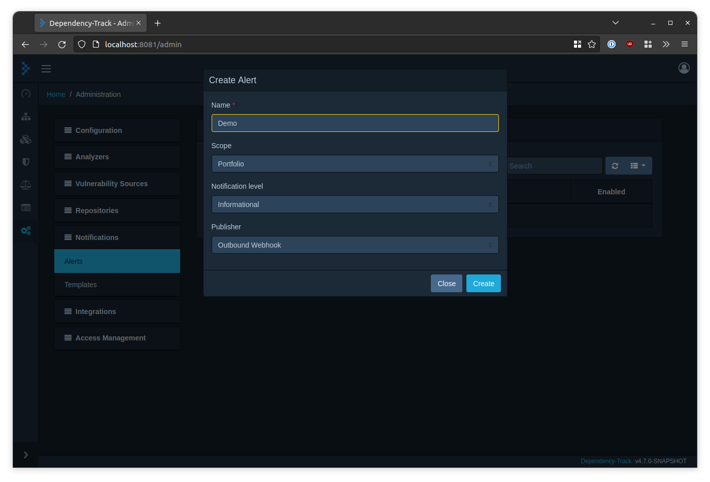
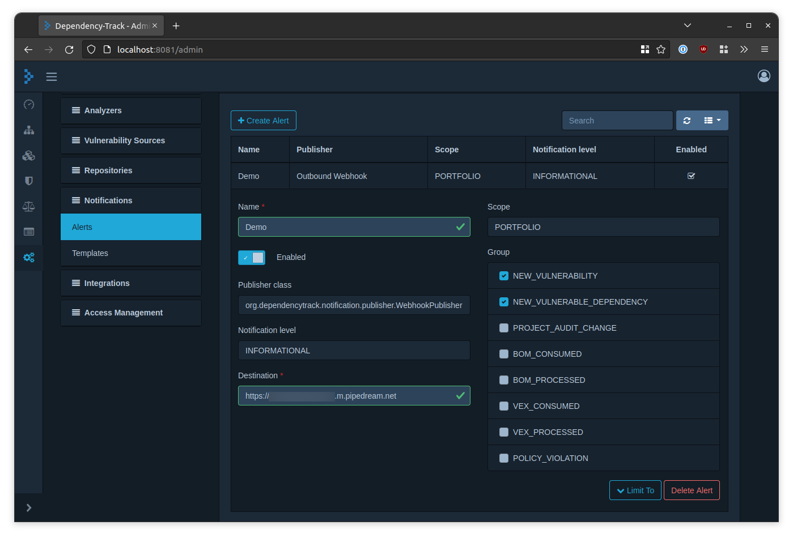
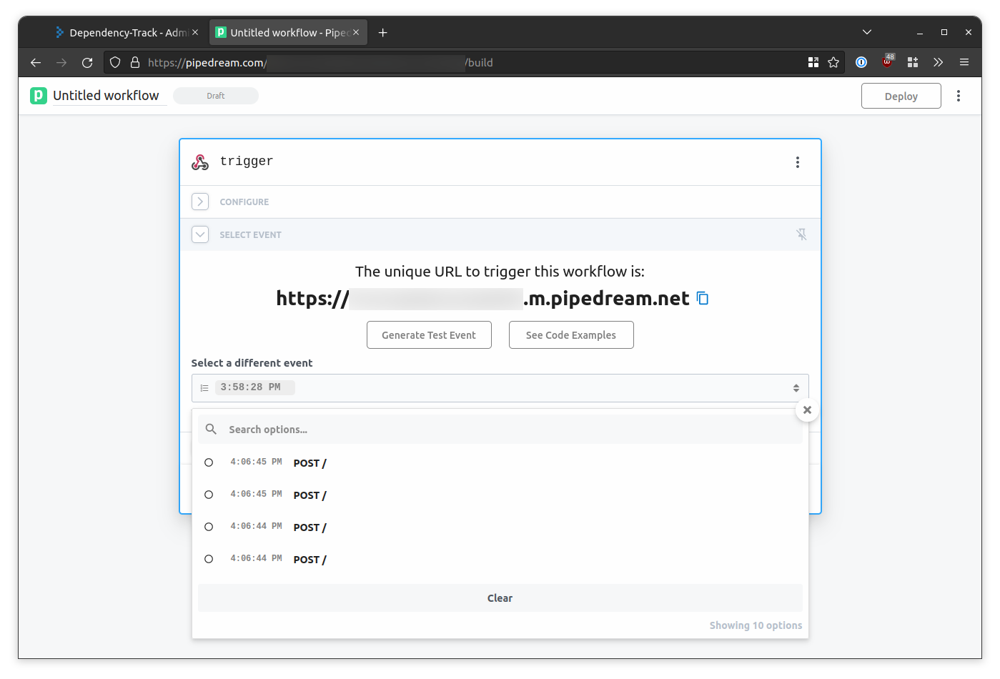

# Demo

## Setup 💻

All you need is [Docker], [Docker Compose] and a somewhat capable machine.  
A UNIX-based system is strongly recommended. In case you're bound to Windows, please use WSL.

> **Note**
> A >4 core CPU and >=8GB RAM are recommended for a smooth experience.

1. In a terminal, clone *this* repository and navigate to it:
```shell
git clone https://github.com/DependencyTrack/hyades.git
cd hyades
```
2. Generate a secret key for encryption and decryption of credentials in the database:
```shell
openssl rand 32 > secret.key
```
3. Pull and start all containers:
```shell
docker compose --profile demo up -d --pull always
```
* Make sure you include the `--profile demo` flag!

Once completed, the following services will be available:

| Service            | URL                    |
|:-------------------|:-----------------------|
| API Server         | http://localhost:8080  |
| Frontend           | http://localhost:8081  |
| Redpanda Console   | http://localhost:28080 |
| PostgreSQL         | `localhost:5432`       |
| Redpanda Kafka API | `localhost:9092`       |

> **Note**  
> You'll not need to interact with PostgreSQL or the Kafka API directly to try out the project,
> but if you're curious 🕵️ of course you can!

Finally, to remove everything again, including persistent volumes:

```shell
docker compose --profile demo down --volumes
```

## Testing 🤞

1. In a web browser, navigate to http://localhost:8081 and login (username: `admin`, password: `admin`)
2. Navigate to the *Notifications* section in the [administration panel](http://localhost:8081/admin)
3. Create a new alert with publisher *Outbound Webhook*
   
4. Select a few notification groups and enter a destination URL ([Pipedream](https://pipedream.com/) is convenient for testing Webhooks)
   
5. Navigate to the [projects view](http://localhost:8081/projects) and click *Create Project*
6. Provide an arbitrary project name and click *Create*
7. Select the project you just created from the project list
8. Navigate to the *Components* tab and click *Upload BOM*
9. Upload any (S)BOM you like. If you don't have one handy, here are some to try:
    * [Dependency-Track API Server 4.6.2](https://github.com/DependencyTrack/dependency-track/releases/download/4.6.2/bom.json)
    * [Dependency-Track Frontend 4.6.1](https://github.com/DependencyTrack/frontend/releases/download/4.6.1/bom.json)
    * [CycloneDX SBOM examples](https://github.com/CycloneDX/bom-examples/tree/master/SBOM)
10. Now navigate to the *Audit Vulnerabilities* tab and hit the 🔄 button to the top right of the table a few times
    * You should see the table being populated with vulnerability data
11. Going back to the service you used as Webhook destination, you should see that a few alerts have been delivered
    

Overall, this should behave just like what you're used to from Dependency-Track.  
However in this case, the publishing of notifications and vulnerability analysis was performed by external,
individually scalable services.

[Docker]: https://docs.docker.com/engine/
[Docker Compose]: https://docs.docker.com/compose/install/
[modified Dependency-Track API server]: https://github.com/sahibamittal/dependency-track