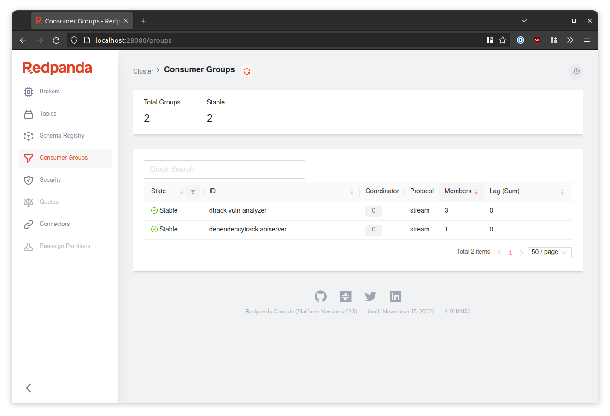
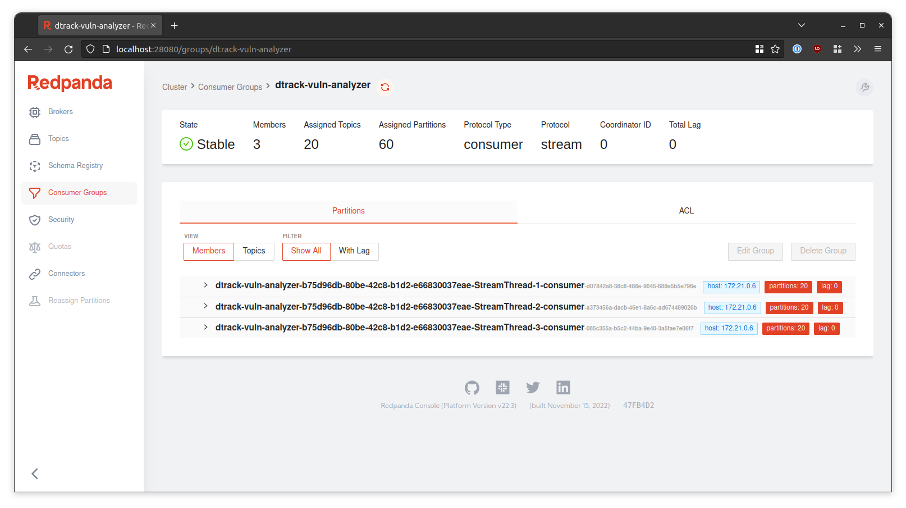

# Demo

## Setup 💻

All you need is [Docker], [Docker Compose] and a somewhat capable machine.

> **Note**
> A >4 core CPU and >=16GB RAM are recommended for a smooth experience.

1. Start by creating a new directory for this setup:
```shell
mkdir demo
```
2. Clone both *this* repository and that of our [modified Dependency-Track API server] into the directory you just created:
```shell
cd demo
git clone https://github.com/mehab/DTKafkaPOC.git
git clone --branch internal-dt-latest https://github.com/sahibamittal/dependency-track.git
```
  * Alternatively, should you not have Git installed, you can download the repositories [here](https://github.com/mehab/DTKafkaPOC/archive/refs/heads/main.zip)
    and [here](https://github.com/sahibamittal/dependency-track/archive/refs/heads/internal-dt-latest.zip)
3. Pull and build all required container images, and finally start them:
```shell
cd DTKafkaPOC
docker compose --profile demo pull
docker compose --profile demo build
docker compose --profile demo up -d
```
  * Make sure you include the `--profile demo` flag!
  * Building the images may take a few minutes

Once completed, the following services will be available:

| Service                  | URL                    |
|:-------------------------|:-----------------------|
| Dependency-Track         | http://localhost:8080  |
| Redpanda Console         | http://localhost:28080 |
| PostgreSQL               | `localhost:5432`       |
| Redpanda Kafka API       | `localhost:9092`       |

> **Note**
> You'll not need to interact with PostgreSQL or the Kafka API directly to try out the PoC,
> but if you're curious 🕵️ of course you can!

## Testing 🤞

1. In a web browser, navigate to http://localhost:8080 and login (username: `admin`, password: `admin`)
2. Navigate to the [projects view](http://localhost:8080/projects) and click *Create Project*
3. Provide an arbitrary project name and click *Create*
4. Select the project you just created from the project list
5. Navigate to the *Components* tab and click *Upload BOM*
6. Upload any (S)BOM you like. If you don't have one handy, here are some to try:
  * [Dependency-Track API Server 4.6.2](https://github.com/DependencyTrack/dependency-track/releases/download/4.6.2/bom.json)
  * [Dependency-Track Frontend 4.6.1](https://github.com/DependencyTrack/frontend/releases/download/4.6.1/bom.json)
  * [CycloneDX SBOM examples](https://github.com/CycloneDX/bom-examples/tree/master/SBOM)
7. Now navigate to the *Audit Vulnerabilities* tab and hit the 🔄 button to the top right of the table a few times
  * You should see the table being populated with vulnerability data

Overall, this should behave just like what you're used to from Dependency-Track.  
However in this case, the vulnerability analysis is being performed by an external services.

## Scaling up 📈

One of the goals of this PoC is to achieve scalability, remember? Well, we're delighted to report
that there are multiple ways to scale! If you're interested, you can find out more about the parallelism model 
at play [here](https://docs.confluent.io/platform/current/streams/architecture.html#parallelism-model).

Per default, when opening the [Consumer Groups view](http://localhost:28080/groups) in Redpanda Console, 
you'll see a total of two groups:



The *Members* column shows the number of stream threads in each group.  
Clicking on the [*dtrack-vuln-analyzer* group](http://localhost:28080/groups/dtrack-vuln-analyzer) will reveal a more detailed view:



Each stream thread got assigned 20 partitions. 20 partitions are a lot to take care of, so being limited to just three
stream threads will not yield the best performance.

### Scaling a single instance 🚀

Arguably the easiest option is to simply increase the number of stream threads used by a service instance.
By modifying the `KAFKA_STREAMS_NUM_STREAM_THREADS` environment variable in `docker-compose.yml`, the number of worker
threads can be tweaked.

Let's change it to `12` and see what happens!  
To do this, remove the comment (`#`) from the `# KAFKA_STREAMS_NUM_STREAM_THREADS: "12"` line in `docker-compose.yml`,
and recreate the container with `docker compose up -d poc`.

### Scaling to multiple instances 🚀🚀🚀

Putting more load on a single service instance is not always desirable, so oftentimes simply increasing the replica 
count is the preferable route. In reality this may be done via Kubernetes manifests, but we can do it in Docker Compose, too.
Let's scale up to three instances:

```shell
docker compose --profile demo up -d --scale poc=3
```

[Docker]: https://docs.docker.com/engine/
[Docker Compose]: https://docs.docker.com/compose/install/
[modified Dependency-Track API server]: https://github.com/sahibamittal/dependency-track