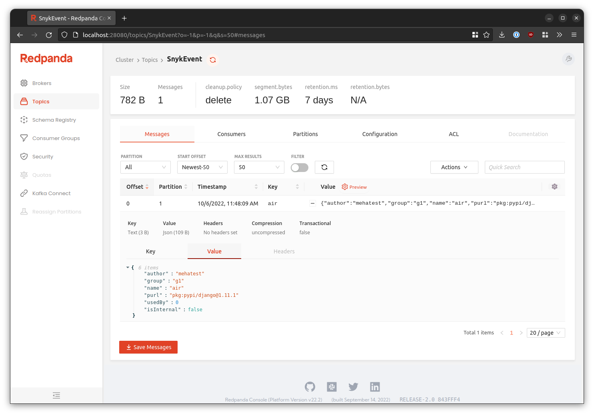

# DT-Kafka-POC

## What is this? 🤔

This project is a proof-of-concept for decoupling responsibilities from [Dependency-Track]'s monolithic API server
into separate, scalable™ services. We're using [Kafka] (or Kafka-compatible brokers like [Redpanda]) for communicating 
between API server and the PoC applications.

As of now, the PoC is capable of:

* Performing vulnerability analysis using [OSS Index] and [Snyk]
* Sending [notifications] via all channels supported by the original API server (E-Mail, Webhook, etc.)

We're planning to expand its set of capabilities further by:

* Performing component meta analysis (e.g. fetching latest versions from remote repositories)
* ...

An overview of the architecture can be found [here](https://excalidraw.com/#room=fba0103fa2642574be40,NomXwyHw3jvoy0yr6JxCJw).

## Great, can I try it? 🙌

Yes! We prepared demo setup that you can use to play around with the PoC.  
Check out 👉 [`DEMO.md`](DEMO.md) 👈 for details!

## Technical Documentation 💻

### Configuration 📝

See [`CONFIGURATION.md`](CONFIGURATION.md).

### Encryption Secret

Dependency-Track needs to store credentials for various purposes in its database.  
Those credentials are AES256 encrypted, using a secret key that has historically been automatically generated when
the API server first launches. Now, with multiple services requiring access to the encrypted data, 
it is necessary to share this secret among them.

To generate the secret key, the `gen-secret-key.jsh` JShell script can be used:

```shell
jshell -R"-Dsecret.key.destination=secret.key" ./scripts/gen-secret-key.jsh
```

Alternatively, should no JDK with JShell be installed on your system, you can do it with Docker as follows:

```shell
docker run -it --rm -v "$(pwd):/tmp/work" -u "$(id -u):$(id -g)" \
  eclipse-temurin:17-jdk-alpine jshell -R"-Dsecret.key.destination=/tmp/work/secret.key" /tmp/work/scripts/gen-secret-key.jsh
```

### Testing 🤞

#### Vulnerability Analysis 💀

The `test.sh` script can be used to test the vulnerability analyzer independent of the API server.  
It publishes an event to the `component-analysis` topic for each component with a
PURL in a given CycloneDX BOM in JSON format, thus emulating the API server after a BOM was uploaded to it.

```shell
./test.sh bom.json
```

> **Note**
> The script requires `jq` and `rpk` to be installed.  
> They can be installed using Homebrew:
> ```shell
> brew install jq
> brew install redpanda-data/tap/redpanda
> ```

Analysis results that are intended for consumption by the API server will be
published to the `component-vuln-analysis-result` topic.

### Redpanda Console 🐼

The provided `docker-compose.yml` includes an instance of [Redpanda Console](https://github.com/redpanda-data/console)
to aid with gaining insight into what's happening in the message broker. Among many other things, it can be used to
inspect messages inside any given topic:



The console is exposed at `http://127.0.0.1:28080` and does not require authentication. It's intended for local use only.

[Dependency-Track]: https://github.com/DependencyTrack/dependency-track
[Kafka]: https://kafka.apache.org/
[notifications]: https://docs.dependencytrack.org/integrations/notifications/
[OSS Index]: https://ossindex.sonatype.org/
[Redpanda]: https://redpanda.com/
[Snyk]: https://snyk.io/