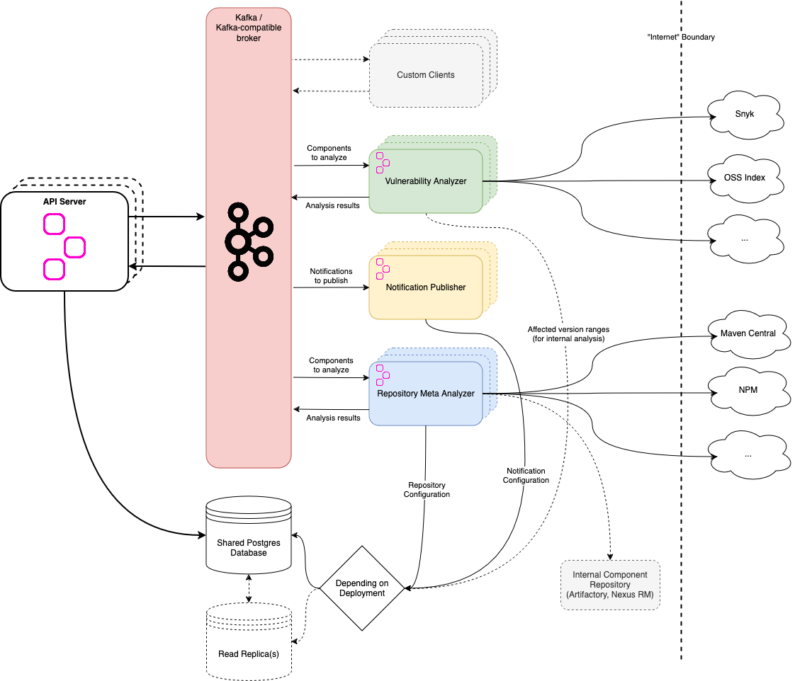

# Hyades

[](https://github.com/DependencyTrack/hyades/actions/workflows/ci.yml)
[](https://github.com/DependencyTrack/hyades/actions/workflows/e2e-test.yml)
[](https://app.codacy.com/gh/DependencyTrack/hyades/dashboard?utm_source=gh&utm_medium=referral&utm_content=&utm_campaign=Badge_grade)
[](https://app.codacy.com/gh/DependencyTrack/hyades/dashboard?utm_source=gh&utm_medium=referral&utm_content=&utm_campaign=Badge_coverage)

## What is this? 🤔

Hyades, named after [the star cluster closest to earth](https://en.wikipedia.org/wiki/Hyades_(star_cluster)), 
is an incubating project for decoupling responsibilities from [Dependency-Track]'s monolithic API server into separate, 
scalable™ services. We're using [Apache Kafka] (or Kafka-compatible brokers like [Redpanda]) for communicating between
API server and Hyades services.

If you're interested in the technical background of this project, please refer to 👉 [`WTF.md`](WTF.md) 👈.

The main objectives of Hyades are:

* Enable Dependency-Track to handle portfolios spanning hundreds of thousands of projects
* Improve resilience of Dependency-Track, providing more confidence when relying on it in critical workflows
* Improve deployment and configuration management experience for containerized / cloud native tech stacks

Other than separating responsibilities, the API server has been modified to allow for high availability (active-active)
deployments. Various "hot paths", like [processing of uploaded BOMs](https://github.com/DependencyTrack/hyades-apiserver/pull/218),
have been optimized in the existing code. Further optimization is an ongoing effort.

Hyades already is a *superset* of Dependency-Track, as changes up to Dependency-Track v4.11.3 were ported,
and features made possible by the new architecture have been implemented on top. Where possible, improvements
made in Hyades are, or will be, backported to Dependency-Track v4.x.

## Features

Generally, Hyades can do [everything Dependency-Track can do](https://github.com/DependencyTrack/dependency-track#features).

On top of that, it is capable of:

* Evaluating policies defined in the [Common Expression Language](https://dependencytrack.github.io/hyades/latest/usage/policy-compliance/expressions/) (CEL)
* Verifying the integrity of components, based on hashes consumed from BOMs and remote repositories

## Architecture

Rough overview of the architecture:



Except the mirror service (which is not actively involved in event processing), all services can be scaled up and down,
to and from multiple instances. Despite being written in Java, all services except the API server can optionally be
deployed as self-contained native binaries, offering a lower resource footprint.

To read more about the individual services, refer to their respective `REAMDE.md`:

* [Repository Metadata Analyzer](repository-meta-analyzer/README.md)
* [Vulnerability Analyzer](vulnerability-analyzer/README.md)

## Great, can I try it? 🙌

Yes! And all you need to kick the tires is [Docker Compose](https://docs.docker.com/compose/install/)!

```shell
docker compose --profile demo up -d --pull always
```

This will launch all required services, and expose the following endpoints:

| Service            | URL                    |
|:-------------------|:-----------------------|
| API Server         | http://localhost:8080  |
| Frontend           | http://localhost:8081  |
| Redpanda Console   | http://localhost:28080 |
| PostgreSQL         | `localhost:5432`       |
| Redpanda Kafka API | `localhost:9092`       |

Simply navigate to the [frontend](http://localhost:8081) to get started!  
The initial admin credentials are `admin` / `admin` 🌚

## Deployment 🚢

The recommended way to deploy Hyades is via Helm.
The chart is maintained in the [`DependencyTrack/helm-charts`](https://github.com/DependencyTrack/helm-charts) repository.

```shell
$ helm repo add dependency-track https://dependencytrack.github.io/helm-charts
$ helm search repo dependency-track -o json | jq -r '.[].name'
dependency-track/dependency-track
dependency-track/hyades
```

The chart does *not* include:

* a database
* a Kafka-compatible broker

Helm charts to deploy Kafka brokers to Kubernetes are provided by both [Strimzi](https://strimzi.io/)
and [Redpanda](https://github.com/redpanda-data/helm-charts).

### Minikube

Deploying to a local [Minikube](https://minikube.sigs.k8s.io/docs/) cluster is a great way to get started.

> [!NOTE]  
> To allow for frictionless testing, we will use the [`values-minikube.yaml`](https://github.com/DependencyTrack/helm-charts/blob/main/charts/hyades/values-minikube.yaml)
> configuration template. **This template includes PostgreSQL and Redpanda deployments**.
> Both are configured for *minimal resource footprint*, which *can* lead to suboptimal performance.

1. Start a local Minikube cluster, exposing `NodePort`s for API server (`30080`) and frontend (`30081`)
```shell
minikube start --ports 30080:30080,30081:30081
```
2. Download the example `values-minikube.yaml` configuration template:
```shell
curl -O https://raw.githubusercontent.com/DependencyTrack/helm-charts/main/charts/hyades/values-minikube.yaml
```
3. Make adjustments to `values-minikube.yaml` as needed
    * Refer to [the chart's documentation](https://github.com/DependencyTrack/helm-charts/tree/main/charts/hyades) for details on available values
    * Refer to the [configuration reference](https://dependencytrack.github.io/hyades/latest/reference/configuration/api-server/) for details on available application options
4. Deploy Hyades
```shell
helm install hyades dependency-track/hyades \
  -n hyades --create-namespace \
  -f ./values-minikube.yaml
```
5. Wait a moment for all deployments to become *ready*
```shell
kubectl -n hyades rollout status deployment \
  --selector 'app.kubernetes.io/instance=hyades' \
  --watch --timeout 3m
```
6. Visit `http://localhost:30081` in your browser to access the frontend

## Monitoring 📊

### Metrics

A basic metrics monitoring stack is provided, consisting of Prometheus and Grafana.  
To start both services, run:

```shell
docker compose --profile monitoring up -d
```

The services will be available locally at the following locations:

* Prometheus: http://localhost:9090
* Grafana: http://localhost:3000

Prometheus is [configured](monitoring/prometheus.yml) to scrape metrics from the following services in a 5s intervals:

* Redpanda Broker
* API Server
* Notification Publisher
* Repository Meta Analyzer
* Vulnerability Analyzer

The Grafana instance will be automatically [provisioned](monitoring/grafana/provisioning) to use Prometheus as
data source. Additionally, dashboards for the following services are automatically set up:

* Redpanda Broker
* API Server
* Vulnerability Analyzer

### Redpanda Console 🐼

The provided `docker-compose.yml` includes an instance of [Redpanda Console](https://github.com/redpanda-data/console)
to aid with gaining insight into what's happening in the message broker. Among many other things, it can be used to
inspect messages inside any given topic.

The console is exposed at `http://127.0.0.1:28080` and does not require authentication. It's intended for local use only.

## Technical Documentation 💻

### Configuration 📝

Refer to the [`Configuration`](https://dependencytrack.github.io/hyades/latest/reference/configuration/) documentation.

### Development

#### Prerequisites

* JDK 21+
* Maven
* Docker

#### Building

```shell
mvn clean install -DskipTests
```

#### Running locally

Running the Hyades services locally requires both a Kafka broker and a database server to be present.
Containers for Redpanda and PostgreSQL can be launched using Docker Compose:

```shell
docker compose up -d
```

To launch individual services execute the `quarkus:dev` Maven goal for the respective module:

```shell
mvn -pl vulnerability-analyzer quarkus:dev
```

Make sure you've [built](#building) the project at least once, otherwise the above command will fail.

> **Note**  
> If you're unfamiliar with Quarkus' Dev Mode, you can read more about it 
> [here](https://quarkus.io/guides/maven-tooling#dev-mode)

### Testing 🤞

#### Unit Testing 🕵️‍♂️

To execute the unit tests for all Hyades modules:

```shell
mvn clean verify
```

#### End-To-End Testing 🧟

> **Note**  
> End-to-end tests are based on container images. The tags of those images are currently hardcoded.
> For the Hyades services, the tags are set to `latest`. If you want to test local changes, you'll have
> to first:
> * Build container images locally
> * Update the tags in [`AbstractE2ET`](https://github.com/DependencyTrack/hyades/blob/main/e2e/src/test/java/org/hyades/e2e/AbstractE2ET.java)

To execute end-to-end tests as part of the build:

```shell
mvn clean verify -Pe2e-all
```

To execute *only* the end-to-end tests:

```shell
mvn -pl e2e clean verify -Pe2e-all
```

[Apache Kafka]: https://kafka.apache.org/
[Dependency-Track]: https://github.com/DependencyTrack/dependency-track
[Redpanda]: https://redpanda.com/
[notifications]: https://docs.dependencytrack.org/integrations/notifications/
