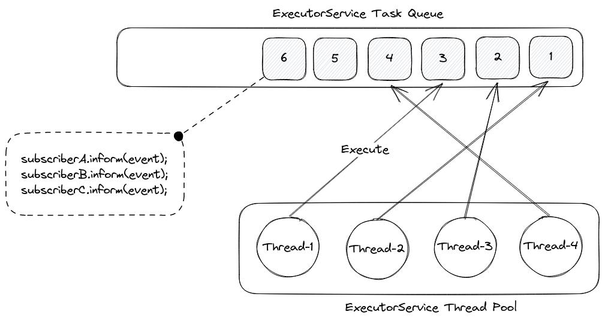

# Q&A

## Why?

> tl;dr: Dependency-Track's architecture prevents it from scaling past a certain workload.

Dependency-Track, for the most part, is an event-based system. As a platform for ingesting data (in the form of BOMs),
listening for and itself emitting signals on it, an event-based architecture makes sense conceptually. The majority of
operations Dependency-Track performs happen asynchronously, without client interaction.

On a technical level, Dependency-Track uses an in-memory [publish-subscribe](https://en.wikipedia.org/wiki/Publish%E2%80%93subscribe_pattern) architecture,
implemented using Java [`ExecutorService`](https://docs.oracle.com/en/java/javase/17/docs/api/java.base/java/util/concurrent/ExecutorService.html)s.
An `ExecutorService` can be thought of as a pool of worker threads, consuming from an internal task queue. Tasks can be
submitted to an `ExecutorService`, which will then execute them one-by-one. As multiple threads work on the queue in 
parallel, the order in which tasks are being processed is not guaranteed. Thread pool sizes can vary from one, 
up to unbounded numbers of threads.

In Dependency-Track, when an event is published, subscribers to the event are looked up. 
Per [API contract](https://github.com/stevespringett/Alpine/blob/alpine-parent-2.2.0/alpine-infra/src/main/java/alpine/event/framework/Subscriber.java), 
event subscribers must implement an `inform` method, which takes the published event as argument.
For any given event, 0-N tasks will be enqueued to the `ExecutorService`'s task queue - one for each subscriber.

There are three `ExecutorService` instances in Dependency-Track:

* [`EventService`](https://github.com/stevespringett/Alpine/blob/alpine-parent-2.2.0/alpine-infra/src/main/java/alpine/event/framework/EventService.java)
* [`SingleThreadedEventService`](https://github.com/stevespringett/Alpine/blob/alpine-parent-2.2.0/alpine-infra/src/main/java/alpine/event/framework/SingleThreadedEventService.java)
* [`NotificationService`](https://github.com/stevespringett/Alpine/blob/alpine-parent-2.2.0/alpine-infra/src/main/java/alpine/notification/NotificationService.java)

`EventService` forms the primary worker pool. Its thread pool size defaults to `<NUM_CPU> * 4`. 
A machine with a 4-core CPU will thus have a thread pool size of `16`. The size is configurable.
Common tasks handled by this worker pool include:

* Processing of uploaded BOMs and VEXs
* Performing vulnerability analysis of components, projects, or the entire portfolio
* Performing repository meta analysis of components, projects, or the entire portfolio
* Calculation of metrics for components, projects, or the entire portfolio

`SingleThreadedEventService` is a worker pool with only a single thread. The purpose of this worker pool is execute
tasks that must not be run in parallel. As such, it serves as a means to serialize task execution. 
Common tasks handled by this worker pool include:

* Mirroring of the [NVD](https://nvd.nist.gov/) vulnerability database
* Updating [Lucene](https://lucene.apache.org/) indexes on disk

`NotificationService` is a dedicated worker pool for dispatching [notifications](https://docs.dependencytrack.org/integrations/notifications/).
Its thread pool size defaults to `4` and is not configurable.

### Limitations

While this architecture works great for small to medium workloads, it presents various challenges for larger ones:

1. **Not horizontally scalable**. As pub-sub is happening entirely in-memory, it is not possible to distribute
the work to multiple application instances. The only way to handle more load using this architecture is to scale
vertically, e.g.
   * Increasing `ExecutorService` thread pool sizes (`alpine.worker.threads`, `alpine.worker.thread.multiplier`)
   * Increasing database connection pool sizes
   * Increasing resource allocations for CPU, RAM, and potentially disk / network
2. **No ordering guarantees of events**. As multiple threads work on a shared queue of tasks in parallel, there is no way
of enforcing a reliable ordering of events. 
3. **Limited fault-tolerance**. If an instance of Dependency-Track goes down, planned or unplanned, all queued tasks are 
gone. Not only does this impact business-as-usual operation, but also limits the times when upgrades can be applied.
4. **Shared, multipurpose task queue**. A single task queue is used to process all kinds of events. This means that
lots of events of a certain type can "clog" the task queue, preventing other types of events from being processed.
This is further amplified if processing of events "clogging" the queue relies on external services, introducing further
latency. Ideally, there should be a dedicated queue per event type, so that one busy queue doesn't block others.
5. **Prone to race conditions**. As a consequence of (2), it is possible that multiple events addressing the same
thing are processed in parallel, leading to race conditions in cache lookups or database operations. Race conditions
would be an even bigger problem if the work was shared across multiple application instances, and would require
distributed locking as a countermeasure, which is [inherently hard to get right](https://martin.kleppmann.com/2016/02/08/how-to-do-distributed-locking.html).

In order to scale Dependency-Track beyond its current capabilities, a distributed messaging service is required.

### Related Issues

On multiple occasions in the past, the Dependency-Track community raised questions about high availability (HA)
deployments, and / or how to better scale the platform:

* https://github.com/DependencyTrack/dependency-track/issues/218
* https://github.com/DependencyTrack/dependency-track/issues/903
* https://github.com/DependencyTrack/dependency-track/issues/1210
* https://github.com/DependencyTrack/dependency-track/issues/1856

## Why Kafka?

Kafka was chosen because it employs [various concepts](https://kafka.apache.org/documentation/#intro_concepts_and_terms) 
that are advantageous for Dependency-Track:

* It supports publish-subscribe use cases based on topics and partitions
  * Events with the same key are guaranteed to be sent to the same partition
  * Order of events is guaranteed on the partition level
  * Consumers can share the load of consuming from a topic by forming [consumer groups](https://docs.confluent.io/platform/current/clients/consumer.html#consumer-groups)
    * Minor drawback: maximum concurrency is bound to the number of partitions
* It is distributed and fault-tolerant by design, [replication](https://kafka.apache.org/documentation/#replication) is built-in
* Events are stored durably on the brokers, with various options to control retention
* [Log compaction](https://kafka.apache.org/documentation/#compaction) allows for fault-tolerant, stateful processing,
  by streaming changes of a local key-value database to Kafka
  * In certain cases, this can aid in reducing load on the database server
* Mature ecosystem around it, including a vast landscape of client libraries for various languages
  * [Kafka Streams](https://kafka.apache.org/33/documentation/streams/core-concepts) with its support for
    [stateful transformations](https://kafka.apache.org/33/documentation/streams/developer-guide/dsl-api.html#stateful-transformations)
    in particular turned out to be a unique selling point for the Kafka ecosystem
* Mature cloud offerings for fully managed instances (see [Options for running Kafka](#options-for-running-kafka))

The concept of partitioned topics turned out to be especially useful: We can rely on the fact that events with the same
key always end up in the same partition, and are processed by only one consumer (within a consumer group) at a time.
In case of vulnerability scanning, by choosing the component's PURL as event key, it can be guaranteed that only the
first event triggers an HTTP request to OSS Index, while later events can be handled immediately from cache.
There is no race condition anymore between lookup and population of the cache.

We also found the first-class support for stateful processing incredibly useful in some cases, e.g.:

* **[Scatter-gather](https://www.enterpriseintegrationpatterns.com/patterns/messaging/BroadcastAggregate.html)**. 
  As used for scanning one component with multiple analyzers. Waiting for all analyzers to complete is a stateful
  operation, that otherwise would require database access.
* **Batching**. Some external services allow for submitting multiple component identifiers per request.
  With OSS Index, up to 128 package URLs can be sent in a single request. Submitting only one package URL at a
  time would drastically increase end-to-end latency. It'd also present a greater risk of getting rate limited.

That being said, Kafka *does* add a considerable amount of operational complexity. Historically, Kafka has depended
on [Apache ZooKeeper](https://zookeeper.apache.org/). Operating both Kafka *and* ZooKeeper is not something we wanted 
to force DT users to do. Luckily, the Apache Kafka project has been working on removing the ZooKeeper dependency, 
and replacing it with Kafka's own raft consensus protocol ([KRaft](https://developer.confluent.io/learn/kraft/)).

There are other, more light-weight, yet Kafka API-compatible broker implementations available, too. 
[Redpanda](https://redpanda.com/) being the most popular. Redpanda is distributed in a single, self-contained
binary and is optimal for deployments with limited resources. Having options like Redpanda available makes
building a system on Kafka much more viable.

For this reason in fact, we primarily develop with, and test against, Redpanda.

### Considered alternatives

Before choosing for Kafka, we looked at various other messaging systems.

#### Apache Pulsar

Among all options, [Pulsar](https://pulsar.apache.org/) was the most promising besides Kafka. Pulsar prides itself in 
being truly cloud native, supporting tiered storage, and multiple messaging paradigms (pub-sub and queueing). 
It has native support for [negative acknowledgment](https://pulsar.apache.org/docs/2.11.x/concepts-messaging/#negative-acknowledgment) 
of messages, and message [retries](https://pulsar.apache.org/docs/2.11.x/concepts-messaging/#retry-letter-topic). 
However, the [Pulsar architecture](https://pulsar.apache.org/docs/2.11.x/concepts-architecture-overview/) consists not 
only of Pulsar brokers, but also requires Apache ZooKeeper **and** [Apache BookKeeper](https://bookkeeper.apache.org/) 
clusters. We had to dismiss Pulsar for its operational complexity.

#### RabbitMQ

[RabbitMQ](https://www.rabbitmq.com/) is a popular message broker. It exceeds in cases where multiple worker processes
need to work on a shared queue of tasks (similar to how Dependency-Track does it today). It can achieve a high level
of concurrency, as there's no limit to how many consumers can consume from a queue. This high grade of concurrency
comes with the cost of lost ordering, and high potential for race conditions. 

RabbitMQ supports Kafka-like partitioned streams via its [Streams plugin](https://www.rabbitmq.com/streams.html#super-streams).
In the end, we decided against RabbitMQ, because brokers do not support key-based compaction, and its consumer libraries 
in turn lack adequate support for fault-tolerant stateful operations.

#### Liftbridge

[Liftbridge](https://liftbridge.io/) is built on top of NATS and provides Kafka-like features. It is however not
compatible with the Kafka API, as it uses a custom [envelope protocol](https://liftbridge.io/docs/envelope-protocol.html),
and is heavily focused on Go. There are no managed service offerings for Liftbridge, leaving self-hosting as only
option to run it.

### Options for running Kafka

When it comes to running Kafka in production, users will have the choice between various self-hosted and fully managed 
Infrastructure as a Service (IaaS) solutions. The following table lists a few, but there will be more we don't know of:

| Solution                  | Type               | URL                                                                                        |
|:--------------------------|:-------------------|:-------------------------------------------------------------------------------------------|
| Apache Kafka              | Self-Hosted        | https://kafka.apache.org/quickstart                                                        |
| Redpanda                  | Self-Hosted / IaaS | https://redpanda.com/                                                                      |
| Strimzi                   | Self-Hosted        | https://strimzi.io/                                                                        |
| Aiven                     | IaaS               | https://aiven.io/kafka                                                                     |
| AWS MSK                   | IaaS               | https://aws.amazon.com/msk/                                                                |
| Azure Event Hubs          | IaaS               | https://azure.microsoft.com/en-us/products/event-hubs/                                     |
| Confluent Cloud           | IaaS               | https://www.confluent.io/                                                                  |
| Red Hat OpenShift Streams | IaaS               | https://developers.redhat.com/products/red-hat-openshift-streams-for-apache-kafka/overview |

The wide range of mature IaaS offerings is a very important benefit of Kafka over other messaging systems we evaluated.

## Why Java?

We went with Java for now because it was the path of the least resistance for us. There is no intention to exclusively 
use Java though. We are considering to use [Go](https://github.com/DependencyTrack/hyades/issues/253), and generally 
are open to any technology that makes sense.

For the time being, new services make use of [Quarkus](https://quarkus.io/), which comes with the nice side effect
that applications can be compiled to native binaries, using [GraalVM](https://www.graalvm.org/).

## Why not microservices?

The proposed architecture is based on the rough idea of domain services for now. This keeps the number of independent
services manageable, while still allowing us to distribute the overall system load. If absolutely necessary, it is 
possible to break this up even further. For example, instead of having one *vulnerability-analyzer* service, 
the scanners for each vulnerability source (e.g. OSS Index, Snyk) could be separated out into dedicated microservices.
