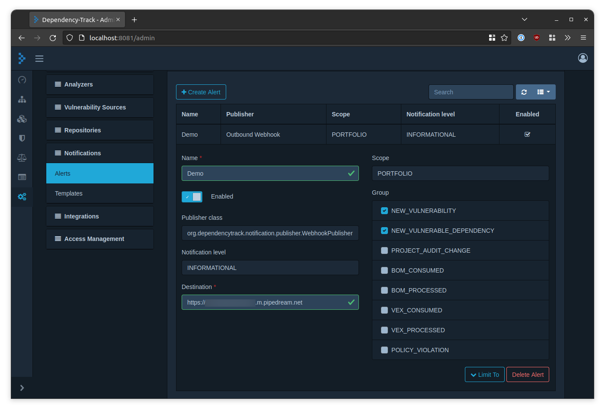
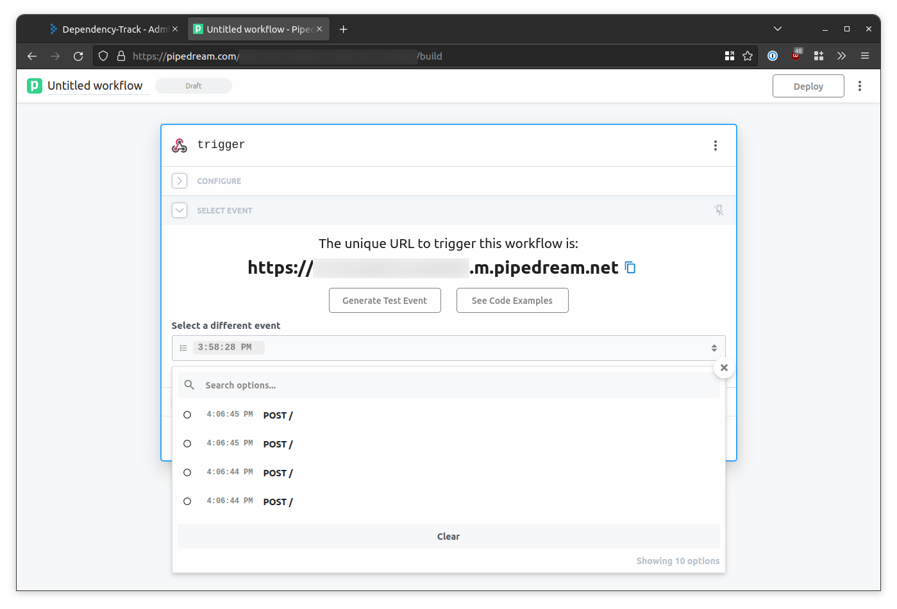
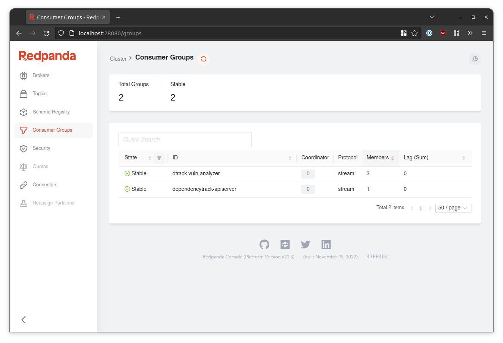
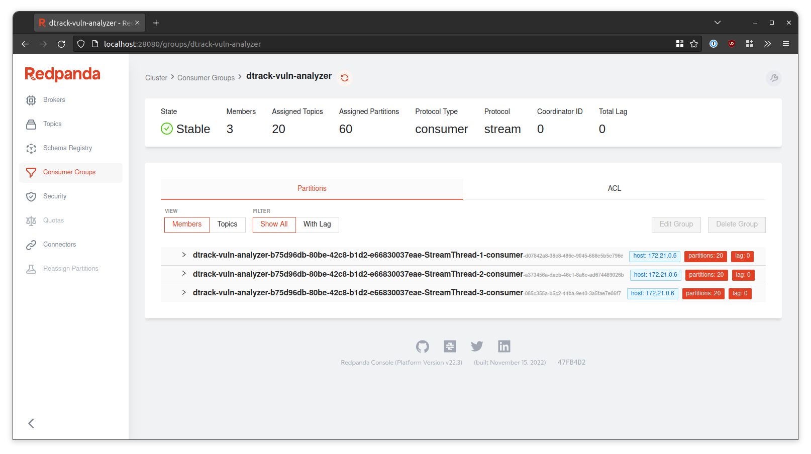

# Demo

## Setup 💻

All you need is [Docker], [Docker Compose] and a somewhat capable machine.  
A UNIX-based system is strongly recommended. In case you're bound to Windows, please use WSL.

> **Note**
> A >4 core CPU and >=16GB RAM are recommended for a smooth experience.

1. In a terminal, clone *this* repository and navigate to it:
```shell
git clone https://github.com/DependencyTrack/hyades.git
cd hyades
```
2. Generate a secret key for encryption and decryption of credentials in the database:
```shell
openssl rand 32 > secret.key
```
3. Pull and start all containers:
```shell
docker compose --profile demo up -d --pull always
```
* Make sure you include the `--profile demo` flag!

Once completed, the following services will be available:

| Service            | URL                    |
|:-------------------|:-----------------------|
| API Server         | http://localhost:8080  |
| Frontend           | http://localhost:8081  |
| Redpanda Console   | http://localhost:28080 |
| PostgreSQL         | `localhost:5432`       |
| Redpanda Kafka API | `localhost:9092`       |

> **Note**  
> You'll not need to interact with PostgreSQL or the Kafka API directly to try out the project,
> but if you're curious 🕵️ of course you can!

Finally, to remove everything again, including persistent volumes:

```shell
docker compose --profile demo down --volumes
```

### Common Issues

#### Postgres container fails to start

If the `dt-postgres` container fails to start with messages like:

```
ls: can't open '/docker-entrypoint-initdb.d/': Permission denied
```

It's likely that the local directory mounted into `/docker-entrypoint-initdb.d` is not accessible by the postgres process.
To fix, make the local directory readable by everyone, and restart the `dt-postgres` container:

```shell
chmod -R o+r ./commons/src/main/resources/migrations/postgres
docker restart dt-postgres
```

## Testing 🤞

1. In a web browser, navigate to http://localhost:8081 and login (username: `admin`, password: `admin`)
2. Navigate to the *Notifications* section in the [administration panel](http://localhost:8081/admin)
3. Create a new alert with publisher *Outbound Webhook*
   
4. Select a few notification groups and enter a destination URL ([Pipedream](https://pipedream.com/) is convenient for testing Webhooks)
   
5. Navigate to the [projects view](http://localhost:8081/projects) and click *Create Project*
6. Provide an arbitrary project name and click *Create*
7. Select the project you just created from the project list
8. Navigate to the *Components* tab and click *Upload BOM*
9. Upload any (S)BOM you like. If you don't have one handy, here are some to try:
    * [Dependency-Track API Server 4.6.2](https://github.com/DependencyTrack/dependency-track/releases/download/4.6.2/bom.json)
    * [Dependency-Track Frontend 4.6.1](https://github.com/DependencyTrack/frontend/releases/download/4.6.1/bom.json)
    * [CycloneDX SBOM examples](https://github.com/CycloneDX/bom-examples/tree/master/SBOM)
10. Now navigate to the *Audit Vulnerabilities* tab and hit the 🔄 button to the top right of the table a few times
    * You should see the table being populated with vulnerability data
11. Going back to the service you used as Webhook destination, you should see that a few alerts have been delivered
    

Overall, this should behave just like what you're used to from Dependency-Track.  
However in this case, the publishing of notifications and vulnerability analysis was performed by external,
individually scalable services.

## Scaling up 📈

> **Warning**  
> This section is still a work in progress and does not necessarily show
> the current state of the setup.

One of the goals of this project is to achieve scalability, remember? Well, we're delighted to report
that there are multiple ways to scale! If you're interested, you can find out more about the parallelism model
at play [here](https://docs.confluent.io/platform/current/streams/architecture.html#parallelism-model).

Per default, when opening the [Consumer Groups view](http://localhost:28080/groups) in Redpanda Console,
you'll see a total of two groups:



The *Members* column shows the number of stream threads in each group.  
Clicking on the [*dtrack-vuln-analyzer* group](http://localhost:28080/groups/dtrack-vuln-analyzer) will reveal a more detailed view:



Each stream thread got assigned 20 partitions. 20 partitions are a lot to take care of, so being limited to just three
stream threads will not yield the best performance.

### Scaling a single instance 🚀

Arguably the easiest option is to simply increase the number of stream threads used by a service instance.
By modifying the `KAFKA_STREAMS_NUM_STREAM_THREADS` environment variable in `docker-compose.yml`, the number of worker
threads can be tweaked.

Let's change it to `3` and see what happens!  
To do this, remove the comment (`#`) from the `# KAFKA_STREAMS_NUM_STREAM_THREADS: "3"` line in `docker-compose.yml`,
and recreate the container with `docker compose up -d vulnerability-analyzer`.

### Scaling to multiple instances 🚀🚀🚀

Putting more load on a single service instance is not always desirable, so oftentimes simply increasing the replica
count is the preferable route. In reality this may be done via Kubernetes manifests, but we can do it in Docker Compose, too.
Let's scale up to three instances:

```shell
docker compose --profile demo up -d --scale vulnerability-analyzer=3
```

[Docker]: https://docs.docker.com/engine/
[Docker Compose]: https://docs.docker.com/compose/install/
[modified Dependency-Track API server]: https://github.com/sahibamittal/dependency-track