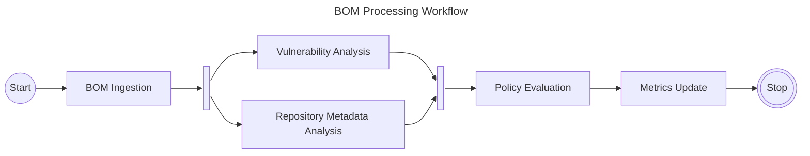
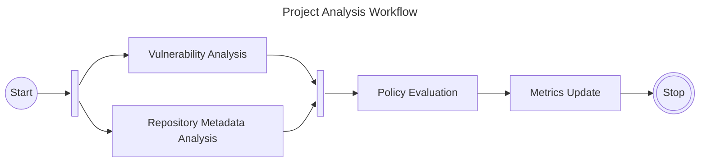
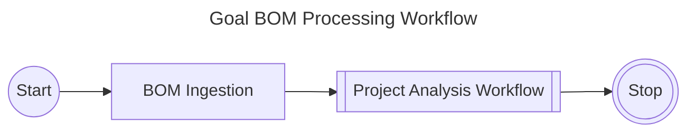

| Status   | Date       | Author(s)                            |
|:---------|:-----------|:-------------------------------------|
| Proposed | 2025-01-16 | [@nscuro](https://github.com/nscuro) |

## Context

By dropping the Kafka dependency ([ADR-001]), we are now missing a way to enqueue
and distribute work for asynchronous execution.

Dependency-Track v4 used an in-memory queue, which is neither reliable (queued messages are lost on restart),
nor cluster-friendly (queue is not shared by multiple instances).

As part of [ADR-001], we explored options such as introducing a different, more lightweight message
broker. Another alternative was the introduction of an in-memory data grid (IMDG).
We decided against these options, and opted for leveraging the existing Postgres infrastructure instead.

We also expressed having grown unhappy with the choreography-style architecture,
as it complicates observability and is hard to grasp. A solution that is more akin to an
orchestrator is desirable.

### Requirements

To better understand our requirements, we explain them based on workflows we're dealing with today.
One of the core workflows in Dependency-Track is processing uploaded BOMs:

> Workflow simplified for brevity. Omitted failure compensations and further fork-join patterns.  
> In reality, *Vulnerability Analysis* would split into more steps, one for each enabled analyzer.

Each step is either I/O intensive, or relies on external systems. It is not practical to execute
all steps synchronously. Depending on the size of the BOM and system load, an execution of this
workflow can take anywhere from a few milliseconds, to multiple minutes.

However, BOM uploads are not the only way in which a project analysis may be triggered:

* All projects are re-analyzed on a recurring basis, at least daily.
* Users can manually request a re-analysis of specific projects.

This means that project analysis should ideally be its own, reusable workflow:

It could then be launched individually, or reused as follows:

#### Concurrency control

To prevent race conditions and redundant work, an instance of the *Project Analysis* workflow for any given
project should prevent other instances of *Project Analysis* for the same project from executing concurrently.
This should be true even if the *Project Analysis* is part of another workflow, e.g. *BOM Upload Processing*.
As such, **workflow instances must be treated as dedicated units of work, rather than a simple chain of tasks**.

#### Fairness

Since workflows can be triggered as part of a client interaction (i.e. BOM upload, explicit request), *and* on schedule,
it is critical that the former take precedence over the latter. The system performing a scheduled analysis of all projects
in the portfolio should not prevent clients from receiving feedback in a timely manner. There must be a mechanism
to prioritize work.

We expect to run multiple types of workflows on the system. Many instances of workflow `A` being scheduled for
execution should not cause execution of instances of workflow `B` to be delayed. Work queues must be isolated.

#### Performance

Throughput is more important than latency for Dependency-Track. This is particularly true
as we aim to raise the ceiling of how many projects we can support in a portfolio.

Due to tasks being I/O-heavy, speed of scheduling and queueing of tasks in itself is not anticipated to be a
limiting factor of the system. If the execution of a single task takes longer than a second, it's acceptable
for dequeueing of `N >= 1` tasks to take up to a few hundreds of milliseconds. Given proper indexing, autovacuum
configuration, and fast disks, Postgres should support dequeue queries *well below* 100ms, even for very large queues.

Since we have at least one workflow that will be scheduled for each project in the portfolio, at least daily,
the system must be able to handle large queue depths. Assuming a portfolio of 100k projects, a queue depth of
at least 100k tasks must be supported with little to no performance degradation as the bare minimum.

We chose to rely on Postgres. A relational, [MVCC]-based database. The workflow orchestration solution
should avoid usage patterns that are suboptimal for Postgres (e.g. lots of small transactions),
and make use of features that allow Postgres to operate more efficiently (e.g. batching, advisory locks, 
`FOR UPDATE SKIP LOCKED`, partitioned tables).

It is expected that the solution can optionally be pointed to a Postgres instance separate from the main
application. This may be necessary for larger deployments, as more tasks are enqueued and more workers
poll for tasks.

#### Resiliency

We frequently interact with external systems which can experience temporary downtime,
or enforce rate limiting, causing RPCs to fail or be rejected. In the majority of cases,
retries are sufficient to recover from such failures. 

Individual workflow steps must be retryable. It should be possible to define a backoff strategy,
as well as a limit after which no more retries will be attempted. A workflow step being retried
should not block the execution of steps belonging to other workflow instances.

In case of node failures, it is expected that uncompleted work is not lost,
and will be picked up by the same node upon restart, or other nodes in the cluster.

#### Scheduling

We have many tasks that need to run repeatedly on a schedule. The currently implemented solution is based on
a combination of in-memory timers and database-backed locks to prevent duplicate executions.

The orchestration system should allow us to schedule recurring workflow executions, e.g. using cron expressions.

Ideally, the system would allow for schedules to be adjusted at runtime, instead of requiring a restart.

#### Observability

Based on interactions with the community, it is clear that not everyone is able or willing to operate infrastructure
for centralized log monitoring and alerting. Further, it is very common for users, even administrative ones,
to *not* have direct access to application logs.

We can thus not rely on logging and metrics instrumentation to ensure observability.  
We need a solution that has observability built in, and allows us to expose it on the application layer.

In extension, records of workflow instances should be retained for a specified amount of time.
This allows retrospective investigation of failures. The retention duration should be configurable.

The intention is to make it easier for users without log access to see what's going on.  
The intention is **not** to replace logs and metrics.  
Both remain crucial for operators of Dependency-Track and must continue to be part of our implementation.

### Possible solutions

#### A: Adopt a job scheduling framework

Multiple open source frameworks for job scheduling using relational databases exist.
Among them [db-scheduler], [JobRunr] and [Quartz]. While they focus on execution of individual
jobs, they usually ship with basic workflow capabilities as well.

Quartz jobs can be chained to form workflows, using [`JobChainingJobListener`](https://www.quartz-scheduler.org/api/2.3.0/org/quartz/listeners/JobChainingJobListener.html).
This functionality is self-described as "poor man's workflow".

[JobRunr] has a [similar concept](https://www.jobrunr.io/en/documentation/pro/job-chaining/), 
but it's only available in the commercial Pro version. As an open source project, we cannot use
commercial tooling.

[db-scheduler] appears to be the most capable option, while being entirely free without commercial offering.
It, too supports job chaining to form workflows of multiple steps.

Job chaining is an implementation of the [routing slip pattern]. This model is akin to what Dependency-Track v4
relied on, and we found it to be both unreliable and limiting at times. Since there is no orchestration layer
in this setup, failure compensations are harder to implement.

Fork-join / [scatter-gather] patterns are not supported by this approach. We need this capability to run certain
workflow steps concurrently, e.g. *Vulnerability Analysis* and *Repository Metadata Analysis*. Additional state-keeping
and coordination is necessary to achieve the desired behavior with job chaining.

Also, none of these options allow job chains to be treated as logical units of work,
which complicates concurrency control, fairness, and monitoring.

#### B: Adopt an embedded workflow engine

Per the [awesome-workflow-engines] list, available Java-based embedded workflow engines
that can cater to our requirements include [COPPER] and [nFlow].

At the time of writing, the [COPPER] repository has not seen any activity for over 6 months.
The documentation is scarce, but [COPPER] appears to be achieving durability by serializing stack
frames of Java code, which leads to many restrictions when it comes to modifying workflows.

[nFlow] requires Spring Framework which we do not use, and we don't plan on changing this.

#### C: Adopt an external workflow engine

Out of all external engines we encountered, [Temporal] is a perfect match. It supports everything we need,
allows us to write workflows as code, and is open source. The same is true for [Cadence], the spiritual predecessor
of [Temporal].

But systems like the above are built so scale, and scale in such a way that can support
entire enterprises in running their workflows on shared infrastructure. This is great,
but comes with a lot of additional complexity that we can't justify to introduce. 
We just need something that supports our own use cases, without additional operational burden.

#### D: Build our own

[Temporal] is a spiritual successor to Microsoft's [Durable Task Framework] (DTFx). DTFx is not an external service,
but an embeddable library. Unfortunately, DTFx is written in C#, so we can not use it.

Microsoft has further invested into a Go port of DTFx: [durabletask-go], which can be used as a Go library,
but also as an external service (i.e. sidecar). It powers [Dapr Workflow] in this configuration. 
[durabletask-go] can be used with various storage backends, among them Postgres. A Java SDK for the 
[durabletask-go] sidecar is available with [durabletask-java]. We don't want to require an external service though,
even if it's *just* a sidecar.

There are also some features that the DTFx implementations do not offer, for example scheduling, prioritization,
and concurrency control. But the foundation for everything else we want is there. And judging by [durabletask-go]'s
code, implementing a DTFx-like engine is doable without a lot of complexity. Various patterns enabled by the DTFx model
can be seen in the [Dapr Workflow Patterns] documentation.

In short, the plan for this solution is as follows:

* Build a Java-based, embeddable port of DTFx, roughly based on the logic of [durabletask-go].
* Omit abstractions to support multiple storage backends, focus entirely on Postgres instead.
* Omit features that we do not need to keep the porting effort low.
* Build features we need on top of this foundation.

This approach allows us to fulfill our current requirements, but also adapt more quickly to new ones in the future.
We completely avoid introduction of additional infrastructure or services, keeping operational complexity low.
The solution is also not entirely bespoke, since we can lean on design decisions of the mature and proven DTFx ecosystem.

## Decision

We will follow option *D*.

## Consequences

A DTFx port as outlined in [D: Build our own](#d-build-our-own) needs to be developed.

This work was already started to evaluate feasibility of this approach.
The current state of the code is available here:

* [`DependencyTrack/hyades-apiserver@workflow-v2`](https://github.com/DependencyTrack/hyades-apiserver/tree/workflow-v2/src/main/java/org/dependencytrack/workflow)
* [`DependencyTrack/hyades-frontend@workflow-v2`](https://github.com/DependencyTrack/hyades-frontend/tree/workflow-v2/src/views/workflowRuns)

A corresponding design document that describes our implementation will follow.

[ADR-001]: ./001-drop-kafka-dependency.md
[awesome-workflow-engines]: https://github.com/meirwah/awesome-workflow-engines
[Cadence]: https://cadenceworkflow.io/
[COPPER]: https://copper-engine.org/
[Dapr Workflow]: https://docs.dapr.io/developing-applications/building-blocks/workflow/workflow-overview/
[Dapr Workflow Patterns]: https://docs.dapr.io/developing-applications/building-blocks/workflow/workflow-patterns/
[db-scheduler]: https://github.com/kagkarlsson/db-scheduler
[Durable Task Framework]: https://github.com/Azure/durabletask
[durabletask-go]: https://github.com/microsoft/durabletask-go
[durabletask-java]: https://github.com/microsoft/durabletask-java
[JobRunr]: https://www.jobrunr.io/en/
[JWorkflow]: https://github.com/danielgerlag/jworkflow
[MVCC]: https://www.postgresql.org/docs/current/mvcc.html
[nFlow]: https://nflow.io/
[Quartz]: https://www.quartz-scheduler.org/
[routing slip pattern]: https://www.enterpriseintegrationpatterns.com/patterns/messaging/RoutingTable.html
[scatter-gather]: https://www.enterpriseintegrationpatterns.com/patterns/messaging/BroadcastAggregate.html
[Temporal]: https://temporal.io/