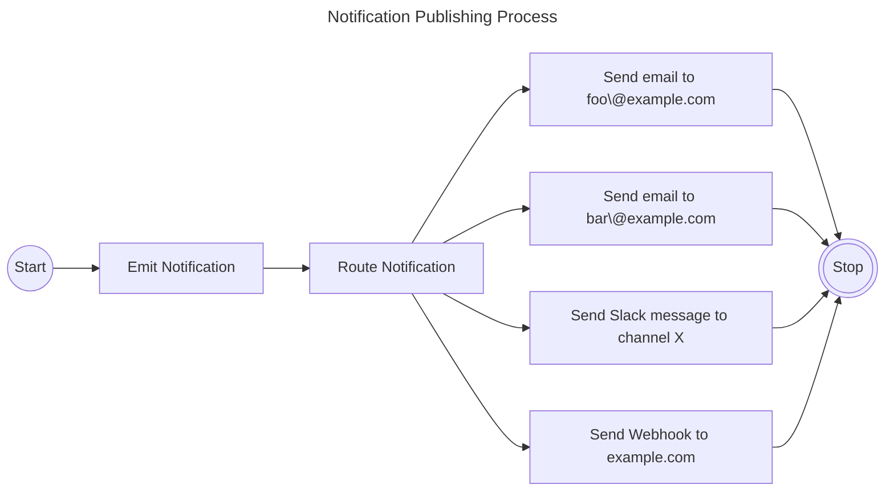
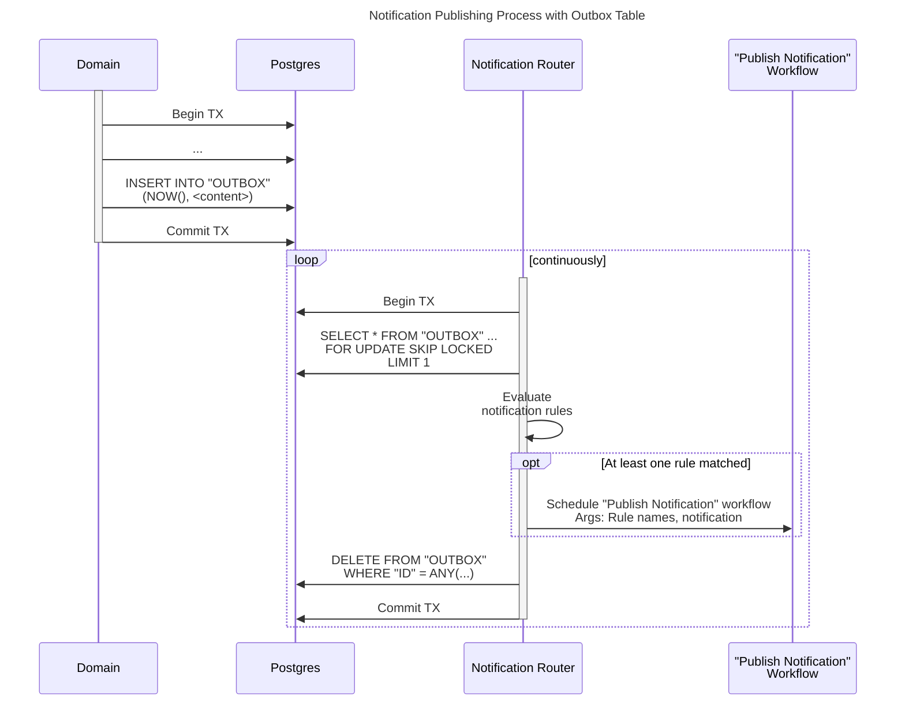
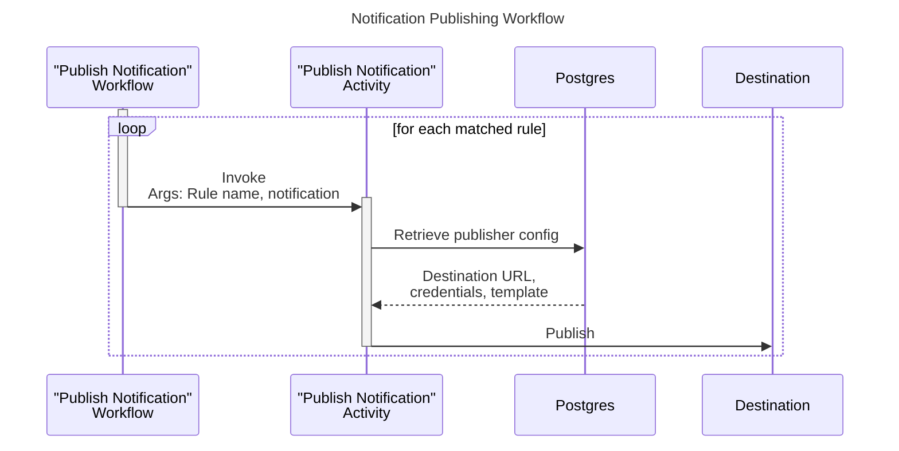
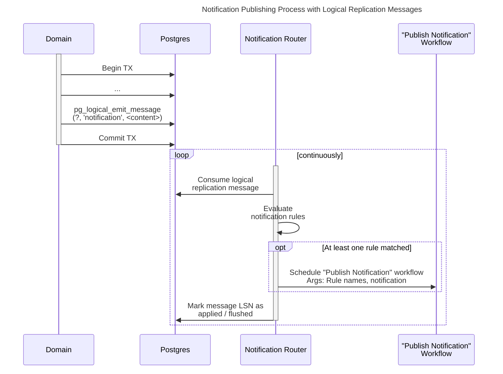
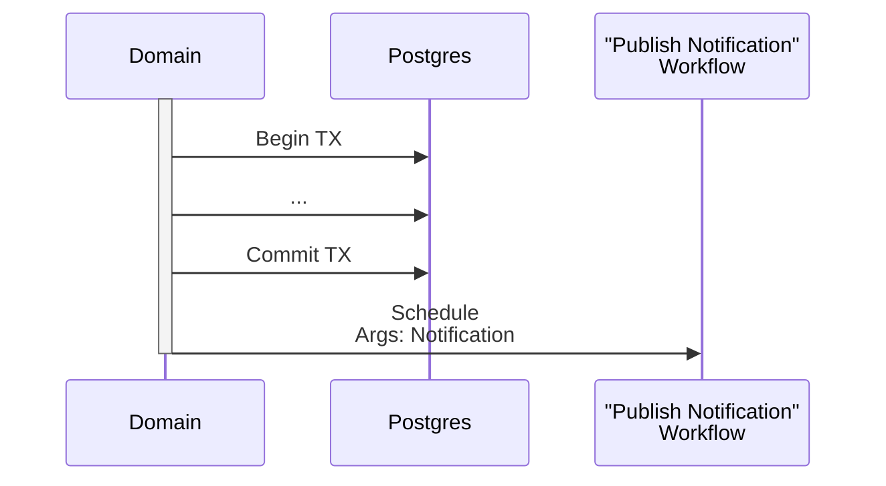
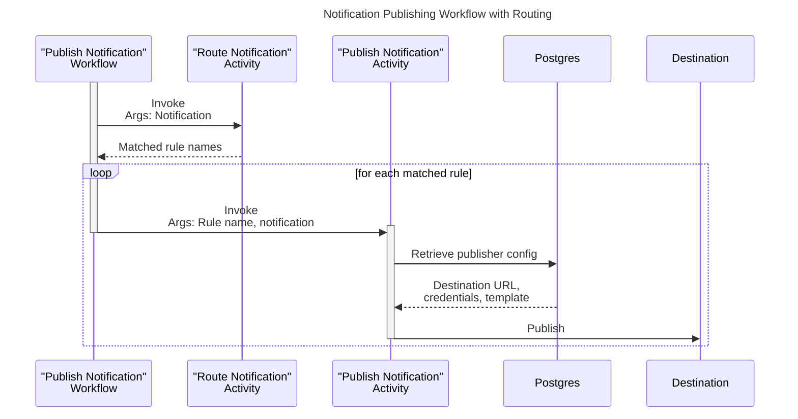

| Status   | Date       | Author(s)                            |
|:---------|:-----------|:-------------------------------------|
| Proposed | 2025-01-19 | [@nscuro](https://github.com/nscuro) |

## Context

By dropping the Kafka dependency ([ADR-001]), we are now missing a means to reliably dispatch
notifications. Users are building processes around the notifications we send, so we must ensure
that whatever we replace Kafka with offers the same or better delivery guarantees.

### Background

Users can configure multiple notification rules (known as *Alerts* in the UI). A rule semantically acts like a consumer,
which subscribes to one or more subjects (aka *Notification Groups*, e.g. `BOM_PROCESSED`, `NEW_VULNERABILITY`),
and publishes those notification to a destination (e.g. email, Slack, Webhook).

Rules can further be limited to specific projects or tags, which acts like an additional filter.

This means that a notification emitted by Dependency-Track "fans-out" to zero or more rules:

Because each rule has a separate destination, the publishing process for them can fail independently.
For example, the email server could be down, the Jira credentials could have expired, or Slack could enforce rate limiting.

In Dependency-Track v4, the routing of notifications according to the configured rules, as well as the
publishing according to those rules, are performed as a single unit of work. There are no retries.

So far in Hyades, we emit notifications to Kafka instead. The routing and publishing still happens in a single
unit of work, but in the separate `notification-publisher` service. The service uses [Confluent Parallel Consumer]
to implement retries. However, these retries can cause duplicates, as documented in [hyades/#771].

### Requirements

#### Atomicity

A limitation of the in-memory, as well as the Kafka-based notification mechanism, is that emission of notifications
can't happen atomically with the state change they inform about. Both approaches suffer from the [dual write problem].
Although not technically a hard requirement, we want atomic notification emission to be *possible*.

Note that notification *delivery* to external systems **can't** be atomic.
Exactly-once delivery is [impossible](https://bravenewgeek.com/you-cannot-have-exactly-once-delivery/).

#### At-least-once delivery

Notifications must be delivered to destination systems *at least once*. Duplicate deliveries are acceptable,
loss of notifications is not.

#### Isolation of deliveries

Notification deliveries must be processed in isolation, and separate from the routing itself.
Only then can deliveries be retried without causing the issue described in [hyades/#771].
More specifically, each delivery must be a separate unit of work in a queue.

### Constraints

#### Notification format

All solutions should treat notification contents as binary blobs. During our initial move to Kafka,
we adopted [Protobuf] to serialize notifications over-the-wire. We intend to keep it this way,
since [Protobuf] makes it easy to perform backward-compatible changes over time. It is also faster
to serialize, and more compact than JSON.

The current [Protobuf] model is defined
[here](https://github.com/DependencyTrack/hyades/blob/589b58042c096865c48939c8db79ef950fd94d20/proto/src/main/proto/org/dependencytrack/notification/v1/notification.proto).

#### No new infrastructure

No new infrastructure must be introduced. The solution should leverage the workflow orchestration capabilities
described in [ADR-002]. This will take care of queueing, observability, and resiliency needs.

#### Payload size

As noted in [ADR-001], notifications can be large: `BOM_CONSUMED` and `BOM_PROCESSED` notifications include the entire
BOM in Base64-encoded format. `PROJECT_VULN_ANALYSIS_COMPLETE` notifications include all vulnerabilities of a project.
While Postgres *can* store large columns (see [TOAST]), it comes with penalties affecting performance, maintenance,
and backups. Potent compression (e.g. using `zstd`) will most definitely be necessary for all solutions.
Postgres itself will compress large values, too, but using a less effective algorithm (`pglz`).

> Starting with Postgres v14, the default compression algorithm for [TOAST]-ed tables can be changed to `lz4`.
> This should be added to our [database operations guide](../../operations/database.md).
> `lz4` [performs noticeably better](https://www.timescale.com/blog/optimizing-postgresql-performance-compression-pglz-vs-lz4)
> than `pglz`.

### Possible Solutions

#### A: Use transactional outbox pattern

The [transactional outbox] pattern involves a separate *outbox* table, where to-be-dispatched notifications
are inserted into as part of a database transaction. A simple outbox table might look like this:

| Column Name | Column Type   |
|:------------|:--------------|
| `ID`        | `BIGINT`      |
| `TIMESTAMP` | `TIMESTAMPTZ` |
| `CONTENT`   | `BYTEA`       |

The pattern is mostly meant to deal with the [dual write problem], but it could also act as a work queue:
A pool of workers polls the table in regular intervals, and either deletes polled records, or marks them as delivered:

Outbox items are dequeued, processed, and marked as completed in a single database transaction,
using the `FOR UPDATE SKIP LOCKED` clause to allow for multiple concurrent pollers.

If workflow scheduling fails, the transaction is rolled back, and the respective record will be retried
during the next poll.

> The workflow engine may reside on a separate database, so scheduling of workflows 
> can't happen atomically with the polling of outbox records. It is possible that a
> workflow gets scheduled, but committing of the transaction fails. In worst case,
> multiple workflows get scheduled for the same notification. This should be rare,
> but it would still satisfy our at-least-once delivery goal.

The actual delivery is then taken care of by a workflow:

**Pro**:

1. Allows for atomic emission of notifications.
2. When marking outbox records as processed instead of deleting them, enables (targeted) replay of past notifications.
3. When partitioning the outbox table by timestamp, cheap retention enforcement via `DROP TABLE`.
4. Allows for multiple concurrent routers. 

**Con**:

1. More database overhead: `INSERT`s, `UPDATE`s / `DELETE`s, polling, vacuuming, retention, storage.
2. Overhead can't be delegated to separate database without losing transactional guarantees.
3. Duplicates queueing logic we already have in the workflow orchestration system.
4. Partitioning by timestamp requires partition management, either manually or via `pg_partman`.
5. Multiple concurrent routers increase the chance of delivering notifications out-of-order.
6. When not using partitioning, requires a separate retention enforcement mechanism.

#### B: Use Postgres logical replication messages

A way to sidestep the drawbacks of maintaining an outbox table is to emit and consume logical replication messages.
Here, notifications are written to Postgres' write-ahead-log (WAL), but never materialized into an actual table.
This still provides transactional guarantees, but completely avoids the overhead of table maintenance.

The procedure is inspired by Gunnar Morling's 
[*The Wonders of Postgres Logical Decoding Messages*](https://www.infoq.com/articles/wonders-of-postgres-logical-decoding-messages/)
article.

Conceptually, the process of publishing notification remains mostly identical to
[option A](#a-use-transactional-outbox-pattern):

Instead of polling a table, the router reads a stream of messages from a logical replication slot.
Each message has an associated log sequence number (LSN), which represents its position in the WAL.
In order for Postgres to know that a message was delivered successfully, the router acknowledges
the LSN of processed messages. This is similar to how Kafka uses offset commits to track progress
within a topic partition.

The *Publish Notification* workflow being scheduled remains identical to [option A](#a-use-transactional-outbox-pattern).

**Pro**:

1. Allows for atomic emission of notifications.
2. Less pressure on the WAL. [Option A](#a-use-transactional-outbox-pattern) involves *at least* one `INSERT`,
   and one `UPDATE` or `DELETE` per notification, each of which writes to the WAL, too.
3. No increase in storage requirements.
4. No retention logic necessary.
5. No additional overhead for autovacuum.

**Con**:

1. Only a single instance can consume from a replication slot at a time.
2. Logical replication requires a special kind of connection, thus can't go through a connection pooler.
3. Requires Postgres v14 or later. This is when the default `pgoutput` decoding plugin started to support
   consumption of replication messages.

#### C: Schedule workflows directly

This option is similar to [A](#a-use-transactional-outbox-pattern) and
[B](#b-use-postgres-logical-replication-messages), but skips the respective intermediary step.

Notifications are no longer emitted atomically with the domain's persistence operations, 
but instead *after* the database transaction committed successfully, effectively re-introducing the [dual write problem]:

The routing based on configured notification rules is performed as part of the *Publish Notification* workflow.

**Pro**:

1. Fewer moving parts than options [A](#a-use-transactional-outbox-pattern) and
   [B](#b-use-postgres-logical-replication-messages).
2. All concerns related to publishing are neatly encapsulated in a workflow.
3. Rule resolution benefits from the same reliability guarantees as the publishing itself.

**Con**:

1. Atomic emission of notifications is impossible.
2. Workflows are scheduled even if no rule may be configured for the notification at hand,
   increasing pressure on the workflow system.

## Decision

We propose to follow option [B](#b-use-postgres-logical-replication-messages), because:

1. Maintaining an outbox table as detailed in option [A](#a-use-transactional-outbox-pattern) comes with a lot of
overhead that we prefer to not deal with.
2. Option [C](#c-schedule-workflows-directly) does not provide transactional guarantees.

TODO: Update with final decision.

## Consequences

* The minimum required Postgres version becomes 14. This version is over three years old and well-supported
  across all managed offerings. We don't anticipate it to be a problem.
* It must be possible to configure separate database connection details for the notification router,
  in case a pooler like PgBouncer is used. Logical replication requires a direct connection.

[ADR-001]: 001-drop-kafka-dependency.md
[ADR-002]: 002-workflow-orchestration.md
[Confluent Parallel Consumer]: https://github.com/confluentinc/parallel-consumer
[dual write problem]: https://www.confluent.io/blog/dual-write-problem/
[hyades/#771]: https://github.com/DependencyTrack/hyades/issues/771
[Protobuf]: https://protobuf.dev/
[TOAST]: https://www.postgresql.org/docs/current/storage-toast.html
[transactional outbox]: https://microservices.io/patterns/data/transactional-outbox.html