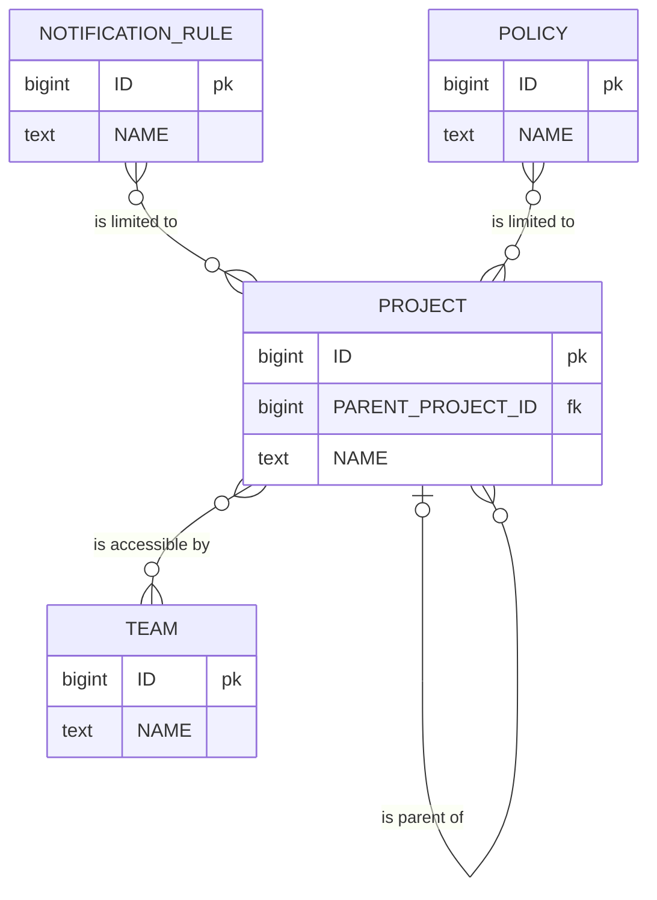
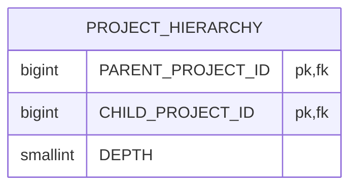
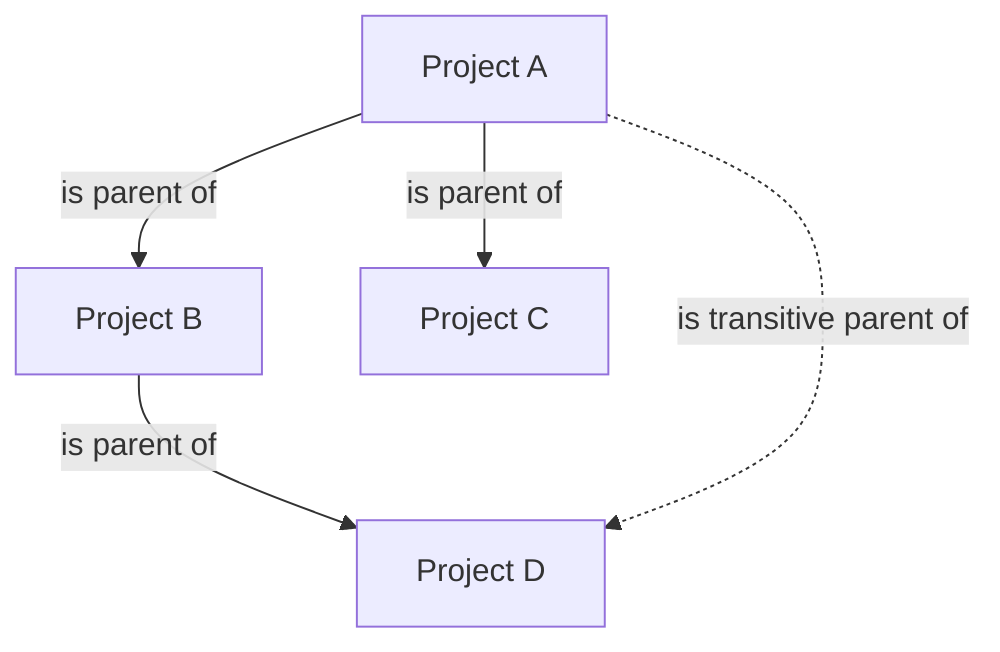

| Status   | Date       | Author(s)                            |
|:---------|:-----------|:-------------------------------------|
| Accepted | 2025-03-08 | [@nscuro](https://github.com/nscuro) |

## Context

### Current model

Heavily simplified data model of projects and how they relate to other functionalities of the system:



* Projects can form hierarchies by referencing their respective parent.
* Portfolio ACL requires teams to be given explicit access to specific projects.
For project hierarchies, child projects are expected to be implicitly accessible,
if access was granted to a respective parent project. 
* Notification rules can be limited to specific projects, such that they only trigger for a subset
of projects in a portfolio. Rules can further decide to include children of projects associated with them.
* Policies can be limited to apply to only a subset of projects, similar to notification rules.

### Access patterns

With this model, evaluation of project hierarchies necessitates a [recursive CTE].  
For example, the following query retrieves the IDs of all parents of a project with ID `projectId`:

```sql linenums="1"
with recursive project_hierarchy(id, parent_id) as(
  select "ID" as id
       , "PARENT_PROJECT_ID" as parent_id
    from "PROJECT"
   where "ID" = :projectId
   union all
  select "PROJECT"."ID" as id
       , "PROJECT"."PARENT_PROJECT_ID" as parent_id
    from "PROJECT"
   inner join project_hierarchy
      on project_hierarchy.parent_id = "PROJECT"."ID"
)
select id
  from project_hierarchy
```

To support portfolio ACL inheritance, we consider a project to be accessible by a team,
if either the project itself is, or *any* of its parents are accessible. Given the SQL query
above, an inheritance-aware ACL check can be expressed like this:

```sql linenums="1"
with recursive project_hierarchy(id, parent_id) as(/* See above */)
select exists(
  select 1
    from project_hierarchy
   inner join "PROJECT_ACCESS_TEAMS"
      on "PROJECT_ACCESS_TEAMS"."PROJECT_ID" = project_hierarchy.id
   where "PROJECT_ACCESS_TEAMS"."TEAM_ID" = :teamId
)
```

For historical reasons, we also have various cases of hierarchy checks in Java code.
This is horribly inefficient of course, because it requires loading of all projects forming
the hierarchy into memory.  

An example is [`ProjectQueryManager#isChildOf(Project, UUID)`](https://github.com/DependencyTrack/hyades-apiserver/blob/85f87a09af93747473ca3cb2cbedd7b38d206ac7/src/main/java/org/dependencytrack/persistence/ProjectQueryManager.java#L1310-L1320):

```java linenums="1"
private static boolean isChildOf(Project project, UUID uuid) {
    boolean isChild = false;
    if (project.getParent() != null) {
        if (project.getParent().getUuid().equals(uuid)) {
            return true;
        } else {
            isChild = isChildOf(project.getParent(), uuid);
        }
    }
    return isChild;
}
```

### Challenges

While this "works", it still poses challenges:

1. The complete hierarchy must be constructed before ACL checks can be performed.
2. Constructing project hierarchies ad-hoc is expensive, especially for hierarchies spanning multiple levels.
3. Expensiveness is amplified for list operations, i.e. "list all projects a user has access to".
4. Hierarchy checks are common in the "hot path", e.g. during notification routing and policy evaluation.

## Decision

Introduce a new table `PROJECT_HIERARCHY`. The table is responsible for storing "flattened" parent-child
relationships:



"Flattened" in this case means that instead of only *direct* relationships, it will also contain *transitive* relationships.  
The depth always denotes the distance between the respective parent and child.

For the hierarchy `A -> B -> C`, we will store:

* `A -> B` (depth `1`)
* `B -> C` (depth `1`)
* `A -> C` (depth `2`)

This allows for fast lookups no matter how deep the hierarchy is: A check for whether `C` is a child of `A` is
as efficient as a check for whether `C` is a child of `B` and vice versa.

We will additionally use self-referential records for each project in the form of:

* `A -> A` (depth `0`)
* `B -> B` (depth `0`)
* `C -> C` (depth `0`)

This ensures that projects are present in the table, even if they're not explicitly part of a hierarchy.  
Self-referential records will always have the depth `0`, making them easy to filter out if needed.

### Maintenance

The `PROJECT_HIERARCHY` table being separate from the `PROJECT` table, additional maintenance
work is required in order to keep it up-to-date as projects are created, updated, or deleted.

#### Project creation

When a new project gets created, we have to:

1. Create a self-referential record with depth `0` for the new project.
2. Create new records pointing from all parents of the new project's parent, to the new project.

#### Project update with new parent

When an existing project's parent project changes, we have to:

1. Delete records which reference the updated project as child.
    * By design this includes self-referential records.
2. Create a self-referential record with depth `0` for the project.
3. Create new records pointing from all parents of the project's new parent, to the project.

#### Project deletion

When a project is deleted, we have to:

1. Delete records which reference the updated project as child.
    * By design this includes self-referential records.

#### Using database triggers

We're going to use database [triggers] to maintain the `PROJECT_HIERARCHY` table, because:

* Leveraging [DataNucleus lifecycle listeners] requires affected projects to be loaded into memory first.
    * Incompatible with usage of `ON DELETE CASCADE` on foreign keys: If the database performs cascading deletes,
      the ORM can no longer load those deleted records. We specifically added cascading deletes for efficiency reasons,
      and don't want to drop them again.
    * Becomes extremely inefficient for batch deletes, particularly in the context of project retention enforcement,
      where we might delete multiple hundreds or thousands of projects in one go.
* Manual maintenance is too error-prone. We don't want to play whack-a-mole with code where we forgot to perform maintenance.
    * Would need to duplicate maintenance logic for code that uses raw SQL instead of DataNucleus.
    * Logic would need to be ported to the `hyades` repository to make `PROJECT_HIERARCHY` usable in tests.
* Updating the `PROJECT_HIERARCHY` table is extremely cheap and does not involve any business logic.
* Data will remain consistent even when project records are modified outside the application context.
* Triggers require no changes in existing code. Everything just works.

### Example

Consider the following project hierarchy:



It would be represented as follows in the `PROJECT` table:

| ID | NAME      | PARENT_PROJECT_ID |
|:---|:----------|:------------------|
| 1  | Project A | null              |
| 2  | Project B | 1                 |
| 3  | Project C | 1                 |
| 4  | Project D | 2                 |

The corresponding `PROJECT_HIERARCHY` table content would look like this:

| PARENT_PROJECT_ID | CHILD_PROJECT_ID | DEPTH |
|:------------------|:-----------------|:------|
| 1                 | 1                | 0     |
| 2                 | 2                | 0     |
| 3                 | 3                | 0     |
| 4                 | 4                | 0     |
| 1                 | 2                | 1     |
| 1                 | 3                | 1     |
| 2                 | 4                | 1     |
| 1                 | 4                | 2     |

To facilitate access control, assume the team with ID `1` to have been given access to project `B`.
Consequently, `PROJECT_ACCESS_TEAMS` will contain the following record:

| PROJECT_ID | TEAM_ID |
|:-----------|:--------|
| 2          | 1       |

In order to check whether team `1` can access `Project D` (child of `Project B`), we can use this query:

```sql linenums="1"
select exists(
  select 1
    from "PROJECT_ACCESS_TEAMS" as access_teams
   inner join "PROJECT_HIERARCHY" as hierarchy
      on hierarchy."PARENT_PROJECT_ID" = access_teams."PROJECT_ID"
   where access_teams."TEAM_ID" = 1
     and hierarchy."CHILD_PROJECT_ID" = 4
)
```

Which should return `true`.

Alternatively, a check for whether `Project D` is a child of `Project A` becomes:

```sql linenums="1"
select exists(
  select 1
    from "PROJECT_HIERARCHY" as hierarchy
   inner join "PROJECT" as parent_project
      on parent_project."ID" = hierarchy."PARENT_PROJECT_ID"
   inner join "PROJECT" as child_project
      on child_project."ID" = hierarchy."CHILD_PROJECT_ID"
   where parent_project."NAME" = 'Project A'
     and child_project."NAME" = 'Project D'
)
```

### Considered alternatives

[@mulder999] [suggested](https://github.com/DependencyTrack/dependency-track/issues/2042#issuecomment-2708506664)
a similar approach that reuses the existing `PROJECT` table:

```sql
CREATE TABLE PROJECT (
  project_id SERIAL PRIMARY KEY,
  name VARCHAR(255) NOT NULL,
  root_parent_id INT NOT NULL,
  depth INT NOT NULL,
  parent_id INT NOT NULL,    
  CONSTRAINT fk_root_parent FOREIGN KEY (root_parent_id) REFERENCES PROJECT(project_id),
  CONSTRAINT fk_parent FOREIGN KEY (parent_id) REFERENCES PROJECT(project_id)    
);

INSERT INTO PROJECT (project_id, name, root_parent_id, depth, parent_id) VALUES
  (1, 'Project A', 1, 0, 1),
  (2, 'Project B', 1, 1, 1),
  (3, 'Project D', 1, 2, 2),
  (4, 'Project F', 1, 3, 3),
  (5, 'Project H', 1, 4, 4),
  (6, 'Project J', 1, 5, 5),
  (40, 'Project Fxx', 1, 3, 3),
  (50, 'Project Hxx', 1, 4, 40),
  (60, 'Project Jxx', 1, 5, 50);

SELECT * -- To show there is no extra records captured
  FROM PROJECT AS project_parent
INNER JOIN PROJECT AS project_child ON project_parent.root_parent_id = project_child.root_parent_id
  AND project_parent.depth < project_child.depth
WHERE project_parent.name like 'Project D'
  AND project_child.name like 'Project H';
```

But also [noted](https://github.com/DependencyTrack/dependency-track/issues/2042#issuecomment-2708718402):

> Sorry this does not work as it captures some mixed up trees. For eg: `Project Fxx` and `Project J`
> would be captured and indeed one would need to load more info to complete filtering in memory. 
> If you need the subtree in memory and don't have too many sibling subtrees you are not interested in, 
> this might still be a valid approach.

## Consequences

* The `PROJECT_HIERARCHY` table must be maintained whenever a project is created, deleted,
  or its `PARENT_PROJECT_ID` column is updated. While cheap, it still introduces additional overhead for write operations.
* Code that historically used recursive CTEs or Java code can trivially be optimized by leveraging the new table.

[DataNucleus lifecycle listeners]: https://www.datanucleus.org/products/accessplatform_6_0/jdo/persistence.html#lifecycle_listeners
[Functions are blackboxes]: https://dba.stackexchange.com/a/8189
[recursive CTE]: https://www.postgresql.org/docs/current/queries-with.html#QUERIES-WITH-RECURSIVE
[triggers]: https://www.postgresql.org/docs/current/triggers.html

[@mulder999]: https://github.com/mulder999
