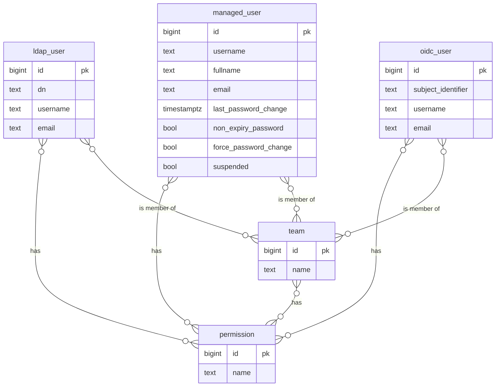
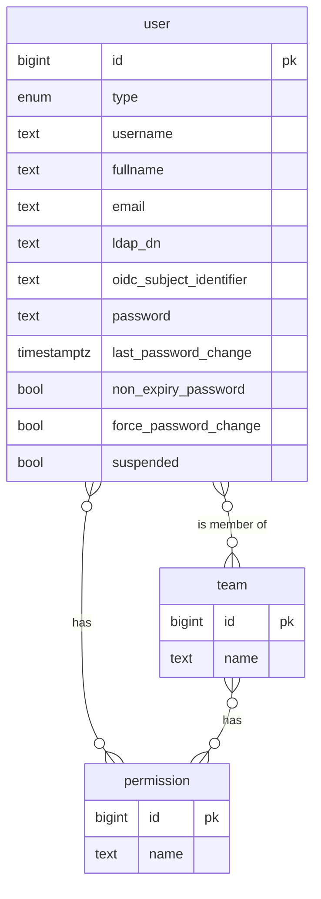

| Status   | Date       | Author(s)                            |
|:---------|:-----------|:-------------------------------------|
| Proposed | 2025-04-16 | [@nscuro](https://github.com/nscuro) |

## Context

The current data model treats managed users, LDAP users, and OIDC users as different entities.  
This leads to redundancies, both in database tables and application code.

### Data Model



### Drawbacks

* The uniqueness of usernames cannot be enforced across all user tables.
* Queries to determine or modify permissions of a user are unnecessarily complex.
* Higher cognitive burden due to the many redundant relationships.

## Decision

* Consolidate all user tables in a single table.
* Use a discriminator column to keep different types apart.
* Leverage check constraints in the database to handle invariants.
* Use inheritance strategies for mapping the new model to JDO classes.

[@jhoward-lm](https://github.com/jhoward-lm) provides a more thorough draft implementation in
[this Gist](https://gist.github.com/jhoward-lm/39ae80d40ad3ad3b40fe7f17f79e7243).

### Data Model



### Invariants

Not all fields make sense for all user types:

* LDAP and OIDC users don't have a password.
* Managed users have no LDAP DN or OIDC subject identifier.

Such invariants should be prevented at the database level, using `check` constraints. For example:

```sql
  ADD CONSTRAINT check_user_type
CHECK ("TYPE" IN ('MANAGED', 'LDAP', 'OIDC'));

ALTER TABLE "USER"
  ADD CONSTRAINT check_managed_columns
CHECK (
    ("TYPE" = 'MANAGED'
        AND "FORCE_PASSWORD_CHANGE" IS NOT NULL
        AND "LAST_PASSWORD_CHANGE" IS NOT NULL
        AND "NON_EXPIRY_PASSWORD" IS NOT NULL
        AND "PASSWORD" IS NOT NULL
        AND "SUSPENDED" IS NOT NULL)
    OR
    ("TYPE" != 'MANAGED'
        AND "FORCE_PASSWORD_CHANGE" IS NULL
        AND "FULLNAME" IS NULL
        AND "LAST_PASSWORD_CHANGE" IS NULL
        AND "NON_EXPIRY_PASSWORD" IS NULL
        AND "PASSWORD" IS NULL
        AND "SUSPENDED" IS NULL)
);

ALTER TABLE "USER"
  ADD CONSTRAINT check_ldap_columns
CHECK (
    ("TYPE" = 'LDAP' AND "DN" IS NOT NULL)
    OR ("TYPE" != 'LDAP' AND "DN" IS NULL)
);

ALTER TABLE "USER"
  ADD CONSTRAINT check_oidc_columns
CHECK ("TYPE" = 'OIDC' OR "SUBJECT_IDENTIFIER" IS NULL);
```

### JDO Mapping

To ease interaction with this consolidated model using JDO / DataNucleus, the mapping will
be adjusted to use the [inheritance](https://www.datanucleus.org/products/accessplatform_6_0/jdo/mapping.html#inheritance)
strategy [`SUPERCLASS_TABLE`](https://www.datanucleus.org/products/accessplatform_6_0/jdo/mapping.html#inheritance_superclasstable). 

The abstract `User` class will hold all fields and relationships that are common among all user types.

```java
@PersistenceCapable(table = "USER")
@Discriminator(column = "TYPE", strategy = DiscriminatorStrategy.VALUE_MAP, value = "USER")
@Inheritance(strategy = InheritanceStrategy.NEW_TABLE)
public abstract class User implements Serializable, Principal {

    @PrimaryKey
    @Persistent(valueStrategy = IdGeneratorStrategy.NATIVE)
    private long id;

    @Persistent(table = "USERS_TEAMS")
    @Join(column = "USER_ID")
    @Element(column = "TEAM_ID")
    private List<UserTeam> teams;

    @Persistent(table = "USERS_PERMISSIONS")
    @Join(column = "USER_ID")
    @Element(column = "PERMISSION_ID")
    private List<PermissionsImpl> permissions;

    @Persistent
    @Column(name = "USERNAME")
    private String username;

    @Persistent
    @Column(name = "EMAIL")
    private String email;

    @PersistenceCapable
    @Inheritance(strategy = InheritanceStrategy.SUPERCLASS_TABLE)
    @Discriminator(value = "LDAP")
    public static class Ldap extends User {

        @Persistent
        @Column(name = "DN")
        private String dn;

    }

    @PersistenceCapable
    @Inheritance(strategy = InheritanceStrategy.SUPERCLASS_TABLE)
    @Discriminator(value = "MANAGED")
    public static class Managed extends User {

        @Persistent
        @Column(name = "PASSWORD")
        private String password;

        @Persistent
        @Column(name = "LAST_PASSWORD_CHANGE")
        private Date lastPasswordChange;

        @Persistent
        @Column(name = "FULLNAME")
        private String fullname;

        @Persistent
        @Column(name = "SUSPENDED")
        private boolean suspended;

        @Persistent
        @Column(name = "FORCE_PASSWORD_CHANGE")
        private boolean forcePasswordChange;

        @Persistent
        @Column(name = "NON_EXPIRY_PASSWORD")
        private boolean nonExpiryPassword;

    }

    @PersistenceCapable
    @Inheritance(strategy = InheritanceStrategy.SUPERCLASS_TABLE)
    @Discriminator(value = "OIDC")
    public static class Oidc extends User {

        @Persistent
        @Column(name = "SUBJECT_IDENTIFIER")
        private String subjectIdentifier;

    }

}
```

## Consequences

* Existing user records will need to be migrated.
* Need to decide if we also want to consolidate REST API endpoints or keep the current endpoints and responses
to avoid breaking changes. This could be a multi-stage effort as well.