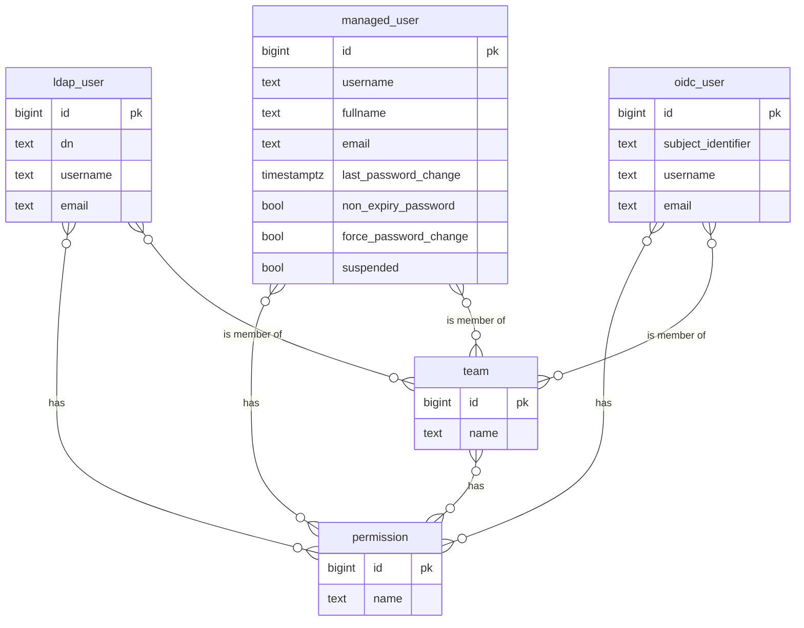
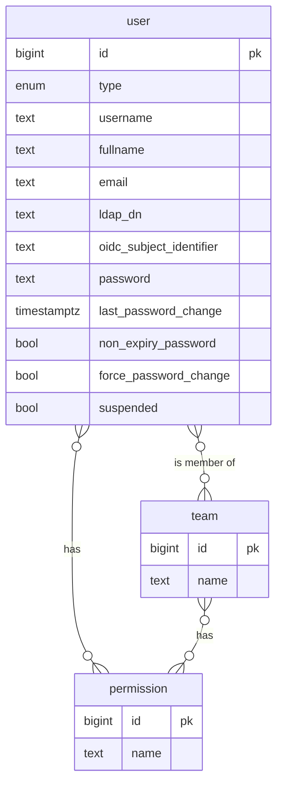

| Status   | Date       | Author(s)                            |
|:---------|:-----------|:-------------------------------------|
| Proposed | 2025-04-16 | [@nscuro](https://github.com/nscuro) |

## Context

What is the issue that we're seeing that is motivating this decision or change?

### Data Model



### Drawbacks

* Uniqueness of usernames cannot be enforced across all user tables.
* Queries to determine permissions of a user are unnecessarily complex.

## Decision

What is the change that we're proposing and/or doing?

### Data Model



### Invariants

Not all fields make sense for all user types:

* LDAP and OIDC users don't have a password.
* Managed users have no LDAP DN or OIDC subject identifier.

Such invariants should be prevented at the database level, using `check` constraints. For example:

```sql
(type = 'managed' and password is not null and ldap_dn is null and oidc_subject_identifier is null)
or (type = 'ldap' and password is null and ldap_dn is not null and oidc_subject_identifier is null)
or (type = 'oidc' and password is null and ldap_dn is null and oidc_subject_identifier is not null)
```

## Consequences

* Existing user records will need to be migrated.
* Need to decide if we want to consolidate REST API endpoints or keep the current endpoints and responses
to avoid breaking changes.