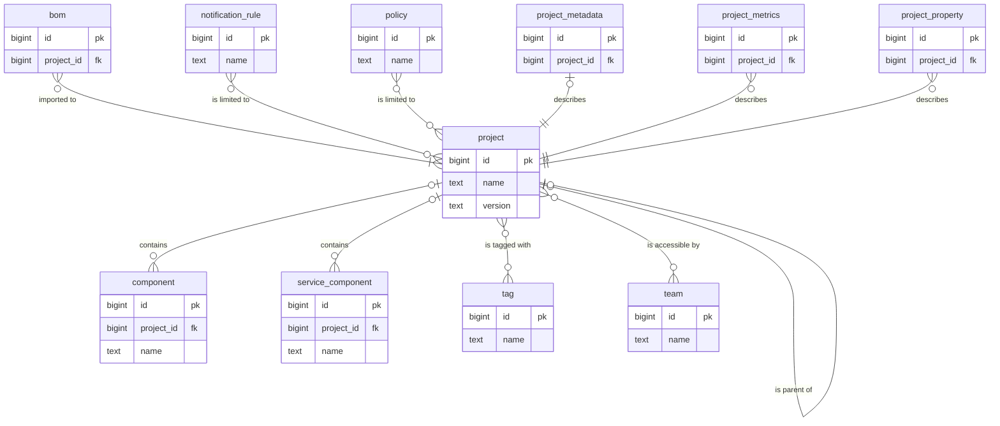
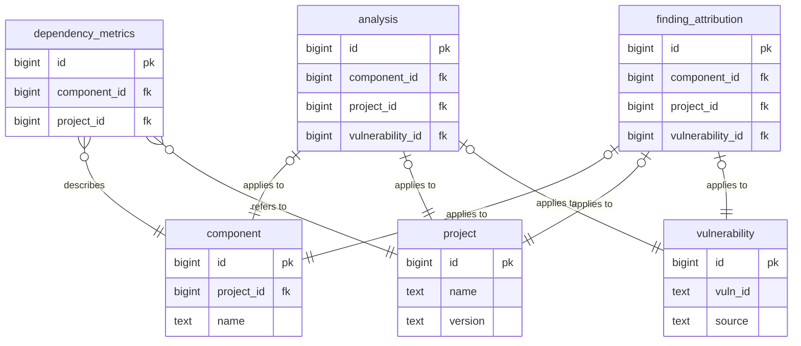
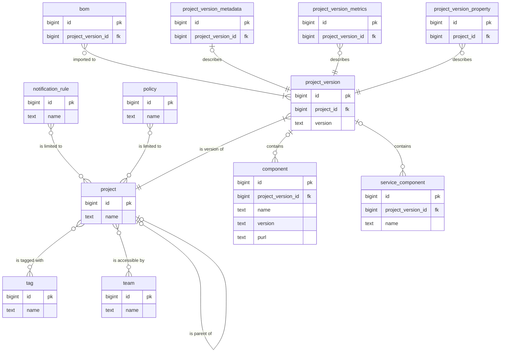
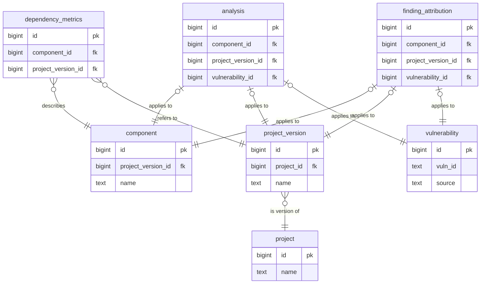

| Status   | Date       | Author(s)                            |
|:---------|:-----------|:-------------------------------------|
| Proposed | 2025-04-15 | [@nscuro](https://github.com/nscuro) |

## Context

Currently, multiple versions of the same project are represented as separate, independent records in the `PROJECT` table.

The concept of a project version is treated very loosely: the fact that two `PROJECT` records represent different
versions of the same project is merely implied by both sharing the same `NAME` column.

This poses a challenge for features such as portfolio ACL, where it becomes increasingly impractical
to explicitly grant access to individual project versions.

### Data Model

In addition to the above, projects are also referred to in certain component-centric relationships.
Here, inclusion of foreign keys on `project` allow queries to skip a `JOIN`. For brevity, such auxiliary relationships
in the model are depicted separately:

## Decision

Decouple the concept of *project* from *project version*.  
This enables features such as portfolio ACL to apply to projects, rather than individual project versions.

### Data Model

The data model may be refactored as follows:

Auxiliary relationships mostly remain the same, in that they're being shifted from `project` to `project_version`.
It might be helpful to add *additional* foreign keys to `project`, but this still remains to be verified.

**TODO**:

- Should tags be allowed for `project` *and* `project_version`?
- Should properties be allowed for `project` *and* `project_version`?

### Field Assignment

By splitting `project` records effectively into two separate entities,
it must be decided which `project` field should remain in `project`,
and which to reassign to `project_version` instead.

| Field                  | Type                          | Belongs To         |
|:-----------------------|:------------------------------|:-------------------|
| authors                | `List<OrganizationalContact>` | `project_version`  |
| publisher              | `String`                      | `project_version`  |
| manufacturer           | `OrganizationalEntity`        | `project_version`  |
| supplier               | `OrganizationalEntity`        | `project_version`  |
| group                  | `String`                      | `project`          |
| name                   | `String`                      | `project`          |
| description            | `String`                      | `project`?         |
| version                | `String`                      | `project_version`  |
| classifier             | `Classifier`                  | `project_version`  |
| cpe                    | `String`                      | `project_version`  |
| purl                   | `String`                      | `project_version`  |
| swidTagId              | `String`                      | `project_version`  |
| directDependencies     | `String`                      | `project_version`  |
| parent                 | (Self)                        | `project`          |
| children               | `List<Self>`                  | `project`          |
| properties             | `List<ProjectProperty>`       | `project_version`? |
| tags                   | `List<Tag>`                   | `project`?         |
| lastBomImport          | `Date`                        | `project_version`  |
| lastBomImportFormat    | `String`                      | `project_version`  |
| lastInheritedRiskScore | `Double`                      | `project_version`  |
| inactiveSince          | `Date`                        | `project_version`  |
| accessTeams            | `Set<Team>`                   | `project`          |
| externalReferences     | `List<ExternalReference>`     | `project_version`  |
| metadata               | `ProjectMetadata`             | `project_version`  |
| isLatest               | `boolean`                     | `project_version`  |

### Project Hierarchies

With the current model, project hierarchies are effectively defined at the project *version* level.

This, however, doesn't make sense once versions are separated from the projects themselves.
It would be confusing to allow versions of a project to be scattered across multiple hierarchies,
or hierarchy levels. It would further complicate hierarchy-aware ACL checks, as touched on in [ADR-005].

**TODO**: Flesh this out more. Impact on API, UI?

### Notable Changes

Notification rules, policies, access teams, and tags are associated with projects, 
making them applicable to all versions of a project.

BOMs, components, services, metrics, and metadata remain associated with individual
project versions. More generally, information ingested from BOMs stays at the project version level.

`project_version_metadata` was `PROJECT_METADATA` before. This table is used to track information
from the `metadata` section of uploaded BOMs, such as authors, suppliers, and tools. 
While it may seem counter-intuitive to have such metadata  at the version level, 
it's the only way to properly retain it, since it can differ wildly between BOMs.

## Consequences

* Projects without version will no longer be allowed. A `project_version` record without one doesn't make sense.
* Existing data will need to be migrated to the new model.
* (TODO: Add more)

[ADR-005]: 005-materialize-project-hierarchies.md