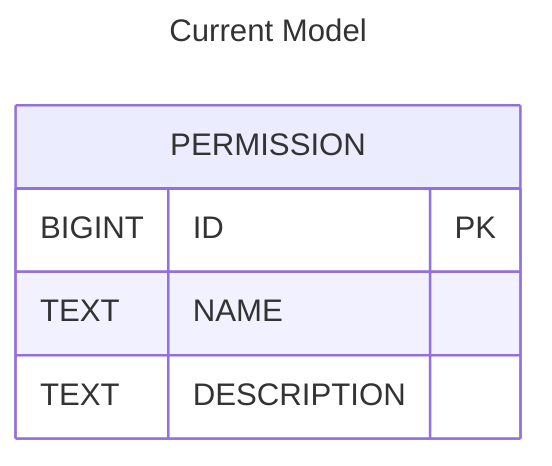
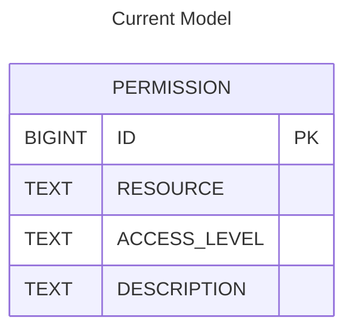

| Status   | Date       | Author(s)                            |
|:---------|:-----------|:-------------------------------------|
| Proposed | 2025-05-14 | [@jhoward-lm](https://github.com/jhoward-lm) |

## Context

The current permission model does not consider access levels scoped to a given project,
and treats all permissions as global across the DependencyTrack instance.

### Data Model

Currently, the `PERMISSION` table is very simplistic:

## Decision

Normalize the permission model by separating the text value `NAME`
into the distinct concepts of `RESOURCE` and `ACCESS_LEVEL`.

### Data Model

### Proposed Scheme

| RESOURCE               | ACCESS LEVELS      | SCOPE   |
| ---------------------- | ------------------ | ------- |
| `ACCESS_MANAGEMENT`    | ALL                | SYSTEM  |
| `BADGES`               | READ               | PROJECT |
| `BOM`                  | READ,CREATE        | PROJECT |
| `FINDING`              | READ,UPDATE,CREATE | PROJECT |
| `NOTIFICATION_RULE`    | ALL                | SYSTEM  |
| `POLICY`               | ALL                | SYSTEM  |
| `POLICY_VIOLATION`     | READ,UPDATE,CREATE | PROJECT |
| `PORTFOLIO`            | ALL                | SYSTEM  |
| `PROJECT`              | READ,UPDATE,DELETE | PROJECT |
| `SYSTEM_CONFIGURATION` | ALL                | SYSTEM  |
| `TAG`                  | ALL                | SYSTEM  |
| `VULNERABILITY`        | ALL                | SYSTEM  |

### Mapping of Current Scheme to Proposed

| CURRENT                           | RESOURCE(S)            | ACCESS LEVEL |
| --------------------------------- | ---------------------- | ------------ |
| `ACCESS_MANAGEMENT`               | `ACCESS_MANAGEMENT`    | `SYSTEM`     |
| `ACCESS_MANAGEMENT_CREATE`        | `ACCESS_MANAGEMENT`    | `SYSTEM`     |
| `ACCESS_MANAGEMENT_DELETE`        | `ACCESS_MANAGEMENT`    | `SYSTEM`     |
| `ACCESS_MANAGEMENT_READ`          | `ACCESS_MANAGEMENT`    | `SYSTEM`     |
| `ACCESS_MANAGEMENT_UPDATE`        | `ACCESS_MANAGEMENT`    | `SYSTEM`     |
| `BOM_UPLOAD`                      | `BOM`                  | `CREATE`     |
| `POLICY_MANAGEMENT`               | `POLICY`               | `SYSTEM`     |
| `POLICY_MANAGEMENT_CREATE`        | `POLICY`               | `SYSTEM`     |
| `POLICY_MANAGEMENT_DELETE`        | `POLICY`               | `SYSTEM`     |
| `POLICY_MANAGEMENT_READ`          | `POLICY`               | `SYSTEM`     |
| `POLICY_MANAGEMENT_UPDATE`        | `POLICY`               | `SYSTEM`     |
| `POLICY_VIOLATION_ANALYSIS`       | `POLICY_VIOLATION`     | `UPDATE`     |
| `PORTFOLIO_MANAGEMENT`            | `PORTFOLIO`            | `SYSTEM`     |
| `PORTFOLIO_MANAGEMENT_CREATE`     | `PORTFOLIO`            | `SYSTEM`     |
| `PORTFOLIO_MANAGEMENT_DELETE`     | `PORTFOLIO`            | `SYSTEM`     |
| `PORTFOLIO_MANAGEMENT_READ`       | `PORTFOLIO`            | `SYSTEM`     |
| `PORTFOLIO_MANAGEMENT_UPDATE`     | `PORTFOLIO`            | `SYSTEM`     |
| `PROJECT_CREATION_UPLOAD`         | `BOM`, `PORTFOLIO`     | `CREATE`     |
| `SYSTEM_CONFIGURATION`            | `SYSTEM_CONFIGURATION` | `SYSTEM`     |
| `SYSTEM_CONFIGURATION_CREATE`     | `SYSTEM_CONFIGURATION` | `SYSTEM`     |
| `SYSTEM_CONFIGURATION_DELETE`     | `SYSTEM_CONFIGURATION` | `SYSTEM`     |
| `SYSTEM_CONFIGURATION_READ`       | `SYSTEM_CONFIGURATION` | `SYSTEM`     |
| `SYSTEM_CONFIGURATION_UPDATE`     | `SYSTEM_CONFIGURATION` | `SYSTEM`     |
| `TAG_MANAGEMENT`                  | `TAG`                  | `SYSTEM`     |
| `TAG_MANAGEMENT_DELETE`           | `TAG`                  | `SYSTEM`     |
| `VIEW_BADGES`                     | `BADGES`               | `READ`       |
| `VIEW_POLICY_VIOLATION`           | `POLICY_VIOLATION`     | `READ`       |
| `VIEW_PORTFOLIO`                  | ---------------------- | ------------ |
| `VIEW_VULNERABILITY`              | `PROJECT`              | `READ`       |
| `VULNERABILITY_ANALYSIS`          | ---------------------- | ------------ |
| `VULNERABILITY_ANALYSIS_CREATE`   | `PROJECT`, `FINDING`   | `CREATE`     |
| `VULNERABILITY_ANALYSIS_READ`     | `PROJECT`, `FINDING`   | `READ`       |
| `VULNERABILITY_ANALYSIS_UPDATE`   | `PROJECT`, `FINDING`   | `UPDATE`     |
| `VULNERABILITY_MANAGEMENT`        | `VULNERABILITY`        | `SYSTEM`     |
| `VULNERABILITY_MANAGEMENT_CREATE` | `VULNERABILITY`        | `SYSTEM`     |
| `VULNERABILITY_MANAGEMENT_DELETE` | `VULNERABILITY`        | `SYSTEM`     |
| `VULNERABILITY_MANAGEMENT_READ`   | `VULNERABILITY`        | `SYSTEM`     |
| `VULNERABILITY_MANAGEMENT_UPDATE` | `VULNERABILITY`        | `SYSTEM`     |

## Consequences

- `hyades-frontend` permission definitions will need to be updated accordingly
- `hyades-apiserver` `@PermissionRequired` annotation will need to be updated for all API resource endpoints
