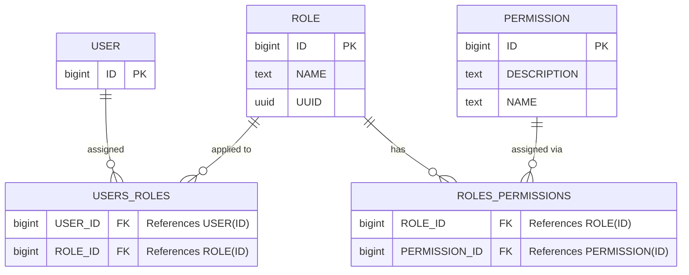

| Status   | Date       | Author(s)                                  |
| :------- | :--------- | :----------------------------------------- |
| Proposed | 2025-05-14 | [@jmayer-lm](https://github.com/jmayer-lm) |

## Context

The Dependency Track system currently faces challenges with its permission structure, lacking clear role definitions and appropriate access controls. To address these issues, a comprehensive overhaul of the permission system is proposed. This initiative aims to refine and fix the existing permissions, introduce roles, and enhance the overall access management within Dependency Track.

## Decision

We decide to implement a comprehensive overhaul of the Dependency Track permission system, incorporating the following key elements:

- Refine and fix the existing permissions and introduce roles to improve access control, allowing for more granular and flexible management of user privileges.
- Split the current permission set into global, shared, and team/project-based permissions, adding any potentially missing ones to ensure comprehensive coverage of access scenarios.
- Add custom roles to Dependency Track with a field to link to external services, enhancing integration capabilities and allowing for more seamless interactions with other tools and platforms.
- Separate Team administration from system administration, clarifying roles and responsibilities to prevent confusion and minimize the risk of unintended system-wide changes.
- Fix the issue of flattened permissions to prevent Team Permissions from leaking into global permissions, maintaining the integrity of the access control system and preventing unauthorized access.
- Fix the Team Admin role to remove global admin privileges, ensuring that Team Admins can manage their teams effectively without posing a risk to the overall system security or stability.

## Data Model

## Consequences

The implementation of the new permission system and roles in Dependency Track is expected to have the following consequences:

- Improved Security: The introduction of more granular permission controls and the separation of team administration from system administration will reduce the risk of unauthorized access to sensitive features and data, enhancing the overall security posture of the platform.
- Enhanced Usability: By providing more tailored and flexible access controls, users will have a more streamlined experience, with access to the features and resources they need to perform their tasks, without being overwhelmed by unnecessary permissions or complexity.
- Reduced Administrative Burden: The clarification of roles and responsibilities, particularly the distinction between team and system administration, will simplify the management of the platform, reducing the administrative workload and making it easier to maintain and evolve the system over time.
- Better Scalability: The introduction of custom roles and the ability to link to external services will make it easier for Dependency Track to integrate with other tools and platforms, improving its scalability and adaptability to different use cases and environments.
- Increased Complexity for Small Teams: For very small teams or individual users, the introduction of more granular permission controls might add complexity, potentially making it more challenging to manage permissions and access. Guidance and documentation will be crucial in mitigating this impact.

