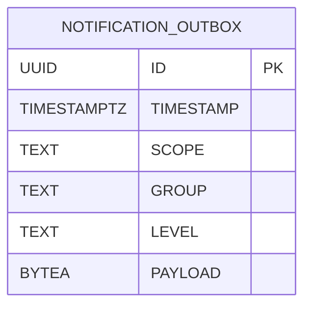
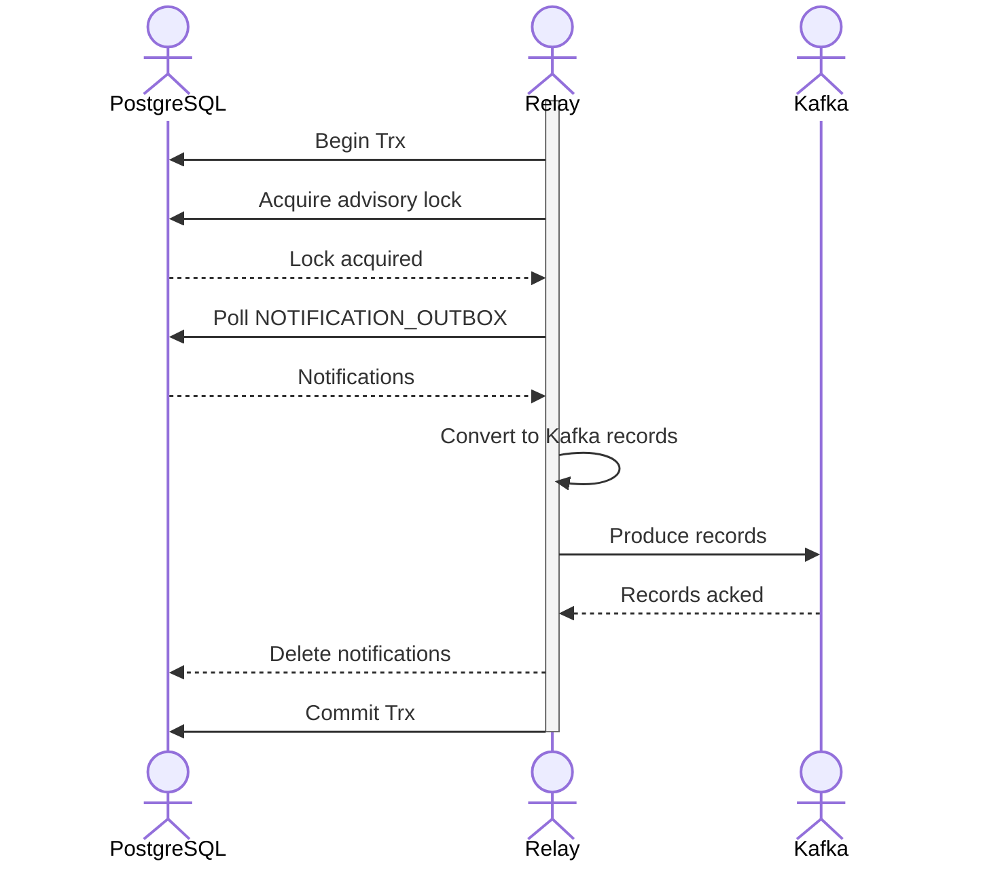

| Status   | Date       | Author(s)                            |
|:---------|:-----------|:-------------------------------------|
| Accepted | 2025-10-26 | [@nscuro](https://github.com/nscuro) |

## Context

As per [ADR-003](./003-notification-publishing.md) we originally decided to leverage PostgreSQL's
logical replication to support atomic notification emission. The main benefit was that tailing the
WAL would bypass the need to maintain and poll an outbox table, which is overhead we'd have loved to avoid.

After further consideration however, we decided against the logical replication approach, for the following reasons:

* Requires a special connection that users would need to configure. The connection must bypass any connection poolers.
* Requires elevated privileges via the `REPLICATION` attribute. Users with this attribute are able to read all changes
  across all tables in a database. In hindsight, we feel this could be a security footgun.
* Requires constant monitoring. Postgres only deletes WAL segments that have been read by all replication slots.
  Should a replication consumer be slow, or otherwise fail to advance its slot, the Postgres server could run out
  of disk space.

We might revisit logical replication later, but for the time being the cons outweigh the pros.

## Decision

We will follow a classic [transactional outbox] design instead.

### Schema

A new `NOTIFICATION_OUTBOX` table is created with the following schema:

* `ID` is a [UUIDv7], ensuring both global uniqueness and sortability. The latter also makes it index-friendly.
* `PAYLOAD` is the serialized notification in Protobuf format.

The columns `TIMESTAMP`, `SCOPE`, `GROUP`, and `LEVEL` are included for debugging and monitoring purposes.
They are also part of the notification itself, but since `PAYLOAD` is not human-readable, that doesn't help much.

The notification Protobuf schema is extended to also include the UUIDv7 ID.

### Emission

To emit notifications, records are inserted into the `NOTIFICATION_OUTBOX` table.
This can be done as part of the database transactions that also perform the "business logic",
thus preventing the dual write problem.

### Relay

A new *notification outbox relay* component is added to the API server.
The relay continuously polls the `NOTIFICATION_OUTBOX` table for records
and sends them to Kafka.

!!! note
    Sending to Kafka is an intermediary step that allows us to make this change
    without touching too many parts of the system at once.

Per default, the relay polls every 1 second for up to 100 notifications.
Interval and batch size are configurable. 

It is possible to disable the relay entirely, which might be useful for users
who operate multi-node clusters, and want more granular control over which nodes
relay notifications.

Noteworthy details:

* Transaction-level [advisory locks] are used to prevent concurrent execution.
  We ideally want notifications to be relayed in the order in which they were
  emitted. If we were to do concurrent relays, we would lose this property.
  Limiting concurrency further reduces load on the database.
* Notifications are *deleted* from the `NOTIFICATION_OUTBOX` table upon successful relay.
  We don't have use-cases that would require keeping them around for longer. Should that requirement
  arise, we should look into partitioning of the `NOTIFICATION_OUTBOX` table.
* The database transaction is committed *after* Kafka has acknowledged reception of records.
  This is necessary to achieve at-least-once semantics, but can lead to duplicate messages
  should the commit fail after Kafka has successfully acked records. Notification consumers
  can use the new `id` field to de-duplicate on their end.

## Consequences

* Notifications can atomically be emitted as part of database transactions
* Kafka and the notification-publisher service remain unchanged for now

[UUIDv7]: https://en.wikipedia.org/wiki/Universally_unique_identifier#Version_7_(timestamp_and_random)
[advisory locks]: https://www.postgresql.org/docs/current/explicit-locking.html#ADVISORY-LOCKS
[transactional outbox]: https://microservices.io/patterns/data/transactional-outbox.html
