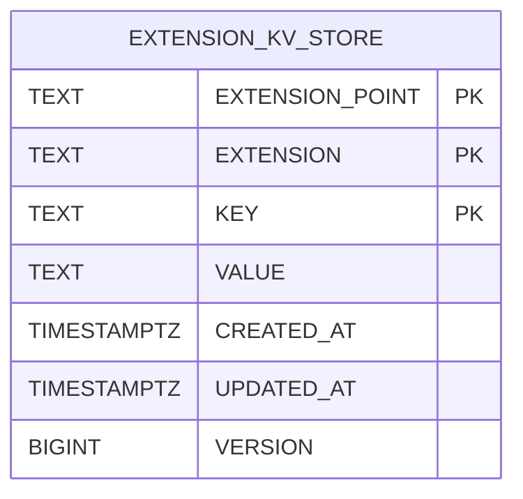

| Status   | Date       | Author(s)                            |
|:---------|:-----------|:-------------------------------------|
| Accepted | 2025-11-02 | [@nscuro](https://github.com/nscuro) |

## Context

Extensions need to occasionally persist some sort of state.
An example of this is the checkpointing / watermarking mechanism used by vulnerability data sources (see [ADR-010]).

As briefly touched on in [ADR-010], we originally planned to leverage the existing `ConfigRegistry`
abstraction for this. However, this turned out to not be a good idea, for the following reasons:

* It mixes two concerns that should be separate: configuration and storage.
* It encourages extensions to modify their own configuration at runtime.
* `ConfigRegistry` is lacking concurrency control mechanisms, making it prone to [lost updates].
* Configuration is intended to be modifiable by clients, making [lost updates] all the more likely.

## Decision

Provide a simple key-value store to extensions. Key-value stores are easy to implement and easy to secure.

A store instance is scoped to a single extension. Accessing values of other extensions is not possible.

### API Contract

The key-value store API provides the following high-level mechanisms:

* Simple operations: `put`, `get`, `delete`.
    * Write operations are not concurrency-safe.
* Bulk operations: `putMany`, `getAll`, `getMany`, `deleteMany`.
    * Most efficient due to reduced I/O overhead.
    * Write operations are not concurrency-safe.
* Concurrency-safe operations: `compareAndPut`, `compareAndDelete`.
    * Offer [optimistic concurrency control] via version numbers.

Both keys and values of a stores are strings. Extensions may choose to use
any other data types in their logic, as long as they can be serialized to strings (e.g., JSON).

```java
interface ExtensionKVStore {

    void putMany(Map<String, String> kvPairs);

    void put(String key, String value);

    CompareAndPutResult compareAndPut(String key, String value, Long expectedVersion);

    List<Entry> getAll();

    Map<String, Entry> getMany(Collection<String> keys);

    default Entry get(String key);

    void deleteMany(Collection<String> keys);

    void delete(String key);

    CompareAndDeleteResult compareAndDelete(String key, long expectedVersion);
    
}
```

In addition to the key and value, a store entry holds the following information:

* `createdAt`: When the entry was first created.
* `updatedAt`: When the entry was last modified.
* `version`: Version of the entry for [optimistic concurrency control].

```java
record Entry(
    String key,
    String value,
    Instant createdAt,
    Instant updatedAt,
    long version) {
}
```

The `compareAndPut` and `compareAndDelete` operations have special return types,
which are defined as follows:

```java
sealed interface CompareAndPutResult {
    
    record Failure(Reason reason) implements CompareAndPutResult {
        
        enum Reason {
            ALREADY_EXISTS,
            VERSION_MISMATCH
        }
    }
    
    record Success(long newVersion) implements CompareAndPutResult {
    }
}

sealed interface CompareAndDeleteResult {
    
    record Failure(Reason reason) implements CompareAndDeleteResult {
        
        enum Reason {
            VERSION_MISMATCH
        }
    }
    
    record Success() implements CompareAndDeleteResult {
    }
}
```

Since optimistic concurrency failures are *expected*, they are not modeled as exceptions.
They leverage [sealed interfaces] to communicate the possible outcomes in a type-safe manner.

This allows handling of operation outcomes with [pattern matching]:

```java
CompareAndPutResult result = kvStore.compareAndPut("foo", "bar", 1);

switch (result) {
    case Success(long newVersion) -> /* do something with newVersion */;
    case Failure(Failure.Reason reason) -> /* do something with reason */;
};
```

### Schema

Store entries are persisted to a new `EXTENSION_KV_STORE` database table.



Each entry is scoped to a combination of *extension point* and *extension*,
e.g. `vuln.datasource` and `github`. Whenever an extension accesses its store,
the underlying SQL query will ensure that it cannot see entries of other extensions:

```sql
SELECT "KEY"
     , "VALUE"
     , "CREATED_AT"
     , "UPDATED_AT"
     , "VERSION"
  FROM "EXTENSION_KV_STORE"
 WHERE "EXTENSION_POINT" = 'vuln.datasource'
   AND "EXTENSION" = 'github'
   AND "KEY" = 'foo';
```

A composite primary key is created on the `EXTENSION_POINT`, `EXTENSION`, and `KEY` columns.
This serves two purposes in one:

* It prevents duplicate keys within the namespace of an extension.
* It acts as index for lookups by key.

We don't anticipate individual extensions maintaining large sets of keys for now.
This means that, for the time being, no further indexes are required.

### In-Memory Implementation

`ExtensionKVStore` will be part of the plugin API. The plugin API should be as lightweight
as possible and not contain any implementation details of the core platform.

However, plugin authors still need to be able to test their extensions.
For this purpose, we ship a simple in-memory implementation of `ExtensionKVStore`
as part of the plugin API.

The implementation is backed by a [ConcurrentMap].

### Possible Future Enhancements

* Stores could be extended to support prefix scans. Given proper key structure,
  it would allow extensions to more efficiently sift through a large number of keys.
* Quotas could be implemented that control how many keys a given extension may
  have. This would prevent excessive usage or abuse of the feature.

### Considered Alternatives

It was considered to grant extensions direct access to the underlying SQL database.
This would allow extensions to leverage the full power of PostgreSQL, enabling more complex use-cases.

Isolation from the main application's data would be achieved using [PostgreSQL schemas].
Each extension would get its own schema, coupled with a database user that only
has access to the extension's schema.

Dependency-Track would then need to maintain separate connection pools for every extension,
since connections are bound to specific users.

This design was discarded *for now* for the following reasons:

* The complexity is not justifiable at the moment.
* There's increased overhead of maintaining multiple DB connection pools.
* Full database access results in greater chances of extensions negatively impacting database load.
* Since the design shares commonality with how tenant isolation is achieved in multi-tenant systems,
  it could cause headaches if we decide to implement multi-tenancy later down the line.

## Consequences

* A clean separation between configuration and storage concerns is achieved.
* Concurrency-safe storage operations are available to extensions. 
* Extensions that currently use the `ConfigRegistry` for storage will need to be refactored
  to use the new key-value store instead.

[ADR-010]: ./010-vulnerability-datasource-extension-point.md#checkpointing
[ConcurrentMap]: https://docs.oracle.com/en/java/javase/25/docs/api/java.base/java/util/concurrent/ConcurrentMap.html
[PostgreSQL schemas]: https://www.postgresql.org/docs/current/ddl-schemas.html
[lost updates]: https://en.wikipedia.org/wiki/Write%E2%80%93write_conflict
[optimistic concurrency control]: https://en.wikipedia.org/wiki/Optimistic_concurrency_control
[pattern matching]: https://docs.oracle.com/en/java/javase/25/language/pattern-matching.html
[sealed interfaces]: https://docs.oracle.com/en/java/javase/25/language/sealed-classes-and-interfaces.html