## Overview

dex is an embedded [**d**urable **ex**ecution](#durable-execution) engine that provides reliable,
scalable execution of potentially long-running processes.

The engine is influenced by [Temporal] and Microsoft's [Durable Task Framework].
It is purpose-built for Dependency-Track's requirements, and optimized for PostgreSQL.

## Core concepts

### Durable Execution

Durable execution is a programming model where the state and progress of (potentially long-running)
processes is automatically persisted, enabling them to survive failures and restarts.

!!! note
    Because dex is heavily influenced by [Temporal], it has adopted most of its concepts and wording.
    Some concepts may have different names in other engines, e.g. Durable Task uses *orchestration*
    instead of *workflow*.

Like [Temporal], dex records every completed step of a [workflow](#workflow) as an event in the database.
If a process crashes or is restarted, the workflow automatically resumes from where it left off
by replaying its event history. This makes workflows resilient without requiring manual
work to implement state management or retry logic.

Durable execution ensures that once a workflow is started, it will run to completion,
even when experiencing repeated transient failures.

### Workflow

A workflow is the formal description of a sequence of steps to execute.
Workflows are defined as normal Java code, but must be *deterministic and free of side effects*
to enable reliable history replay. Their sole purpose is orchestration: sequencing and
coordinating work, not performing it directly.

Workflows can invoke [activities](#activity), create [timers](#timer), spawn child workflows,
and wait for [external events](#external-event).

## Workflow Instance

A workflow instance is a specific instantiation of a [workflow](#workflow).

Instances can be executed multiple times, but only a single execution
in non-terminal state can exist at any given point in time.

In dex, instances are identified by an *instance ID*, which is defined by clients when starting a workflow.

### Activity

An activity is the formal description of a non-deterministic operation. It is where interactions with
external systems, and more generally I/O, is intended to happen.

Execution of activities happens asynchronously from their "owning" workflow's execution, making it non-blocking.

In practice, activity invocations behave similar to conventional background jobs.

Activities are anticipated to fail, and will be transparently retried. Retry behaviour is
customizable using retry policies, on a per-invocation basis. Because activities may be executed
multiple times as part of the retry mechanism, they should be [idempotent].

### Workflow run

A workflow run is a single execution of a workflow. Each run has a unique identifier
and maintains a complete event history. The history enables replay for recovery
and ensures deterministic behaviour.

Runs can carry the following additional metadata:

* **Concurrency Key**: Serializes execution of runs sharing the same key.
* **Priority**: Influences execution order (higher priority runs execute first).
* **Labels**: Custom key-value metadata.

### Timer

A timer provides durable delays within a workflow execution.

Unlike regular sleeps, timers are recorded in the workflow run's event history,
making them deterministic and replay-safe.

### External Event

An external event is a message sent to a workflow run from outside the dex engine.

External events enable workflows to pause and wait for signals from external systems or users,
such as approval notifications, webhook callbacks, or status updates. Each event has a unique
identifier and can carry optional payload data.

### Task

A task is a unit of work generated by the dex engine to drive progress of either
a [workflow run](#workflow-run) or an [activity](#activity).

Tasks are scheduled for execution on [task queues](#task-queue),
from where they're picked up by [task workers](#task-worker).

### Task queue

A task queue is a named queue where [tasks](#task) are scheduled for execution.

Task queues organize and distribute work to [workers](#task-worker). Each queue has a type (*workflow* or *activity*)
and tracks its capacity and current depth (i.e. number of pending tasks). Workflows and activities
specify which queue their tasks should be routed to.

Queues enable separation of concerns, allowing different workers to specialize in different
types of work and providing resource isolation between workloads.

!!! note
    In dex, queues further act as a means to scale, as each task queue
    is stored in a separate physical table [partition](https://www.postgresql.org/docs/current/ddl-partitioning.html#DDL-PARTITIONING-OVERVIEW).

The capacity of a queue is modifiable at runtime, allowing administrators to throttle
task execution globally for an entire cluster. It is further possible to *pause* queues entirely.

### Task worker

A task worker polls tasks from a queue and executes them. Workers process either
workflow tasks or activity tasks, but not both. Each worker polls from *exactly one* queue.

## Execution model

dex uses event sourcing to provide durability. When a workflow executes,
the engine records events for each completed step. If execution is interrupted,
the workflow resumes by replaying the recorded history.


During replay, the workflow code re-executes, but side effects are skipped.
Results of previously completed steps are retrieved from the history instead.
This requires workflow code to be deterministic. Given the same history,
it must make the same decisions.

This model also enables high degrees of concurrency. When a workflow blocks waiting for an
activity, timer, or external event, it yields control back to the engine. The
engine can then progress other workflows while the blocked one waits. This allows
a single worker to manage many concurrent workflow runs without dedicating a
thread to each one.

## Engine architecture

### Overview

dex consists of the following components:

* **Workflow task scheduler**: Creates workflow tasks from eligible workflow runs.
* **Activity task scheduler**: Transitions activity tasks to queued status.
* **Workflow task worker**: Executes workflow code with history replay.
* **Activity task worker**: Executes activity code.
* **Maintenance worker**: Enforces retention by deleting old completed runs.
* **Leader election**: Coordinates single-instance operations in a cluster.


By default, dex uses the same database as the main Dependency-Track application for simplicity.
For larger deployments, it can be configured to use a separate database instance
to isolate engine load from application concerns.

### Leader election

Certain operations are intended to only be performed by a single node in a cluster. For example:

* Maintenance
* Task scheduling

dex utilises a simple lease-based leader election mechanism that is backed
by the `dex_lease` table with the following schema:

| Column      | Type           | Constraints |
|:------------|:---------------|:------------|
| name        | text           | pk          |
| acquired_by | text           | not null    |
| acquired_at | timestamptz(3) | not null    |
| expires_at  | timestamptz(3) | not null    |

Every node in the cluster will regularly (default: 15s) try to acquire the leadership lease
for a given period of time (default: 30s). This design is inspired by Kubernetes controllers.

A lease is acquired by inserting into the `dex_lease` table. Concurrency-safe conflict
resolution is performed using PostgreSQL's
[`on conflict`](https://www.postgresql.org/docs/current/sql-insert.html#SQL-ON-CONFLICT) mechanism:

```sql
insert into dex_lease (name, acquired_by, acquired_at, expires_at)
values ('leadership', 'instanceA', now(), now() + interval '30 seconds')
on conflict (name) do update
set acquired_by = excluded.acquired_by
  , acquired_at = excluded.acquired_at
  , expires_at = excluded.expires_at
where dex_lease.acquired_by = excluded.acquired_by
   or dex_lease.expires_at <= now()
```

The above query atomically creates or extends the lease for `instanceA`,
depending on whether the lease is still held by it, or the previous lease
has expired.

Nodes that fail to attempt lease acquisition, e.g. due to timeouts,
will assume their lease to be *lost*. This is to prevent the likelihood
of [split-brain](https://en.wikipedia.org/wiki/Split-brain_(computing)).
It should be noted though that the worst symptom of split-brain for dex
is an increase is potentially expensive operations. Correctness is not affected.

During graceful shutdown, nodes simply release their leadership lease:

```sql
delete
  from dex_lease
 where name = 'leadership'
   and acquired_by = 'instanceA'
```

The `dex_lease` table is [`unlogged`](https://www.postgresql.org/docs/current/sql-createtable.html#SQL-CREATETABLE-UNLOGGED)
and thus does not cause WAL writes. This is possible because leases are ephemeral by design.

### Task scheduling

dex has two separate schedulers, both running on the leader node:

#### Workflow task scheduler

Creates tasks from workflow runs.
It polls the `dex_workflow_run` table for workflow runs that:

* Are in a non-terminal state (`CREATED`, `RUNNING`, or `SUSPENDED`)
* Have visible messages in their inbox (events waiting to be processed)
* Don't already have a queued task

For each eligible run, a task is inserted into the `dex_workflow_task` table.

#### Activity task scheduler

Activity task scheduling works differently. Activity tasks are created by
workflow execution (when an activity is invoked), not by the scheduler.
The scheduler's role is to transition tasks from `CREATED` to `QUEUED` status,
making them visible to workers.

This two-phase approach exists because activity tasks have a `visible_from` timestamp
used for retry delays. A task in `CREATED` status with a future `visible_from` is
not yet eligible for execution. The scheduler polls for tasks where `visible_from <= now()`
and transitions them to `QUEUED`.

#### Queue

Each task queue is stored in a separate PostgreSQL table partition, created dynamically
when a new queue is registered. This provides isolation between workloads and allows
the database to manage each queue's data independently.

Queues have two properties that can be modified at runtime:

* **Capacity**: The maximum number of pending tasks. The scheduler stops creating tasks
  when a queue reaches capacity, providing backpressure.
* **Status**: Queues can be paused, preventing any new tasks from being scheduled.

Tasks are scheduled with a priority (0-100), inherited from their workflow run.
Higher priority tasks are processed first. Within the same priority, tasks are
processed in creation order.

### Task processing

!!! note
    dex leverages Java's [virtual threads] for task execution, enabling high degrees
    of concurrency while maintaining a slim resource footprint.

#### Workflow tasks

The scheduler polls for eligible workflow runs and inserts tasks into the `dex_workflow_task` table.
Workers poll from this table, execute the workflow, and update run state and history.


#### Activity tasks

Activity tasks are created by workflow execution, not the scheduler.
The scheduler transitions tasks from `CREATED` to `QUEUED` when their
`visible_from` timestamp has passed, making them visible to workers.

```mermaid
---
title: Activity task processing
---
sequenceDiagram
    participant S as Scheduler
    participant T as Activity tasks
    participant W as Worker
    participant H as History

    Note over S: Leader node only
    activate S
    S ->> T: Poll CREATED tasks where visible_from <= now()
    S ->> T: UPDATE status → QUEUED
    deactivate S

    Note over W: All nodes
    activate W
    W ->> T: SELECT ... FOR UPDATE SKIP LOCKED
    T -->> W: Task
    W ->> W: Execute activity
    W ->> H: Record result
    W ->> T: DELETE task
    deactivate W
```



Because the scheduler and workers poll the same table, the scheduler uses
`FOR NO KEY UPDATE SKIP LOCKED` when transitioning tasks to avoid deadlocks.

### Concurrency Control

Task execution concurrency can be controlled at two levels:

#### Local

Each worker limits how many tasks it executes concurrently using a [Semaphore].
The worker only polls for as many tasks as it has available permits, preventing
it from claiming more work than it can handle.

This controls the parallelism of task execution on a single node. Setting a lower
value reduces resource consumption but may increase latency. Setting a higher value
allows more throughput but increases memory and CPU usage.

#### Global

Task queue capacity limits how many tasks can be pending across the entire cluster.
When a queue reaches capacity, the scheduler stops creating new tasks for that queue,
providing backpressure to the system.

This prevents unbounded queue growth during load spikes. Workflow runs remain in
their current state until capacity becomes available, at which point the scheduler
resumes creating tasks for them.

Local and global concurrency control complement each other.
Queue capacity controls how much work is queued,
while worker concurrency controls how fast that work is processed.

### Buffering

In contrast to most other durable execution and workflow engines, dex buffers certain write
operations, and flushes them to the database in batches. This is done to reduce network round-trips
between dex and its database, and amortize transaction overhead.

A property that all durable execution engines share, is that there is always a time window
between an action (e.g. issuing a HTTP request) having been *performed*, and its outcome having
been *recorded* (e.g. by writing it to a database). If recording the outcome fails,
the engine has to assume that the action itself has never happened. There is no way to make this atomic.
This is one reason why actions should be [idempotent], making them safe to execute multiple times.
dex takes advantage of this inherent risk, and utilises buffering in exactly that time window.

When flushing buffers, dex leverages
[Postgres-specific optimizations](https://www.tigerdata.com/blog/boosting-postgres-insert-performance)
to further reduce the amount of time spent *in the database*.

!!! note
    This is a trade-off that values throughput over latency, and efficiency over correctness:

      * While throughput is improved, buffering *does* negatively impact end-to-end latency.
      * Flushing writes in batches comes with the risk of an increased blast radius in case of failures.

Dependency-Track is not a latency-sensitive system. It is generally acceptable to wait
a few seconds for a workflow to complete. It is much more important that the database is
not hammered with many tiny transactions that spike CPU and I/O utilization.

PostgreSQL is not infinitely scalable, but by designing a system optimized for throughput
and efficiency, our scaling ceiling is much higher.

Three operations are buffered independently:

* **Activity task heartbeats**: Heartbeats from long-running activity tasks.
* **External events**: Messages sent to workflow runs from outside the engine.
* **Task events**: Results of workflow and activity task execution.

!!! tip
    Flush intervals and batch sizes of buffers are configurable:

      * [`dt.dex-engine.activity-task-heartbeat-buffer.flush-interval-ms`](../../reference/configuration/api-server.md#dtdex-engineactivity-task-heartbeat-bufferflush-interval-ms)
      * [`dt.dex-engine.activity-task-heartbeat-buffer.max-batch-size`](../../reference/configuration/api-server.md#dtdex-engineactivity-task-heartbeat-buffermax-batch-size)
      * [`dt.dex-engine.external-event-buffer.flush-interval-ms`](../../reference/configuration/api-server.md#dtdex-engineexternal-event-bufferflush-interval-ms)
      * [`dt.dex-engine.external-event-buffer.max-batch-size`](../../reference/configuration/api-server.md#dtdex-engineexternal-event-buffermax-batch-size)
      * [`dt.dex-engine.task-event-buffer.flush-interval-ms`](../../reference/configuration/api-server.md#dtdex-enginetask-event-bufferflush-interval-ms)
      * [`dt.dex-engine.task-event-buffer.max-batch-size`](../../reference/configuration/api-server.md#dtdex-enginetask-event-buffermax-batch-size)
    
    Users who care more about latency are free to decrease intervals, at the cost of higher database utilization.

## Retry and Failure Handling

As noted in [Activity](#activity), activities are automatically retried on failure.
The retry behavior is controlled by a configurable policy:

| Parameter            | Description                       |
|:---------------------|:----------------------------------|
| Initial Delay        | Delay before first retry          |
| Delay Multiplier     | Exponential backoff factor        |
| Randomization Factor | Jitter to prevent thundering herd |
| Max Delay            | Upper bound on retry delay        |
| Max Attempts         | Maximum number of attempts        |

Retries are scheduled by updating the task's `visible_from` timestamp,
making it invisible to workers until the retry delay has elapsed.

Failures are classified as either terminal or retryable:

* **Terminal failures** stop retries immediately.
* **Retryable failures** trigger the retry mechanism.

## Noteworthy design decisions

### Embedded

Not requiring an external service simplifies operations due to fewer moving parts.
Testing and debugging becomes easier for the same reason.

Embedding the engine in the application further avoids network and serialization
overhead during task distribution, since workers can poll the database directly.

### PostgreSQL Only

Following the direction of the main Dependency-Track application, dex only supports PostgreSQL.
This allows for more optimization techniques, easier testing / debugging, and less operational
overhead for users.

### No `LISTEN` / `NOTIFY`

Many queueing systems based on PostgreSQL utilize the [`LISTEN` / `NOTIFY`](https://www.postgresql.org/docs/current/sql-notify.html)
feature to reduce latencies, e.g. by emitting a notification whenever a new task has been scheduled for execution.

This was explored for dex as well, but ultimately discarded, because:

* `LISTEN` requires a persistent, direct connection to the database, which does not play well with connection poolers.
* > When a NOTIFY query is issued during a transaction, it acquires a global lock on the entire database
  > [...] during the commit phase of the transaction, effectively serializing all commits.
  > ([Source](https://www.recall.ai/blog/postgres-listen-notify-does-not-scale))

Instead, dex entirely relies on polling.

### Protobuf Serialization

Workflow events, as well as workflow and activity arguments and results, leverage Protobuf for serialization.
Protobuf is fast and efficient, and serialized messages are smaller than their JSON counterparts.

The tooling around Protobuf is excellent. With [`buf`](https://buf.build/), we have linting and breaking
change detection covered.

This decision comes with the drawback of events and payloads not being human-readable when
manually inspecting database tables.

## References

* [ADR-002: Workflow Orchestration](../decisions/002-workflow-orchestration.md)
* [Temporal]
* [Durable Task Framework]

[Durable Task Framework]: https://github.com/Azure/durabletask
[Semaphore]: https://docs.oracle.com/en/java/javase/25/docs/api//java.base/java/util/concurrent/Semaphore.html
[Temporal]: https://temporal.io/
[idempotent]: https://en.wikipedia.org/wiki/Idempotence#Computer_science_meaning
[virtual threads]: https://docs.oracle.com/en/java/javase/25/core/virtual-threads.html