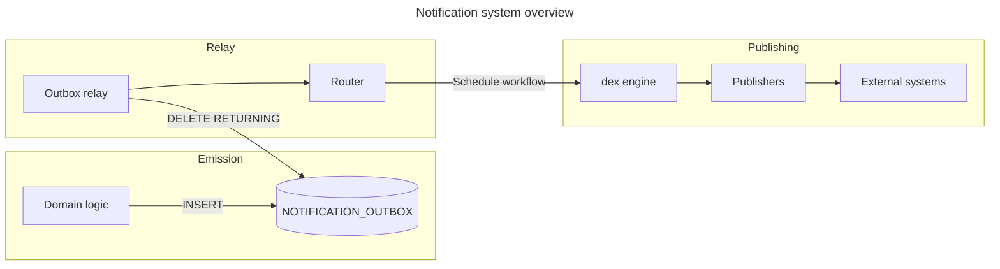
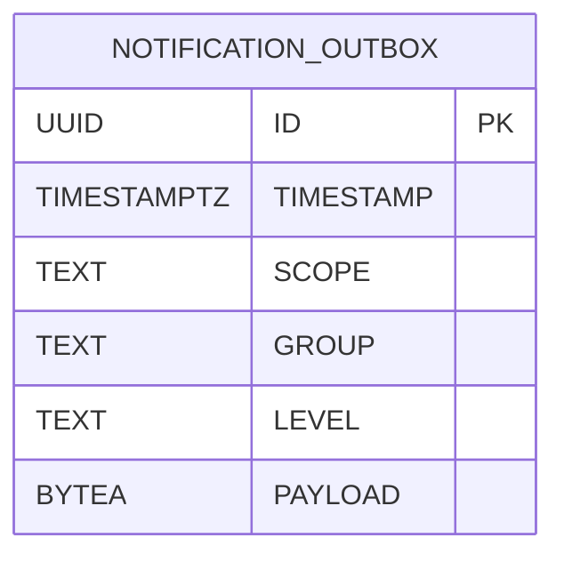
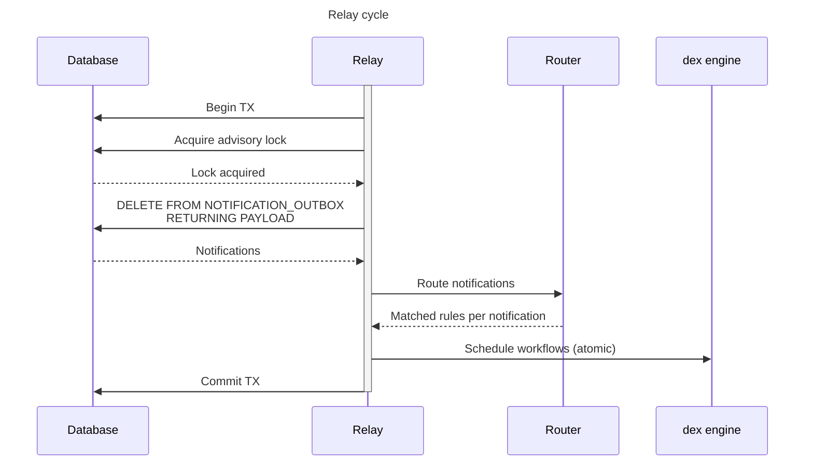
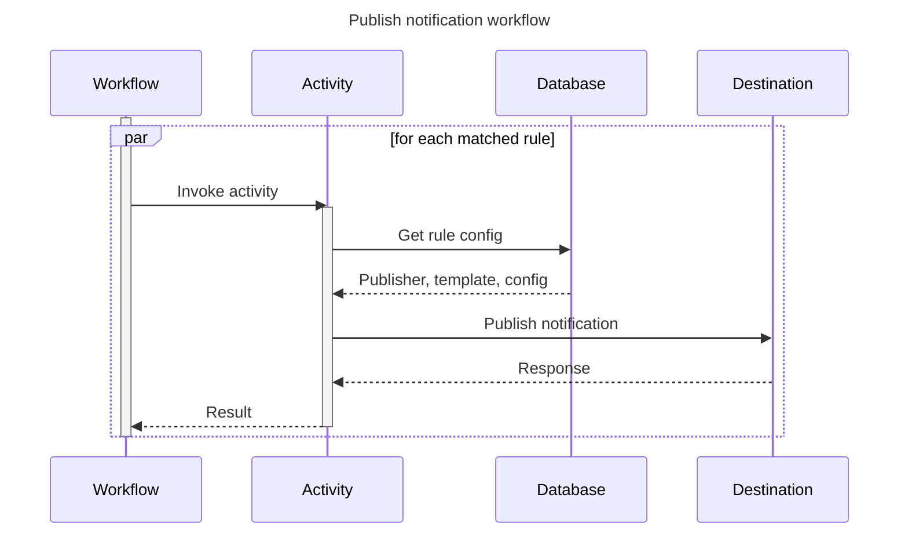

## Overview

The notification system is responsible for informing users and external systems about events
occurring in the platform. It consists of three phases:

1. **Emission**: Writing notifications to an outbox table
2. **Relay**: Polling the outbox, routing notifications to matching rules, and scheduling workflows
3. **Publishing**: Delivering notifications to destination systems via durable workflows

This design follows the [transactional outbox] pattern, as described in [ADR-011].
It enables atomic emission of notifications, removing the need for external message brokers
in the critical path.

## Emission

Notifications are emitted by inserting records into the `NOTIFICATION_OUTBOX` table.
This can happen within the same database transaction that performs the business logic
triggering the notification, thus avoiding the [dual write problem].

The `ID` column uses [UUIDv7], which combines global uniqueness with sortability.
The `PAYLOAD` column contains the serialized notification in [Protobuf] format.
Its schema is documented [here](../../reference/schemas/notification.md).

### Preliminary filtering

To reduce load on the outbox table, notifications are only inserted if *at least one*
enabled notification rule could *potentially* match them. This check is performed during
the `INSERT` operation using an `EXISTS` subquery against the `NOTIFICATIONRULE` table.

Notifications that have no matching rules are discarded immediately.

## Relay

The outbox relay is a background process that continuously polls the `NOTIFICATION_OUTBOX` table,
routes notifications to matching rules, and schedules publishing workflows.
The polling interval is configurable via [`notification.outbox-relay.poll-interval-ms`](../../reference/configuration/api-server.md#notificationoutbox-relaypoll-interval-ms),
and defaults to 1 second.

### Concurrency control

Transaction-level [advisory locks] prevent concurrent relay cycles across multiple API server instances.
This ensures notifications are relayed in approximately the order they were emitted.
The lack of concurrency is offset by batch processing. The batch size is configurable
via [`notification.outbox-relay.batch-size`](../../reference/configuration/api-server.md#notificationoutbox-relaybatch-size)
and defaults to 100.

### Routing

The router evaluates each notification against all enabled notification rules
(a.k.a. [alerts](../../usage/notifications/overview.md#alerts)).
A rule matches if:

* Its scope matches the notification's scope
* Its level is equal to or less verbose than the notification's level
* The notification's group is in the rule's configured groups
* If the rule is limited to specific projects or tags, the notification's subject matches

Routing is performed in batches, using a single SQL query with `UNNEST`,
reducing database round trips.

### Large notification handling

Notifications exceeding a configurable size threshold (default: 64KiB) are offloaded to
file storage, rather than being passed directly to the dex engine. This prevents large payloads
(e.g. `PROJECT_VULN_ANALYSIS_COMPLETED`) from bloating the workflow history. 
The publishing workflow retrieves the notification from file storage
and deletes the file upon completion.

## Publishing

For each notification with *at least one* matched rule, a *Publish Notification* workflow
is scheduled. The workflow coordinates delivery for all matched rules.

Publishing for each rule is performed by a separate activity concurrently,
allowing independent retries per rule. If delivery to one destination fails,
it does not affect delivery to others.

A workflow is considered successful if *at least one* rule's publishing succeeded.
Conversely, if publishing for *all* rules failed, the entire workflow is marked as failed.

### Publishers

Publishers are implementations that deliver notifications to specific destination types.
Built-in publishers include email, Kafka, Slack, Microsoft Teams, Jira, Webhook, and more.
Refer to the [publishers](../../usage/notifications/publishers.md) documentation for details.

Publishers receive:

* The notification payload
* Rule-specific configuration (e.g. destination URL, credentials)
* A template renderer for formatting the notification

### Retries

Activities can signal retryable failures (e.g. rate limiting, temporary unavailability).
The dex engine transparently handles retries with backoff. Non-retryable failures are terminal
for a specific rule but do not affect other rules.

[ADR-011]: ../decisions/011-notification-outbox.md
[advisory locks]: https://www.postgresql.org/docs/current/explicit-locking.html#ADVISORY-LOCKS
[dual write problem]: https://www.confluent.io/blog/dual-write-problem/
[Protobuf]: https://protobuf.dev/
[transactional outbox]: https://microservices.io/patterns/data/transactional-outbox.html
[UUIDv7]: https://en.wikipedia.org/wiki/Universally_unique_identifier#Version_7_(timestamp_and_random)
