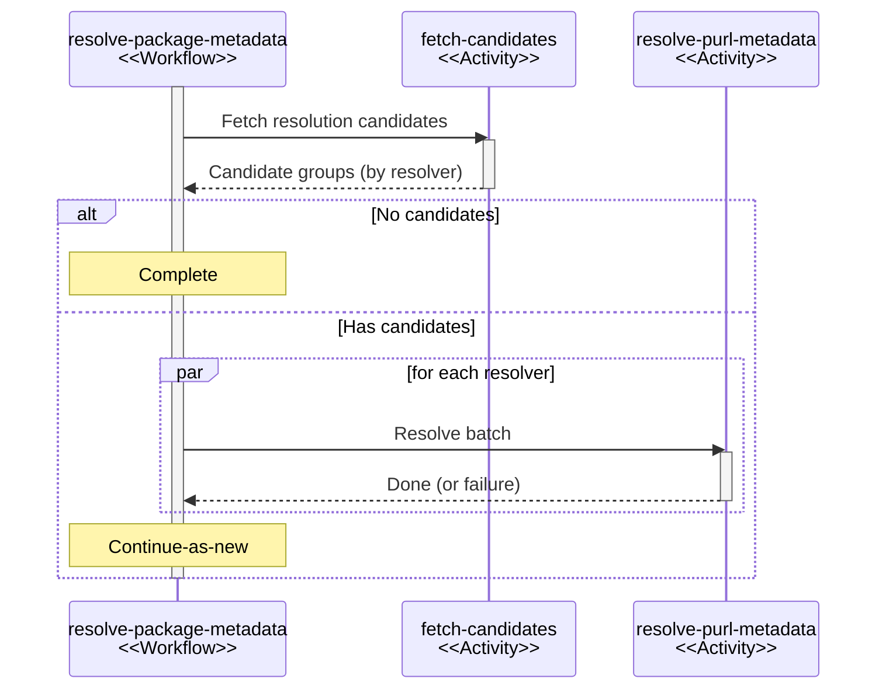

## Overview

The package metadata resolution system retrieves metadata for packages from upstream
repositories. This includes latest available versions, artifact hashes, and publish timestamps.
The data is used for latest version checks, component age policies, and integrity verification.

Resolution is orchestrated as a singleton [durable workflow](durable-execution.md) that
processes packages in controlled batches. The data model is documented in
[ADR-015](../decisions/015-package-metadata.md).

## Responsible consumption of public infrastructure

Package registries like Maven Central, npm, and PyPI are shared public resources.
Sonatype has documented that [1% of IP addresses account for 83% of Maven Central's total bandwidth][maven-overconsumption],
and that registries have begun enforcing [organization-level throttling][maven-tragedy] in response,
returning HTTP 429 errors to excessive consumers.

For a system like Dependency-Track, which may track hundreds of thousands of components across many
projects, this has direct architectural implications. Making an HTTP request per component on every
BOM upload or scheduled analysis cycle is not viable. Neither is spawning hundreds of concurrent
requests against upstream registries. Both patterns would quickly exhaust rate limits, especially
in larger deployments where multiple API server instances run concurrently.

The resolution system is therefore designed around scheduled, controlled processing rather than
ad-hoc lookups. Components that need metadata resolution are identified in batches, resolved
sequentially per resolver, and persisted with enough provenance to avoid redundant upstream requests.

## Data model

Two tables form a two-level hierarchy, both keyed by PURL:

* `PACKAGE_METADATA`: Keyed by PURL *without version, qualifiers, or subpath*
  (e.g. `pkg:maven/com.acme/acme-lib`). Stores the latest available version and resolution provenance.
  One record per package.
* `PACKAGE_ARTIFACT_METADATA`: Keyed by full PURL *including qualifiers and subpath*
  (e.g. `pkg:maven/com.acme/acme-lib@1.2.3?type=jar`). Stores artifact hashes, publish timestamp,
  and resolution provenance. One record per distinct artifact. Has a foreign key to `PACKAGE_METADATA`.

This separates package-level information (latest version) from artifact-level information
(hashes, publish timestamp). The FK constraint enforces that artifact metadata cannot exist
without corresponding package metadata, and the orchestration logic respects the resulting
write-order dependency.

Refer to [ADR-015](../decisions/015-package-metadata.md) for the full rationale.

### Persistence

Both tables use `COALESCE`-based upserts that preserve existing non-null values.
A temporal guard (`WHERE "RESOLVED_AT" < EXCLUDED."RESOLVED_AT"`) prevents older results
from overwriting newer ones. Writes use PostgreSQL `UNNEST` to batch multiple rows
per statement, reducing round trips.

## Workflow

Package metadata resolution is a singleton [durable workflow](durable-execution.md).

### Singleton constraint

The workflow uses a fixed instance ID (`resolve-package-metadata`). The dex engine enforces
that only a single execution of a given workflow instance in non-terminal state can exist at
any point in time. Attempts to create a run while one is already active are silently deduplicated.

This guarantees that at most one resolution workflow is active across the entire cluster,
regardless of how many API server instances are running. Concurrent resolution attempts are
structurally impossible, which prevents redundant upstream requests and data races during
persistence.

### Triggers

The workflow is triggered in three situations:

| Trigger         | When                                                               |
|:----------------|:-------------------------------------------------------------------|
| Scheduled       | Configurable cron schedule                                         |
| BOM upload      | After importing a BOM that contains components                     |
| Manual analysis | When a user manually triggers vulnerability analysis for a project |

All triggers create a run with the same singleton instance ID. If a run is already active,
the creation request is a no-op. This makes triggers cheap to invoke, as the singleton constraint
handles deduplication.

### Structure

### Candidate fetching

| Activity                                        | Task Queue |
|:------------------------------------------------|:-----------|
| `fetch-package-metadata-resolution-candidates`  | `default`  |

A PURL is eligible for resolution if:

* No `PACKAGE_ARTIFACT_METADATA` record exists for it, or
* no `PACKAGE_METADATA` record exists for it, or
* the corresponding `PACKAGE_METADATA` was last resolved over 24 hours ago.

Candidates are fetched in batches of 250 and grouped by resolver. Each PURL is matched
to the first resolver whose `normalize` method returns a non-null result. PURLs with no
matching resolver are grouped under an empty resolver name. The resolve activity persists
empty results for these so they don't re-appear as candidates in subsequent batches.

### Resolution

| Activity                 | Task Queue                     |
|:-------------------------|:-------------------------------|
| `resolve-purl-metadata`  | `package-metadata-resolutions` |

One activity per resolver processes its assigned PURLs sequentially. Different resolver
activities run concurrently.

For each PURL, the activity:

1. Checks if it was already resolved within the last 5 minutes (idempotency guard for retries).
2. Normalizes the PURL via the resolver factory.
3. Looks up configured repositories for the PURL type, ordered by resolution priority.
4. Iterates repositories, respecting internal/external classification, invoking the resolver
   until one succeeds or all are exhausted.
5. Buffers results and flushes to the database in batches of 25.

If a resolver signals a retryable error (e.g. HTTP 429), the activity flushes any buffered
results and propagates the error. The dex engine then retries the activity with backoff.
Non-retryable errors for individual PURLs are caught and an empty result is persisted,
preventing the PURL from becoming a candidate again immediately.

#### Retry policy

| Parameter            | Value |
|:---------------------|:------|
| Initial delay        | 5s    |
| Delay multiplier     | 2x    |
| Randomization factor | 0.3   |
| Max delay            | 1m    |
| Max attempts         | 3     |

### Continue-as-new

After processing a batch, the workflow uses `continueAsNew` to start a fresh run that
picks up the next batch. This prevents unbounded history growth: each run's event history
covers only one batch. Without this, a single run resolving thousands of packages would
accumulate a large history that degrades replay performance.

It also creates a natural checkpoint. If the process is interrupted between batches,
the next run starts with a fresh candidate query, skipping already-resolved PURLs
based on the `RESOLVED_AT` timestamps in the database.

The cycle continues until no more candidates are returned, at which point the workflow
completes normally.

## Concurrency control

Concurrency is controlled at multiple levels:

| Level    | Mechanism                                     | Effect                                             |
|:---------|:----------------------------------------------|:---------------------------------------------------|
| Cluster  | Singleton instance ID                         | At most one resolution workflow across the cluster |
| Engine   | `package-metadata-resolutions` queue capacity | Limits pending resolve activities (default: 25)    |
| Node     | Activity worker max concurrency               | Limits parallel activity execution per node        |
| Resolver | Sequential processing within each activity    | Each resolver processes one PURL at a time         |

Refer to [durable execution](durable-execution.md) for how queue capacity and worker
concurrency interact.

## Resolver extension point

Resolvers are pluggable via the plugin system. The API surface consists of two interfaces:

* **`PackageMetadataResolverFactory`**: Creates resolver instances. Declares whether a repository
  is required, normalizes PURLs (returning `null` to signal non-support), and exposes the
  extension name.
* **`PackageMetadataResolver`**: Given a normalized PURL and an optional repository,
  returns `PackageMetadata` or `null`.

A single resolver handles a given PURL (first match wins based on factory ordering).
Within that resolver, a single repository provides the result (first success wins based
on the configured resolution order).

Resolvers own their caching strategy. The candidate query marks a PURL as eligible
after 24 hours, but a resolver can decide to serve from its own cache and skip the
upstream request entirely.

## Maintenance

A scheduled task cleans up orphaned metadata:

1. Deletes `PACKAGE_ARTIFACT_METADATA` rows where no `COMPONENT` with a matching PURL exists.
2. Deletes `PACKAGE_METADATA` rows where no `PACKAGE_ARTIFACT_METADATA` references them.

The two-step cascade prevents unbounded table growth as components are removed from the portfolio.
Distributed locking ensures only one node executes cleanup at a time.

## Resiliency

The [durable execution](durable-execution.md) engine handles crash recovery and retries
transparently:

* If a node crashes mid-resolution, the workflow resumes from the last completed step on restart.
  Results already flushed to the database are not re-processed, because the 5-minute idempotency
  window in the activity causes recently resolved PURLs to be skipped.
* When resolution fails for a specific resolver even after exhausting retries, the workflow
  catches the `ActivityFailureException`, logs the failure, and continues. Results from
  other resolvers are persisted normally.
* On graceful shutdown, the activity checks for thread interruption before each PURL,
  flushes buffered results, and propagates the interruption.

[maven-overconsumption]: https://www.sonatype.com/blog/beyond-ips-addressing-organizational-overconsumption-in-maven-central
[maven-tragedy]: https://www.sonatype.com/blog/maven-central-and-the-tragedy-of-the-commons