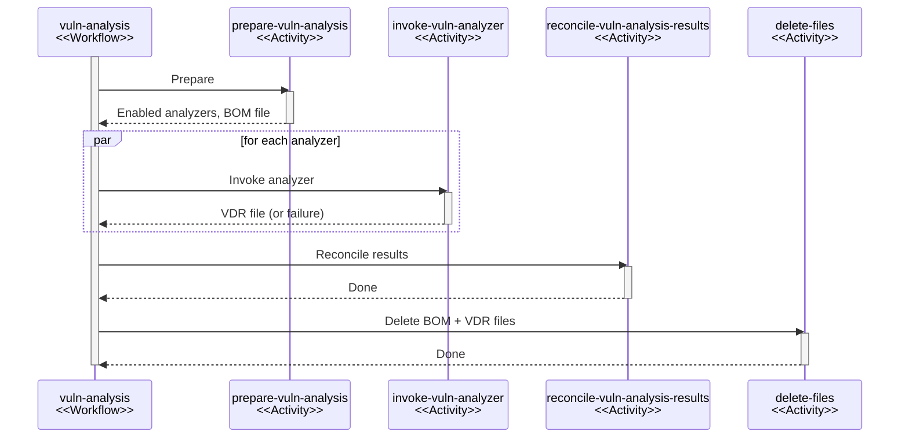

## Overview

The vulnerability analysis system identifies known vulnerabilities in a project's components
by coordinating multiple vulnerability analyzers via a [durable workflow](durable-execution.md).

## Granularity

Vulnerability analysis happens at the project level. This means that analysis of individual
components is not supported.

The reason for this design choice is that analysis can be contextual. Some scanners,
such as [Trivy], may only flag certain vulnerabilities for a component if specific
other components are also present. Analysis of individual components can not offer
this context.

The unit-of-work being a project further has the following, non-functional benefits:

* Fewer asynchronous tasks / events to send and process.
* More opportunities for batching.
* Simpler orchestration.

## Triggers

Vulnerability analysis can be triggered in three ways:

| Trigger    | Workflow Instance ID                    | Concurrency Key               | Priority    |
|:-----------|:----------------------------------------|:------------------------------|:------------|
| Scheduled  | `scheduled-vuln-analysis:<projectUuid>` | `vuln-analysis:<projectUuid>` | 0 (default) |
| BOM upload | *(none)*                                | `vuln-analysis:<projectUuid>` | 50          |
| Manual     | `manual-vuln-analysis:<projectUuid>`    | `vuln-analysis:<projectUuid>` | 75          |

All triggers share the same concurrency key pattern, serializing analysis runs per project
regardless of how they were initiated. Only one run per project can be active at a time.
This prevents data races and excessive resource utilization.

BOM uploads intentionally omit an instance ID. This ensures that every upload
results in an analysis, even if multiple uploads occur in quick succession.
Scheduled and manual triggers use instance IDs to deduplicate concurrent requests
for the same project.

Higher priority values are processed first, so manual triggers (75) take precedence
over BOM uploads (50), which take precedence over scheduled runs (0).

Refer to the [durable execution](durable-execution.md) documentation for details
on how concurrency keys, instance IDs, and priorities are enforced by the engine.

## Workflow Execution

The `vuln-analysis` workflow orchestrates the full analysis lifecycle:



### Preparation

| Activity                | Task Queue |
|:------------------------|:-----------|
| `prepare-vuln-analysis` | `default`  |

1. Determines which analyzers are applicable for the project by querying all enabled
   analyzer instances for their requirements.
2. Aggregates requirements across all analyzers and assembles a CycloneDX BOM containing
   the project's components with the necessary data (CPEs, PURLs, etc.).
3. Stores the BOM to file storage.

If no analyzers are enabled, or the project has no analyzable components,
the workflow terminates early.

### Analyzer Invocation

| Activity               | Task Queue      |
|:-----------------------|:----------------|
| `invoke-vuln-analyzer` | `vuln-analyses` |

1. Retrieves the BOM from file storage.
2. Invokes an analyzer, which yields a VDR.
3. Stores the resulting VDR back to file storage.
4. Runs on the dedicated `vuln-analyses` task queue, isolating analyzer workload
   from other activity processing.

Each analyzer invocation is a separate activity, enabling independent retries
and concurrent execution across analyzers.

### Analyzer Result Reconciliation

| Activity                          | Task Queue |
|:----------------------------------|:-----------|
| `reconcile-vuln-analysis-results` | `default`  |

* Loads VDR files from all successful analyzers from file storage.
* Reconciles the reported vulnerabilities and findings with the database.

Reconciliation performs the following operations, in order:

1. Merging duplicate vulnerability reports across VDRs.
2. Synchronizing vulnerabilities to the database (i.e. creating or updating them).
3. Synchronizing vulnerability alias assertions (see [Alias Synchronization](#alias-synchronization)).
4. Creating and soft-deleting finding attributions (see [ADR-013](../decisions/013-finding-status.md)).
5. Evaluating vulnerability policies for active findings.
6. Emitting notifications (see [Notifications](#notifications)).

All database changes are batched and committed in a single transaction.
This ensures that changes are atomic, and the activity is idempotent.

### File Deletion

| Activity       | Task Queue |
|:---------------|:-----------|
| `delete-files` | `default`  |

Deletes the BOM file, all VDR files, and the context file (if present) from file storage.

## Analyzer Extension Point

Analyzers are pluggable extension points. Their API surface consists of the following interfaces:

???- abstract "VulnAnalyzerFactory"
    ```java linenums="1"
    package org.dependencytrack.vulnanalysis.api;
    
    import org.dependencytrack.plugin.api.ExtensionFactory;
    
    import java.util.EnumSet;
    
    public interface VulnAnalyzerFactory extends ExtensionFactory<VulnAnalyzer> {
    
      /**
       * @return Whether the analyzer is enabled.
       */
      boolean isEnabled();
    
      /**
       * Declares which component data the analyzer needs to perform its analysis.
       * <p>
       * For example, an analyzer that queries the NVD by CPE would return
       * {@link VulnAnalyzerRequirement#COMPONENT_CPE}.
       * <p>
       * Requirements are aggregated across all enabled analyzers. The resulting BOM passed to
       * {@link VulnAnalyzer#analyze(org.cyclonedx.proto.v1_6.Bom)} may thus contain more
       * data than any single analyzer requested. Requirements are satisfied on a best-effort basis,
       * and components provided to analyzers may lack the requested fields.
       * <p>
       * Note that group, name, and version is always provided for all components.
       *
       * @return Requirements for this analyzer.
       */
      EnumSet<VulnAnalyzerRequirement> analyzerRequirements();
    
    }
    ```

???- abstract "VulnAnalyzer"
    ```java linenums="1"
    package org.dependencytrack.vulnanalysis.api;
    
    import org.cyclonedx.proto.v1_6.Bom;
    import org.cyclonedx.proto.v1_6.VulnerabilityAffects;
    import org.dependencytrack.plugin.api.ExtensionPoint;
    import org.dependencytrack.plugin.api.ExtensionPointSpec;
    
    @ExtensionPointSpec(name = "vuln-analyzer", required = false)
    public interface VulnAnalyzer extends ExtensionPoint {
    
      /**
       * Analyzes the given BOM for vulnerabilities.
       *
       * <h4>Input</h4>
       * <p>
       * The input is a CycloneDX BOM representing a project's components.
       * Components MAY have the fields indicated by the analyzer's
       * {@link VulnAnalyzerFactory#analyzerRequirements()}, but this is not guaranteed.
       * Components can have more or fewer fields. It is the responsibility of the analyzer
       * to determine which components it can work with and which it should ignore.
       * <p>
       * Components may include a {@code dependencytrack:internal:is-internal-component} property.
       * When present, the component is internal and its data MUST NOT be sent to external services.
       * The mere presence of the property is suffices, the value is irrelevant. Example:
       * <pre>{@code
       * {
       *   "components": [
       *     {
       *       "bomRef": "ab84cf35-82a1-4341-a70f-0e8c9138e3c4",
       *       "type": "CLASSIFICATION_LIBRARY",
       *       "name": "acme-lib",
       *       "version": "1.0.0",
       *       "purl": "pkg:maven/com.acme/acme-lib@1.0.0",
       *       "properties": [
       *         {
       *           "name": "dependencytrack:internal:is-internal-component"
       *         }
       *       ]
       *     },
       *     {
       *       "bomRef": "cd72ef49-93b2-4452-b81e-1a9249fce4b5",
       *       "type": "CLASSIFICATION_LIBRARY",
       *       "name": "jackson-databind",
       *       "version": "2.18.0",
       *       "purl": "pkg:maven/com.fasterxml.jackson.core/jackson-databind@2.18.0",
       *       "cpe": "cpe:2.3:a:fasterxml:jackson-databind:2.18.0:*:*:*:*:*:*:*"
       *     }
       *   ]
       * }
       * }</pre>
       *
       * <h4>Output</h4>
       * <p>
       * The output is a CycloneDX VDR. It must contain {@code vulnerabilities} with
       * {@link VulnerabilityAffects} entries referencing affected components via their {@code bomRef}.
       * BOM refs should be treated as opaque strings, and analyzers should not make assumptions
       * about their format. Example:
       * <pre>{@code
       * {
       *   "vulnerabilities": [
       *     {
       *       "id": "CVE-2024-1234",
       *       "source": {
       *         "name": "NVD",
       *         "url": "https://nvd.nist.gov/"
       *       },
       *       "affects": [
       *         {
       *           "ref": "cd72ef49-93b2-4452-b81e-1a9249fce4b5"
       *         }
       *       ]
       *     }
       *   ]
       * }
       * }</pre>
       * <p>
       * Vulnerabilities MAY include a {@code dependency-track:vuln:reference-url} property,
       * containing a URL that links to the analyzer-specific advisory or issue page for the
       * vulnerability. Example:
       * <pre>{@code
       * {
       *   "vulnerabilities": [
       *     {
       *       "id": "CVE-2024-1234",
       *       "source": {
       *         "name": "NVD"
       *       },
       *       "properties": [
       *         {
       *           "name": "dependency-track:vuln:reference-url",
       *           "value": "https://security.snyk.io/vuln/SNYK-JAVA-EXAMPLE-1234"
       *         }
       *       ],
       *       "affects": [
       *         {
       *           "ref": "cd72ef49-93b2-4452-b81e-1a9249fce4b5"
       *         }
       *       ]
       *     }
       *   ]
       * }
       * }</pre>
       *
       * @param bom the CycloneDX BOM to analyze.
       * @return A CycloneDX VDR containing discovered vulnerabilities.
       */
      Bom analyze(Bom bom);
    
    }
    ```

## File Storage

The BOM and VDR files produced during analysis are stored via the `FileStorage` mechanism,
which abstracts over an underlying storage backend (*TODO: Link design doc when ready*).

File storage was chosen because:

* In-memory storage is not an option, as workflow execution may span multiple application nodes.
* The respective artifacts are arbitrarily large.
* Passing them directly via workflow and activity arguments would bloat workflow history.
* Storing them as blobs in the database would strain the database with excessive I/O.

The `FileMetadata` returned by the storage provider is passed between activities,
decoupling the workflow from storage specifics.

### File Naming

Files follow a deterministic naming scheme scoped to the workflow run:

| File    | Name Pattern                                             |
|:--------|:---------------------------------------------------------|
| BOM     | `vuln-analysis/<workflowRunId>/bom.proto`                |
| VDR     | `vuln-analysis/<workflowRunId>/vdr_<analyzerName>.proto` |
| Context | `vuln-analysis/context/<bomUploadToken>.proto`           |

## Resiliency

### Activity Retries

Analyzer invocations use the following retry policy:

| Parameter            | Value |
|:---------------------|:------|
| Initial delay        | 5s    |
| Delay multiplier     | 2x    |
| Randomization factor | 0.3   |
| Max delay            | 5m    |
| Max attempts         | 5     |

This yields a maximum retry window of roughly 2-3 minutes before an analyzer
invocation is considered permanently failed.

### Graceful Failure Handling

When an analyzer fails (even after exhausting retries), the workflow catches the
`ActivityFailureException` and records the analyzer as failed. The workflow continues
with results from successful analyzers. During reconciliation, findings attributed
to failed analyzers are preserved. Their attributions are not deleted, since the
absence of a result does not imply the absence of a vulnerability.

An `ANALYZER_ERROR` notification is emitted for each failed analyzer.

### File Cleanup

The `deleteFiles` step runs in both the success path and the error path (via catch + rethrow),
ensuring BOM and VDR files are cleaned up regardless of outcome.

## Reconciliation

During reconciliation, VDRs from all successful analyzers are processed,
and findings synchronized with the database.

### Vulnerability Merge

When multiple analyzers report the same vulnerability (identified by source and vulnerability ID),
only one report is used for synchronization. VDRs are processed in alphabetical
analyzer name order, and the first report wins. The exception is when a later report carries
a pre-populated database ID (only set by the internal analyzer), in which case it takes precedence,
since the ID allows skipping database lookups during synchronization.

### Vulnerability Synchronization

Reported vulnerabilities are synchronized to the database using a three-tier strategy:

1. Pre-populated IDs: Vulnerabilities whose database ID is already known (from the internal
   analyzer) are returned directly without any database query.
2. Read-only resolution: Vulnerabilities that cannot be updated by analyzers (see
   [Vulnerability Updates](#vulnerability-updates)) are resolved via a `SELECT` query, avoiding
   the exclusive row locks that an upsert would acquire.
3. Upsert: Remaining vulnerabilities are inserted or updated via
   `INSERT ... ON CONFLICT DO UPDATE`.

Vulnerabilities are processed in batches of 100.

### Vulnerability Updates

An analyzer can update a vulnerability's data if:

* It is the authoritative source for that vulnerability type
  (e.g. `oss-index` for `OSSINDEX`, `snyk` for `SNYK`), or
* The vulnerability source can be mirrored (e.g. `NVD`, `GITHUB`, `OSV`),
  and mirroring for that source is disabled.

Vulnerabilities from the `INTERNAL` source are never modified by analyzers.

In addition to the source-level checks, the upsert enforces two row-level guards:

* Temporal: the incoming `UPDATED` timestamp must be strictly newer than the existing one.
  This prevents older data from overwriting newer data.
* Idempotency: all mutable fields are compared via `IS DISTINCT FROM`.
  If the incoming data is identical to what is already stored, the row is not written.

### Alias Synchronization

After vulnerability synchronization, alias assertions reported by each analyzer are
synchronized to the database.

Refer to [ADR-014](../decisions/014-new-alias-schema.md) for details on the alias schema
and synchronization algorithm.

### Finding Attributions

Each finding (component and vulnerability pair) tracks which analyzers reported it
via attributions. During reconciliation:

1. New attributions are created for newly reported findings.
2. Stale attributions are soft-deleted when an analyzer that previously reported
   a finding no longer does. Attributions from *failed* analyzers are preserved.
3. A finding is considered active as long as it has at least one non-deleted attribution.

Refer to [ADR-013](../decisions/013-finding-status.md) for further details on the attribution mechanism.

### Policy Evaluation

After findings are reconciled, vulnerability policies are evaluated against
all active findings. Policy results can automatically set analysis states
(e.g. suppression), and any resulting audit changes emit notifications.

When a policy that previously matched a finding no longer does, the automatically
applied analysis state is reset to defaults.

!!! tip
    Policy analyses are applied atomically with finding reconciliation.
    This means that a newly identified finding can be immediately suppressed,
    without ever showing up in time series metrics, or triggering a `NEW_VULNERABILITY` notification.

### Notifications

The following notifications can be emitted during reconciliation:

* `NEW_VULNERABILITY`: For each newly created finding.
* `NEW_VULNERABLE_DEPENDENCY`: When a BOM upload introduces new components that have
  existing vulnerabilities. The BOM upload trigger stores a context file containing the IDs
  of newly added components. During reconciliation, if the context file is present,
  components from that list that ended up with findings trigger this notification.
* `PROJECT_AUDIT_CHANGE`: When a policy evaluation changes the analysis state or 
  suppression of an existing finding.
* `ANALYZER_ERROR`: For each analyzer that failed during invocation.

All notifications are emitted within the same transaction that persists findings,
following the [transactional outbox](notifications.md) pattern.

## Post-Workflow Notifications

After the workflow run completes (regardless of outcome), a  `PROJECT_VULN_ANALYSIS_COMPLETE`
notification is emitted. For successful runs, it includes the full list of active findings for the project.
For failed runs, it includes a failed status indicator.

This notification is emitted by a [dex](durable-execution.md) event listener.
It fires once for each batch of completed workflow runs.

!!! note
    Two additional event listeners exist for backward compatibility and are scheduled
    for removal:

    * **Delayed BOM processed notification**: Optionally defers the `BOM_PROCESSED`
      notification until after vulnerability analysis completes. Only applies to analyses
      that were triggered by a BOM upload.
    * **Legacy workflow step completer**: Bridges new dex workflow runs to the
      [legacy `WorkflowState` tracking system](archive/workflow-state-tracking.md),
      and dispatches downstream policy evaluation and metrics update events.

[Trivy]: https://trivy.dev/