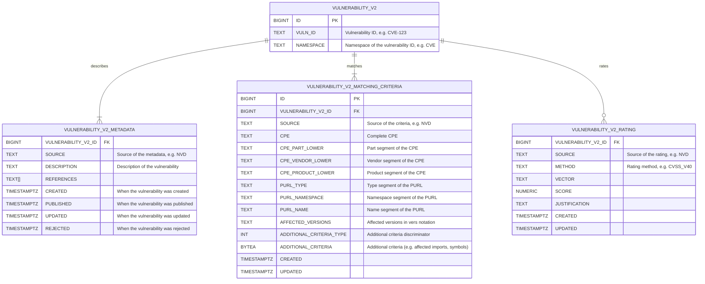

# Vulnerability Database V2

### Schema



### Decisions

#### Separate namespace from source

TODO

#### Separate identifier from metadata

We have to assume that multiple data sources will report metadata for the same vulnerability.
This metadata can be conflicting

#### Separate metadata from ratings

TODO

#### Adopt `vers` for version ranges

TODO

#### Support additional matching criteria

Some upstream databases provide additional data, for example to evaluate whether vulnerable code is being invoked.
There is no standard notation for data like that, and the structure differs across databases and component ecosystem.

Thus, the schema treats additional criteria as opaque byte array. A discriminator column is added to inform readers
about the data format. Discriminators can further be used for versioning, should the data format change over time.

Additional criteria *should* be compressed to reduce storage requirements, for example using [zstd].

#### Store CPE segments in lowercase

CPE matching is supposed to be case-insensitive. 

### Indexes

#### Matching criteria

To facilitate performant querying for matching criteria, we'll use PostgreSQL's *covering indexes*
in order to enable it to use [index-only scans].

```sql linenums="1"
 CREATE
  INDEX "VULNERABILITY_V2_MATCHING_CRITERIA_CPE_IDX"
     ON "VULNERABILITY_V2_MATCHING_CRITERIA"(
          "CPE_PART_LOWER"
        , "CPE_VENDOR_LOWER"
        , "CPE_PRODUCT_LOWER")
INCLUDE ("ID", "VULNERABILITY_V2_ID", "CPE", "AFFECTED_VERSIONS")
  WHERE "CPE_PART_LOWER" IS NOT NULL
    AND "CPE_VENDOR_LOWER" IS NOT NULL
    AND "CPE_PRODUCT_LOWER" IS NOT NULL
```

```sql linenums="1"
 CREATE
  INDEX "VULNERABILITY_V2_MATCHING_CRITERIA_PURL_IDX"
     ON "VULNERABILITY_V2_MATCHING_CRITERIA"(
          "PURL_TYPE"
        , "PURL_NAMESPACE"
        , "PURL_NAME")
INCLUDE ("ID", "VULNERABILITY_V2_ID", "AFFECTED_VERSIONS")
  WHERE "PURL_TYPE" IS NOT NULL
    AND "PURL_NAME" IS NOT NULL
```

### Constraints

#### Matching criteria

Ensure that CPE segments are indeed stored in lower case:

```sql
ALTER TABLE "VULNERABILITY_V2_MATCHING_CRITERIA"
  ADD CONSTRAINT "VULNERABILITY_V2_MATCHING_CRITERIA_CPE_LOWERCASE_CHECK"
CHECK ("CPE_PART_LOWER" = LOWER("CPE_PART_LOWER")
       AND "CPE_VENDOR_LOWER" = LOWER("CPE_VENDOR_LOWER")
       AND "CPE_PRODUCT_LOWER" = LOWER("CPE_PRODUCT_LOWER"));
```

Ensure that PURL segments are indeed stored in URL-decoded form:

```sql
ALTER TABLE "VULNERABILITY_V2_MATCHING_CRITERIA"
  ADD CONSTRAINT "VULNERABILITY_V2_MATCHING_CRITERIA_PURL_URL_DECODED_CHECK"
CHECK ("PURL_NAMESPACE" NOT LIKE '%\%%' ESCAPE '\'
       AND "PURL_NAME" NOT LIKE '%\%%' ESCAPE '\');
```

### Use Cases

#### Query matching criteria by CPE

```sql linenums="1"
SELECT "ID"
     , "VULNERABILITY_V2_ID"
     , "AFFECTED_VERSIONS"
  FROM "VULNERABILITY_V2_MATCHING_CRITERIA"
 WHERE "CPE_PART_LOWER" = LOWER(:cpePart)
   AND "CPE_VENDOR_LOWER" = LOWER(:cpeVendor)
   AND "CPE_PRODUCT_LOWER" = LOWER(:cpeProduct)
```

!!! note
    The query above is simplified for brevity. Usually, `WHERE` conditions are dynamic,
    and depend on the CPE of the component at hand. Refer to the [current query construction logic]
    for details.

#### Query matching criteria by PURL

```sql linenums="1"
SELECT "ID"
     , "VULNERABILITY_V2_ID"
     , "AFFECTED_VERSIONS"
  FROM "VULNERABILITY_V2_MATCHING_CRITERIA"
 WHERE "PURL_TYPE" = :purlType
   AND "PURL_NAMESPACE" = :purlNamespace
   AND "PURL_NAME" = :purlName
```

!!! note
    `PURL_NAMESPACE` and `PURL_NAME` must be in their URL-*decoded* form (i.e. `@foo`, not `%40foo`).

#### Query matching criteria for multiple components

For batch processing purposes, matching criteria can be queried for multiple components at once.
Simply `UNION ALL` multiple queries, and include a `COMPONENT` discriminator in each query to track
which result row was returned for which component.

```sql linenums="1"
SELECT 'foo' AS "COMPONENT"
     , "ID"
     , NULL AS "CPE"
     , "VULNERABILITY_V2_ID"
     , "AFFECTED_VERSIONS"
  FROM "VULNERABILITY_V2_MATCHING_CRITERIA"
 WHERE "PURL_TYPE" = :fooPurlType
   AND "PURL_NAMESPACE" = :fooPurlNamespace
   AND "PURL_NAME" = :fooPurlName
 UNION ALL
SELECT 'bar' AS "COMPONENT"
     , "ID"
     , "CPE"
     , "VULNERABILITY_V2_ID"
     , "AFFECTED_VERSIONS"
  FROM "VULNERABILITY_V2_MATCHING_CRITERIA"
 WHERE "CPE_PART_LOWER" = LOWER(:barCpePart)
   AND "CPE_VENDOR_LOWER" = LOWER(:barCpeVendor)
   AND "CPE_PRODUCT_LOWER" = LOWER(:barCpeProduct)
```

!!! note
    The same approach also works if a component has multiple identifiers, i.e. both CPE *and* PURL.

#### Query additional matching criteria

For criteria for which a version match was identified, additional matching information *may* be retrieved:

```sql linenums="1"
SELECT "ID"
     , "ADDITIONAL_CRITERIA_TYPE"
     , "ADDITIONAL_CRITERIA"
  FROM "VULNERABILITY_V2_MATCHING_CRITERIA"
 WHERE "ID" = ANY (:matchedIds)
   AND "ADDITIONAL_CRITERIA" IS NOT NULL
```

Additional criteria is fetched separately from version ranges, because:

* We expect it to be arbitrarily large, so it's best to defer retrieval until absolutely necessary
* We expect it to be arbitrarily large, so we can't reasonably include it in any of the indexes
* In the majority of cases, versions will *not* match, making retrieval of this data pointless
* This step is entirely optional, and in the majority of cases won't yield any results anyway

#### Adding component identifiers

The proposed schema considers only CPE and PURL. However, new identifiers can always be added later by:

1. Adding new column(s) to the `VULNERABILITY_V2_MATCHING_CRITERIA` table
2. Adding corresponding indexes for [index-only scans] on the new identifier

[current query construction logic]: https://github.com/DependencyTrack/hyades/blob/adfa1f247b33b48b31590403b344dd66ca62319d/commons-persistence/src/main/java/org/dependencytrack/persistence/repository/VulnerableSoftwareRepository.java#L41-L122
[index-only scans]: https://www.postgresql.org/docs/current/indexes-index-only-scans.html
[indexing expressions]: https://www.postgresql.org/docs/current/indexes-expressional.html
[zstd]: https://github.com/facebook/zstd