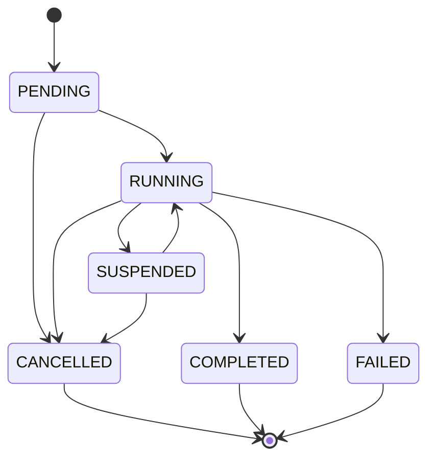
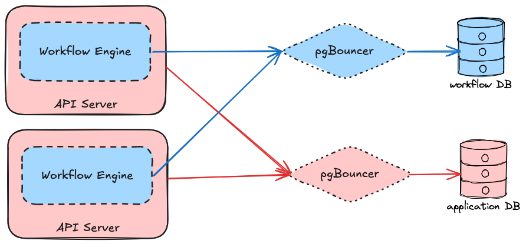

## Introduction

Dependency-Track leverages an embedded [durable execution](#durable-execution) engine
to orchestrate workflows in a resilient and efficient way.

The engine is heavily inspired by Microsoft's [Durable Task Framework] (DTFx)
and Temporal, which is itself a descendant of DTFx.

## Concepts

### Durable Execution

Durable execution differs from other orchestration techniques such as DAGs,
in that they are defined as normal application code. 

Durable execution leans on [async/await] semantics to model asynchronous, fault-tolerant
code invocations. 

### Workflow

TBD

### Workflow Run

A workflow run is a stateful instantiation of a workflow definition. DTFx calls this an *orchestration instance*.

### Activity

TBD

### Sub Workflow

Workflows can invoke other workflows. The invoked workflow is called a sub workflow.

### Side Effect

Side effects are non-deterministic actions performed by a workflow.  
Their results are recorded in the workflow history and replayed when the workflow executes again.

### Timer

TBD

### External Event

TBD

## Workflow API

TBD

## Engine API

### Workflow Run Status


```mermaid
stateDiagram-v2
    [*] --> PENDING
    PENDING --> RUNNING
    PENDING --> CANCELLED
    RUNNING --> SUSPENDED
    RUNNING --> CANCELLED
    RUNNING --> COMPLETED
    RUNNING --> FAILED
    SUSPENDED --> CANCELLED
    SUSPENDED --> RUNNING
    CANCELLED --> [*]
    COMPLETED --> [*]
    FAILED --> [*]
```

## Engine Internals

### Architecture

The engine is designed to run embedded within all API server nodes of a Dependency-Track cluster.
For production deployments, it is intended that a separate database server is used as to not negatively
impact other areas of the application when under load. However, it is also possible to use a separate logical 
database on a shared server, a separate schema in the same logical database, or even the same schema as the
application.



!!! note
    Usage of a centralised connection pool such as pgBouncer is entirely optional,
    but recommended when deploying multiple nodes.

### Prioritization

TBD

### Concurrency Control

#### Per-Instance

Workflows and activities are grouped into `WorkflowGroup`s and `ActivityGroup`s:

```java
var workflowGroup = new WorkflowGroup("a")
        .withWorkflow(WorkflowFoo.class)
        .withMaxConcurrency(5);

var activityGroup = new ActivityGroup("b")
        .withActivity(ActivityFoo.class)
        .withActivity(ActivityBar.class)
        .withMaxConcurrency(10);
```

For each group, a maximum concurrency can be configured, which limits how many
concurrent executions are allowed in a respective workflow engine instance.
This is useful to constrain expensive workflows or activities that could otherwise
overwhelm downstream systems, or to simply reduce the resource footprint of workflow
orchestration.

#### Global

Workflow concurrency can be limited globally, across all engine instances, using *concurrency group IDs*. 

Conceptually, they behave similar to [SQS message group ID]s: workflow runs sharing a group ID will be processed
one after another, in order.

## Performance and Efficiency Techniques

### Buffering and Batching

TBD

### PostgreSQL Nested Inserts

https://www.timescale.com/blog/boosting-postgres-insert-performance

### UUIDv7

TBD

[async/await]: https://en.wikipedia.org/wiki/Async/await
[Durable Task Framework]: https://github.com/Azure/durabletask
[SQS message group ID]: https://docs.aws.amazon.com/AWSSimpleQueueService/latest/SQSDeveloperGuide/FIFO-key-terms.html
[Temporal]: https://github.com/temporalio/temporal