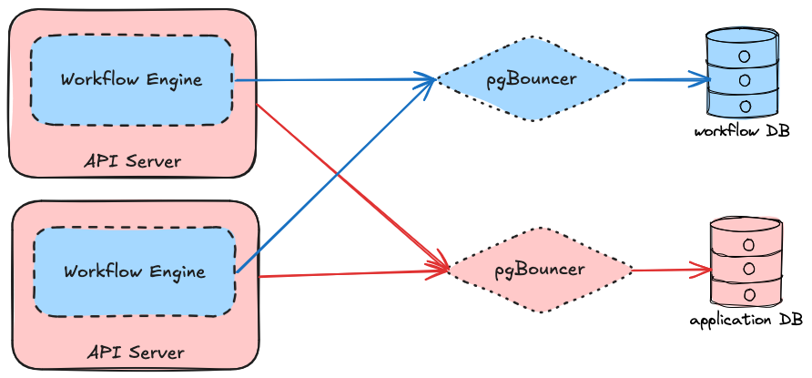

## Introduction

Dependency-Track leverages an embedded [durable execution](#durable-execution) engine
to orchestrate workflows in a resilient and efficient way.

The engine is heavily inspired by Microsoft's [Durable Task Framework] (DTFx)
and Temporal, which is itself a descendant of DTFx.

## Concepts

### Durable Execution

Durable execution differs from other orchestration techniques such as DAGs,
in that they are defined as normal application code. 

Durable execution leans on [async/await] semantics to model asynchronous, fault-tolerant
code invocations. 

### Workflow

TBD

### Workflow Run

A workflow run is a stateful instantiation of a workflow definition. DTFx calls this an *orchestration instance*.

### Activity

TBD

### Child Workflow

Workflows can invoke other workflows. The invoked workflow is called a child workflow.

### Side Effect

Side effects are non-deterministic actions performed by a workflow.  
Their results are recorded in the workflow history and replayed when the workflow executes again.

### Timer

TBD

### External Event

TBD

## Workflow API

A workflow is authored by implementing the `WorkflowExecutor<A, R>` interface,
where `A` is the type of the workflow's argument, and `R` the type of its result.

Workflows are identified by their name and version, which must be provided using the `@Workflow` annotation.

```java linenums="1"
import org.dependencytrack.workflow.api.WorkflowExecutor;
import org.dependencytrack.workflow.api.annotation.Workflow;

@Workflow(name = "demo", version = 1)
public class DemoWorkflow implements WorkflowExecutor<String, String> {
    
    public void execute(WorkflowContext<String> ctx) {
        // TODO: Workflow code goes here.
    }
    
}
```

Implementors of `WorkflowExecutor<A, R>` are given a `WorkflowContext<A>` instance, which enables them to:

* Retrieve the workflow's argument
* Call [activities](#activity)
* Call [child workflows](#child-workflow)
* Execute [side effects](#side-effect)
* Create [timers](#timer)
* Wait for [external events](#external-event)

Similarly, to author an activity, the `ActivityExecutor<A, R>` interface must be implemented,
and the `@Activity` annotation be used:

```java linenums="1"
@Activity(name = "order-pizza")
public class OrderPizzaActivity implements ActivityExecutor<String, String> {
    
    public void execute(ActivityContext<String> ctx) {
        // TODO: Activity code goes here.
    }
    
}
```

### Logging

Workflow code is expected to be executed multiple times until a run completes. This poses a challenge for logging,
since logs are expected to only be emitted once. To address this, `WorkflowContext` provides access to a logger
which omits log emission during history replay:

```java linenums="1"
public void execute(WorkflowContext<String> ctx) {
    ctx.logger().info("Hello from {}!", ctx.workflowName());
}
```

The logger uses the [SLF4J] API.

### Awaitables

An `Awaitable<T>` represents a deferred result of type `T`, similar to Java `Future`s or JavaScript `Promise`s.

!!! note
    Unfortunately, reusing the standard library's `Future` or `CompletableFuture` interfaces was not possible
    due to their large API surface, most of which is not applicable for durable execution use-cases.

In the workflow API, actions that may block the workflow execution return `Awaitable`s.

Invoking the `await` method on an `Awaitable` forces the runtime to evaluate whether a result is available,
and if not, causes it to end the execution and yield control of the thread it's running on back to the engine.

### Retrieving Workflow Argument

```java linenums="1"
public void execute(WorkflowContext<String> ctx) {
    String name = ctx.argument();
    if (name != null) {
        ctx.logger().info("Hello, {}!", name);
    } else {
        ctx.logger().info("Hello, stranger!");
    }
}
```

### Calling Activities

[Activities](#activity) can be called in a type-safe manner using `ActivityClient`s:

```java linenums="1"
// public class SayHelloActivity implements ActivityExecutor<String, String> {}

public void execute(WorkflowContext<String> ctx) {
    String name = ctx.argument();
    
    ActivityClient<String, String> sayHelloClient = 
            ctx.activityClient(SayHelloActivity.class);
    
    Awaitable<String> awaitable = sayHelloClient.call(
            new ActivityCallOptions<>().withArgument(name));
    
    String greetingText = awaitable.await(); // Hello, Alice!
}
```

In case the invoked activity encounters a terminal failure, `await` throws a `ActivityFailureException`.

### Calling Child Workflows

[Child workflows](#child-workflow) can be called in a type-safe manner using `WorkflowClient`s:

```java linenums="1"
// public class OrderPizzaWorkflow implements WorkflowExecutor<String, String> {}

public void execute(WorkflowContext<String> ctx) {
    String name = ctx.argument();
    
    WorkflowClient<String, String> orderPizzaClient = 
            ctx.workflowClient(OrderPizzaWorkflow.class);
    
    Awaitable<String> awaitable = orderPizzaClient.call(
            new WorkflowCallOptions<>().withArgument(name));
    
    String orderedPizzaName = awaitable.await(); // Margherita
}
```

### Executing Side Effects

Sometimes, workflows need to perform actions that are non-deterministic, yet too lightweight
to justify scheduling an activity. In such cases, `sideEffect` may be used:

```java linenums="1"
public void execute(WorkflowContext<Void> ctx) {
    String uuid = ctx.sideEffect(
            /* name */ "UUIDv4 Generation",
            /* argument */ null,
            /* resultConverter */ PayloadConverters.stringConverter(),
            ignored -> UUID.randomUUID().toString()).await();
}
```

### Creating Timers

```java linenums="1"
public void execute(WorkflowContext<Void> ctx) {
    ctx.scheduleTimer("Go to sleep", Duration.ofHours(8)).await();
}
```

### Waiting for External Events

```java linenums="1"
public void execute(WorkflowContext<Void> ctx) {
    String orderId = ctx.activityClient(OrderPizzaActivity.class).call(
            new ActivityCallOptions<>().withArgument("Margherita"));
    
    ctx.logger().info("Waiting for completion of order: {}", orderId);
    String orderStatus = ctx.waitForExternalEvent(
            orderId, PayloadConverters.stringConverter(), Duration.ofHours(3)).await();
    
    ctx.logger().info("Order {} completed with status: {}", orderId, orderStatus);
}
```

### Pattern: Parallel Activity Execution


```java linenums="1"
public void execute(WorkflowContext<Void> ctx) {
    var orderPizzaClient = ctx.activityClient(OrderPizzaActivity.class);

    var awaitables = new ArrayList<Awaitable<Void>>(3);
    for (String pizzaName : List.of("Margherita", "Marinara", "Calzone")){
        awaitables.add(orderPizzaClient.call(
                new ActivityCallOptions<>().withArgument(pizzaName)));
    }

    for (Awaitable<Void> awaitable : awaitables) {
        awaitable.await();
    }
}
```

## Engine API

### Workflow Run Status


## Engine Internals

### Architecture

The engine is designed to run embedded within all API server nodes of a Dependency-Track cluster.
For production deployments, it is intended that a separate database server is used as to not negatively
impact other areas of the application when under load. However, it is also possible to use a separate logical 
database on a shared server, a separate schema in the same logical database, or even the same schema as the
application.



!!! note
    Usage of a centralized connection pool such as [PgBouncer] is entirely optional,
    but recommended when deploying multiple nodes.

### Prioritization

Per default, workflow runs are executed from oldest to newest.

The engine can be nudged towards executing newer runs sooner, by optionally assigning a priority to them.
A priority is an arbitrary integer, where higher values correspond to a higher priority:

```java
new CreateWorkflowRunRequest<>(DemoWorkflow.class).withPriority(666);
```

When determining which runs to execute next, the engine will pick the first `N`
runs after ordering them by: 

```sql
priority DESC NULLS LAST, id ASC
```

!!! note
    Because run IDs are generated using [UUIDv7](#uuidv7), the resulting order is roughly the same as
    when ordering by the creation timestamp. IDs are guaranteed to be unique, while timestamps are not,
    making them a more reliable choice for ordering.

### Concurrency Control

#### Per-Instance

Workflows and activities are grouped into `WorkflowGroup`s and `ActivityGroup`s:

```java
var workflowGroup = new WorkflowGroup("a")
        .withWorkflow(WorkflowFoo.class)
        .withMaxConcurrency(5);

var activityGroup = new ActivityGroup("b")
        .withActivity(ActivityFoo.class)
        .withActivity(ActivityBar.class)
        .withMaxConcurrency(10);
```

For each group, a maximum concurrency can be configured, which limits how many
concurrent executions are allowed in a respective engine instance.
This is useful to constrain expensive workflows or activities that could otherwise
overwhelm downstream systems, or to simply reduce the resource footprint of workflow
orchestration.

#### Global

Workflow concurrency can be limited globally, across all engine instances, using *concurrency group IDs*. 

Conceptually, they behave similar to [SQS message group ID]s: workflow runs sharing a group ID will be processed
one after another, in order.

## Performance and Efficiency Techniques

### Buffering and Batching

TBD

### PostgreSQL Nested Inserts

https://www.timescale.com/blog/boosting-postgres-insert-performance

### UUIDv7

TBD

[async/await]: https://en.wikipedia.org/wiki/Async/await
[Durable Task Framework]: https://github.com/Azure/durabletask
[PgBouncer]: https://www.pgbouncer.org/
[SLF4J]: https://www.slf4j.org/
[SQS message group ID]: https://docs.aws.amazon.com/AWSSimpleQueueService/latest/SQSDeveloperGuide/FIFO-key-terms.html
[Temporal]: https://github.com/temporalio/temporal
[UUIDv7]: https://www.ietf.org/archive/id/draft-peabody-dispatch-new-uuid-format-04.html#name-uuid-version-7