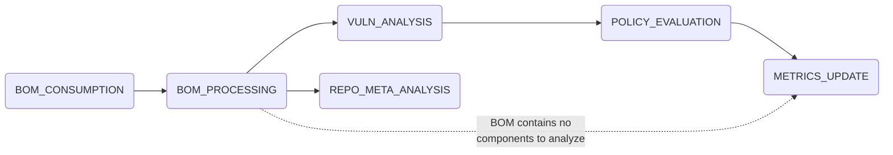
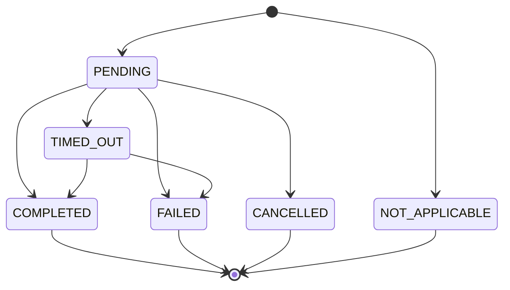
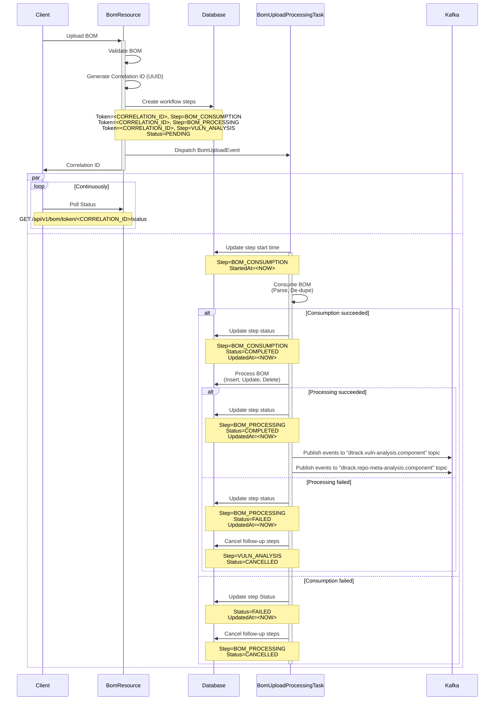
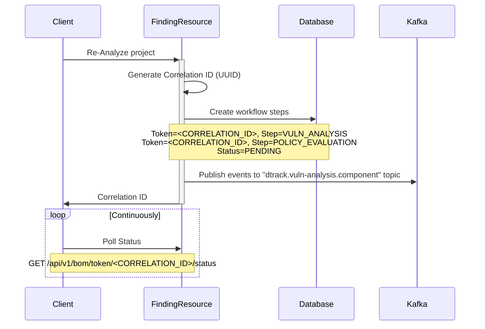

# Tracking of Workflow State for BOM Processing and Analysis

> **Note**  
> This document was extracted from #664.

For CI/CD use-cases, Dependency-Track offers a mechanism that allows clients to poll whether the BOM they just uploaded is still being processed. "Processing" in this context refers to:

* Consumption (Parsing)
* Ingestion (Sync parsed data with database)
* Vulnerability analysis
* Policy Evaluation

This is an important capability, allowing for implementation of quality gates and reporting in CI/CD pipelines.

The mechanism works by assigning identifiers (UUIDs) to events in Alpine's in-memory event system. As long as an event associated to a given identifier can be found in its internal queue, the identifier is considered to be "processing":

* https://github.com/DependencyTrack/dependency-track/blob/6153d286d1ac806462bc76cfe17d84a57c224671/src/main/java/org/dependencytrack/resources/v1/BomResource.java#L323-L342
* https://github.com/stevespringett/Alpine/blob/cd6aa7ed05376935ab32bc43819eba0e3a525b7f/alpine-infra/src/main/java/alpine/event/framework/BaseEventService.java#L158-L161

Events can be chained, such that a `BomUploadEvent` will trigger a `VulnerabilityAnalysisEvent`, which will trigger a `PolicyEvaluationEvent`, and so on. The event identifier is inherited by chained events.

As everything happens in-memory, this mechanism does not work when multiple instances of the API server are used in an active-active deployment. For the functionality to continue to work, the state of processing steps must be persistent to external storage.

Decoupled from #633.

### Design

> **Note**  
> The goal for now is *not* to build a multi-purpose workflow engine, but to track state of one specific workflow. In a future iteration, we may invest more time into coming up with a generic workflow engine concept.

#### What to track

1. BOM consumption (parsing, de-duplication, etc.)
2. BOM processing (ingestion into database)
3. Vulnerability analysis
4. Repository metadata analysis
5. Policy evaluation
6. Metrics update

The order of execution as of today is as follows:



> **Note**  
> Completion of repository metadata analysis can currently not be tracked. We'll need something similar to what we introduced in https://github.com/DependencyTrack/hyades-apiserver/pull/40 for vulnerability analysis completion tracking. For the initial implementation, it may be OK to not track it.

#### States

There are multiple states a processing step can be in:

* `PENDING`: Initial state
* `COMPLETED`: Completion detected; No failures
* `FAILED`: Completion detected; Failures
* `CANCELLED`: Never started because a precondition failed
    * e.g. vulnerability analysis will be cancelled when BOM ingestion failed
* `NOT_APPLICABLE`: The step is not applicable to the subject of the analysis
    * e.g. the analysis was triggered for an existing project, without BOM upload
* `TIMED_OUT`: The deadline for the step completion was exceeded; Step is unlikely to complete



Each step is responsible for updating its own state.

The overall state can be considered to be *complete*, if there's no step in `PENDING` state.

When a step failure is detected, a "failure reason" message must be persisted. If multiple steps fail, (rough) failure details for each step must be available.

> There should be a deadline mechanism, which automatically transitions steps from `PENDING` into `TIMED_OUT` state. Steps in `TIMED_OUT` state communicate that it is *unlikely* that a terminal state can be reached (`COMPLETED`, `FAILED`). However, it is still possible (e.g. due to significant consumer lag, events may arrive late).

#### Workflow

The API server will act as workflow orchestrator, kicking off new steps as needed. This implies that completion of a step must be registered by the API server.

To illustrate how the initial stage of the workflow should look like:



When triggering a re-analysis of an already existing project, the workflow may be kicked off as follows:



#### Proposed Table Schema

Each step of the workflow will be represented in a dedicated row. This allows us to add or remove steps without altering the database schema (see original version of the schema further down below), or even *add* steps while the workflow is running. It also plays better with concurrent writes, as no two threads / instances will need to modify the same row.

| Name | Type | Nullable | Example |
| :---- | :---- | :---: | :---- |
| ID | `SERIAL` | ❌ | 1 |
| PARENT_STEP_ID | `SERIAL FK` | ✅ | 0 |
| TOKEN | `VARCHAR(36)` | ❌ | `484d9eaa-7ea4-4476-97d6-f36327b5a626` |
| STARTED_AT | `TIMESTAMP` | ✅ | `1999-01-08 04:05:06` |
| UPDATED_AT | `TIMESTAMP` | ✅ | `1999-01-08 04:05:06` |
| STEP | `VARCHAR(64)` | ❌ | `METRICS_UPDATE` |
| STATUS | `VARCHAR(64)` | ❌ | `PENDING` |
| FAILURE_REASON | `TEXT` | ✅ | `Failed to acquire database connection` |

**Potential Future Improvements**:
* Do we need/want to capture the order in which steps are supposed to be executed?
* Do we need/want to capture metadata of the overall workflow (who triggered it, when was it triggered, correlation id, ...)?

<details>
<summary>Original Version</summary>

| Name | Type | Nullable | Example |
| :--- | :--- | :---: | :--- |
| TOKEN | `VARCHAR(36)` | ❌ | `484d9eaa-7ea4-4476-97d6-f36327b5a626` |
| STARTED_AT | `TIMESTAMP` | ❌ | `1999-01-08 04:05:06` |
| UPDATED_AT | `TIMESTAMP` | ❌ | `1999-01-08 04:05:06` |
| BOM_CONSUMPTION | `VARCHAR(64)` | ❌ | `PENDING` |
| BOM_PROCESSING | `VARCHAR(64)` | ❌ | `PENDING` |
| VULN_ANALYSIS | `VARCHAR(64)` | ❌ | `PENDING` |
| REPO_META_ANALYSIS | `VARCHAR(64)` | ❌ | `PENDING` |
| POLICY_EVALUATION | `VARCHAR(64)` | ❌ | `PENDING` |
| METRICS_UPDATE | `VARCHAR(64)` | ❌ | `PENDING` |
| FAILURE_REASON | `TEXT` | ✅ | - |

`FAILURE_REASON` is a field of unlimited length. It either holds no value (`NULL`), or a JSON object listing failure details per step, e.g.:

```json
{
  "BOM_PROCESSING": "Failed to acquire database connection"
}
```

</details>

Where applicable, the "detailed" status of a step is tracked in a dedicated table. For example, for vulnerability analysis:

https://github.com/DependencyTrack/hyades/blob/e70c47fff359df1fb8150805d5b0c2acebe85ed3/commons-persistence/src/main/resources/migrations/postgres/V0.0.1__API-Server-4.8.2.sql#L158-L171

#### Retention

Rows in the table should be cleaned up on a recurring basis.

This could be as simple as scheduling a job that executes this SQL query:

```sql
DELETE FROM org.dependencytrack.repometaanalyzer.model.WorkflowStep WHERE this.updatedAt < :threshold
```

A retention time of 1-3 days since the last update should be reasonable.

#### REST API endpoints

The existing endpoint to check whether a BOM is still being processed should continue to work as expected:

```http
GET /api/v1/bom/token/<CORRELATION_ID>
```
```json
{
  "processing": true
}
```

An additional endpoint may be added, which allows for retrieval of the individual step states:

```http
GET /api/v1/workflow/token/<CORRELATION_ID>/status
```
```json
[
  {
    "step": "BOM_CONSUMPTION",
    "status": "COMPLETED",
    "startedAt": "1999-01-08 04:05:06",
    "updatedAt": "1999-01-08 04:05:06"
  },
  {
    "step": "BOM_PROCESSING",
    "status": "FAILED",
    "startedAt": "1999-01-08 04:05:06",
    "updatedAt": "1999-01-08 04:05:06",
    "failureReason": "Failed to acquire database connection"
  },
  {
    "step": "VULN_ANALYSIS",
    "status": "CANCELLED"
  }
]
```

If all a client cares about are vulnerability analysis results, they could stop polling immediately after `vulnerabilityAnalysis` transitions into the `COMPLETED` state.