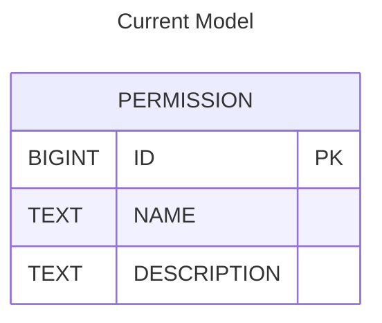
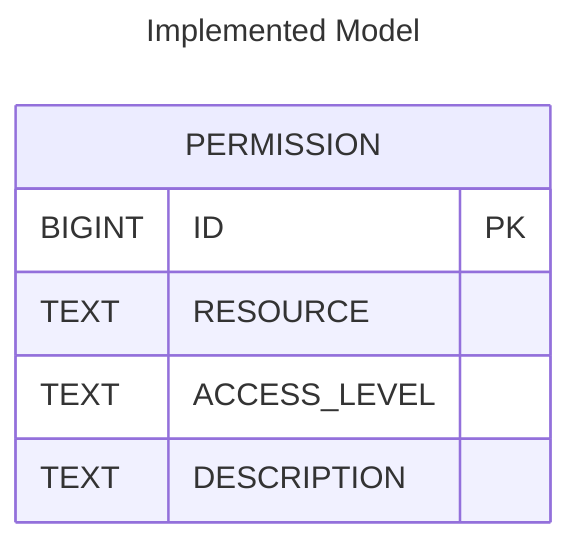
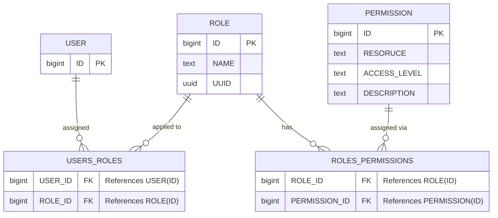

# Roles

## What are Roles?

Roles increase privacy and allow for better ease of use in large scale projects. Essentially, a role defines a set of permissions and responsibilities that a user or group of users can have within the project. By assigning specific roles, project administrators can control who has access to what resources, ensuring that sensitive information is only accessible to those who need it. Custom roles are also included, allowing for the user to create unique permissions for specific use case.

## Scoped Permissions

With the addition of `Roles`, a normalization of the permission model was done. The current model was split into a global, shared, and teams/project based permission set. For an example of how to utilize them, refer to `How To Use Them` section.

Current `PERMISSION TABLE`:

---

Implemented `PERMISSION TABLE`:

## User, Role, Permission Relationship Diagram

---

## How to Use Them?

## Creating a New Role

As a user with `ADMIN` access:

- Navigate to the `Administration > Access Management > Roles` page.
  
- Click the `+ Create Role` button.
  
- Provide a `Role Name` and add `Permissions`
- click `Create`.

## Assigning a Role, Project, and Permissions to a User

- Navigate to any of the three user pages: `LDAPUsers`, `Managed Users`, or `OpenID Connect Users`.
  
- Click `+ Create User` button.
- Complete the fields in the **Create User Modal** and click `Create`.
  
- Click `+` in the `Roles` modal.
- Select your desired `Project` and `Role`.
- Click `Assign`.
  
- Click `+` button in the `Permissions` modal select desired permissions.
- Click `Select`.
  
 