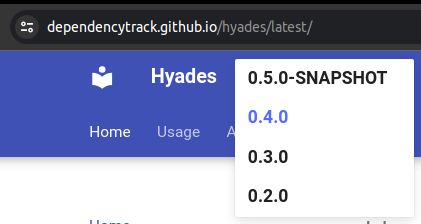
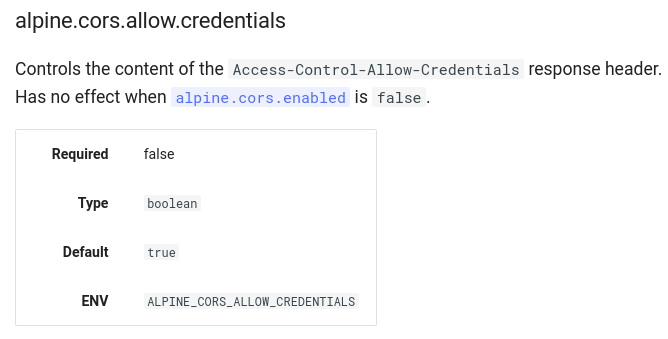

# Documentation

## Introduction

User-facing documentation is implemented with [MkDocs] and [Material for MkDocs].
The sources are located in [`docs`](https://github.com/DependencyTrack/hyades/tree/main/docs).
Changes to the documentation are automatically deployed to GitHub pages, using the
[`deploy-docs.yml`](https://github.com/DependencyTrack/hyades/blob/main/.github/workflows/deploy-docs.yml)
GitHub Actions workflow. Once deployed, the documentation is available at <https://dependencytrack.github.io/hyades/snapshot>.

## Versioning

Documentation is published for each version of the project, including unstable `SNAPSHOT` versions.
This allows users to browse the docs most relevant to their Dependency-Track deployment.

<figure markdown="span">
    
    <figcaption>Version selection on the documentation site</figcaption>
</figure>

Documentation for unstable versions is aliased as `snapshot`, whereas for stable
builds it is aliased as `latest`. They are accessible via [`/snapshot`](https://dependencytrack.github.io/hyades/snapshot)
and [`/latest`](https://dependencytrack.github.io/hyades/latest) respectively.

!!! tip
    When sharing links to the docs with others, prefer using specific versions instead of `latest` or `snapshot`.
    For example <https://dependencytrack.github.io/hyades/0.4.0>. This ensures that your links will not break
    as documentation evolves.

The versioning logic is handled by [mike] as part of the
[`deploy-docs.yml`](https://github.com/DependencyTrack/hyades/blob/main/.github/workflows/deploy-docs.yml) workflow.

## Local Development

For local building and rendering of the docs, use the 
[`docs-dev.sh`](https://github.com/DependencyTrack/hyades/blob/main/scripts/docs-dev.sh) script:

```shell
./scripts/docs-dev.sh
```

It will launch a development server that listens on <http://localhost:8000> and reloads whenever changes
are made to the documentation sources. The script requires the `docker` command to be available.

## Configuration Documentation

To make it easier for users to discover available configuration options (i.e. environment variables),
we generate human-readable documentation for it. You can see the result of this [here](../reference/configuration/api-server.md).

### `application.properties` Annotations

We leverage comments on property definitions to gather metadata. Other than a property's description,
the following *annotations* are supported to provide further information:

| Annotation  | Description                                                                                                                       |
|:------------|:----------------------------------------------------------------------------------------------------------------------------------|
| `@category` | Allows for categorization / grouping of related properties                                                                        |
| `@default`  | To be used for cases where the default value is implicit, for example when it is inherited from the framework or other properties |
| `@example`  | To give an idea of what a valid value may look like, when it's not possible to provide a sensible default value                   |
| `@hidden`   | Marks a property as to-be-excluded from the generated docs                                                                        |
| `@required` | Marks a property as required                                                                                                      |
| `@type`     | Defines the type of the property                                                                                                  |

For example, a properly annotated property might look like this:

```yml linenums="1"
# Defines the path to the secret key to be used for data encryption and decryption.
# The key will be generated upon first startup if it does not exist.
#
# @category: General
# @default:  ${alpine.data.directory}/keys/secret.key
# @type:     string
alpine.secret.key.path=
```

It is also possible to index properties that are commented out, for example:

```ini linenums="1"
# Foo bar baz.
#
# @category: General
# @example:  Some example value
# @type:     string
# foo.bar.baz=
```

This can be useful when it's not possible to provide a sensible default, and providing the property without
a value would break something. Generally though, you should always prefer setting a sensible default.

If a property depends on another property, or relates to it, mention it in the description.
A deep-link will automatically be generated for it. For example:

<figure markdown="span">
    
    <figcaption>Example of a generated deep-link for `alpine.cors.enabled`</figcaption>
</figure>

### Generation

Configuration documentation is generated from `application.properties` files.
We use the [`GenerateConfigDocs`](https://github.com/DependencyTrack/hyades/blob/main/scripts/GenerateConfigDocs.java)
[JBang] script for this:

```
Usage: GenerateConfigDocs [--include-hidden] [-o=OUTPUT_PATH] -t=TEMPLATE_FILE
                          PROPERTIES_FILE
      PROPERTIES_FILE        The properties file to generate documentation for
      --include-hidden       Include hidden properties in the output
  -o, --output=OUTPUT_PATH   Path to write the output to, will write to STDOUT
                               if not provided
  -t, --template=TEMPLATE_FILE
                             The Pebble template file to use for generation
```

!!! tip
    Usually you do not need to run the script yourself. We have a GitHub Actions workflow
    ([`update-config-docs.yml`](https://github.com/DependencyTrack/hyades/blob/main/.github/workflows/update-config-docs.yml)) 
    that does that automatically whenever a modification to `application.properties` files is pushed to
    the `main` branch. It also works across repositories, i.e. it will be triggered for
    changes in the `hyades-apiserver` repository as well.

To generate documentation for the API server, you would run:

```shell linenums="1"
jbang scripts/GenerateConfigDocs.java \
    -t ./scripts/config-docs.md.peb \
    -o ./docs/reference/configuration/api-server.md \
    ../hyades-apiserver/src/main/resources/application.properties
```

Output is generated based on a customizable [Pebble] template 
(currently [`config-docs.md.peb`](https://github.com/DependencyTrack/hyades/blob/main/scripts/config-docs.md.peb)).

[mike]: https://github.com/jimporter/mike
[JBang]: https://www.jbang.dev/
[MkDocs]: https://www.mkdocs.org/
[Material for MkDocs]: https://squidfunk.github.io/mkdocs-material/
[Pebble]: https://pebbletemplates.io/