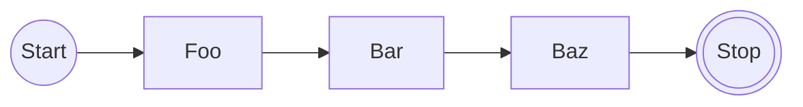
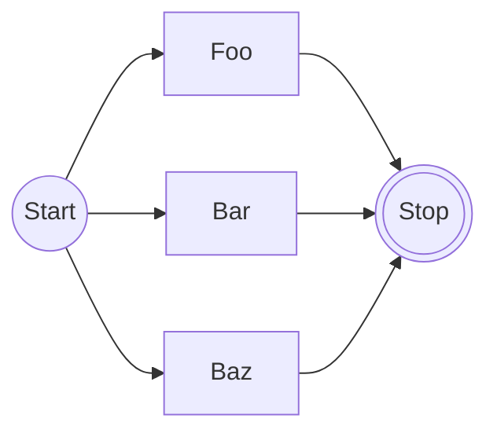

!!! tip
    Refer to the [design document](../architecture/design/durable-execution.md)
    for information on the inner workings of Dependency-Track's durable execution
    implementation.

## Common Patterns

### Chaining

Most workflows require the execution of steps to happen in sequence:



With dex, this can be achieved by `await`ing step results for initiating the next step:

```java
@Workflow(name = "example")
class ExampleWorkflow implements WorkflowExecutor<Void, Void> {

    public Void execute(WorkflowContext<Void> ctx, Void argument) {
        String fooResult = ctx.activity(FooActivity.class).call().await();
        String barResult = ctx.activity(BarActivity.class).call(fooResult).await();
        String bazResult = ctx.activity(BazActivity.class).call(barResult).await();
        ctx.logger().info("Baz result: {}", bazResult);
        return null;
    }

}
```

In the above example, activity calls are scheduled one-by-one, with successive
calls even depending on the result of preceding calls.

The same approach can be used for child workflows and timers.

### Scatter-Gather

Often it is desirable to perform multiple workflow steps concurrently:



With dex, this can be achieved by collecting `Awaitable`s into a collection first,
and then awaiting all of them:

```java
@Workflow(name = "example")
class ExampleWorkflow implements WorkflowExecutor<Void, Void> {

    public Void execute(WorkflowContext<Void> ctx, Void argument) {
        var awaitables = List.<Awaitable<String>>of(
            ctx.activity(FooActivity.class).call(),
            ctx.activity(BarActivity.class).call(),
            ctx.activity(BazActivity.class).call()    
        );

        var results = new ArrayList<String>();
        for (var awaitable : awaitables) {
            String result = awaitable.await();
            results.add(result);
        }

        ctx.logger().info("Results: {}", results);
        
        return null;
    }

}
```

In the above example, all activity calls are scheduled at once when the workflow first
becomes blocked (i.e., the first time `await` is called).

The same approach can be used for child workflows and timers.

### Singletons

Some workflows are intended to exist *at most once*. This is usually true for workflows that:

* are resource-intensive, or
* take a long time to complete, or
* modify some state (be it local or in external systems) in a way that is not concurrency-safe

In dex, this can be achieved using workflow instance IDs.

```java
UUID runId = dexEngine.createRun(
        new CreateWorkflowRunRequest<>(ExampleWorkflow.class)
                .withInstanceId("only-exists-once"));
if (runId == null) {
    // Another run with the same instance ID already exists in non-terminal state.
} else {
    // Run created successfully!
}
```

Multiple workflow runs can have the same instance ID,
but only a single run in non-terminal state can exist
for a given instance ID at any point in time.

!!! note
    Uniqueness of instance IDs is enforced across workflow types.
    Avoid overly generic instance IDs.

### Concurrency Control

When workflows access shared resources, there needs to be a way to serialize
their execution to prevent race conditions.

Holding a distributed lock for the entire duration of a workflow run is not feasible,
as a single run can potentially take hours to complete.

With dex, a *concurrency key* can be defined when creating a new workflow run:

```java
for (int i = 0; i < 100; i++) {
    dexEngine.createRun(
            new CreateWorkflowRunRequest<>(ExampleWorkflow.class)
                    .withConcurrencyKey("example:projectId"));
}
``` 

Instead of preventing creation of new runs, as done for [singletons](#singletons),
dex effectively allows runs to queue up, and will process them in order.

Each run will be executed until completion before the next run is started.

!!! note
    The order in which the runs will execute is determined by:

      * Their priority
      * Their creation timestamp
