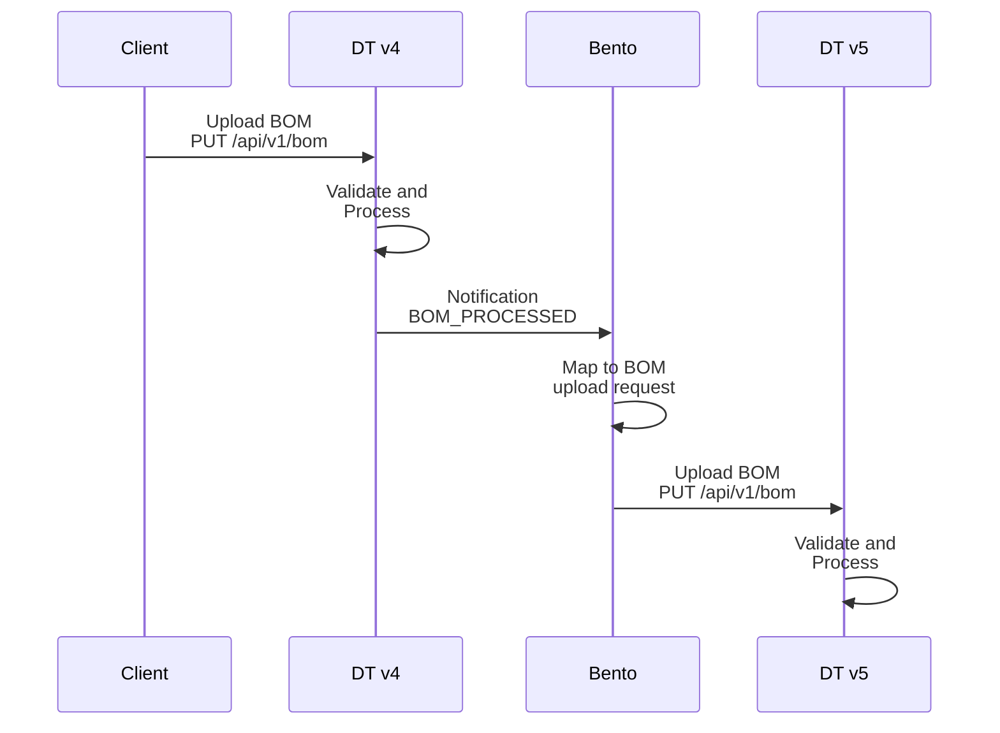
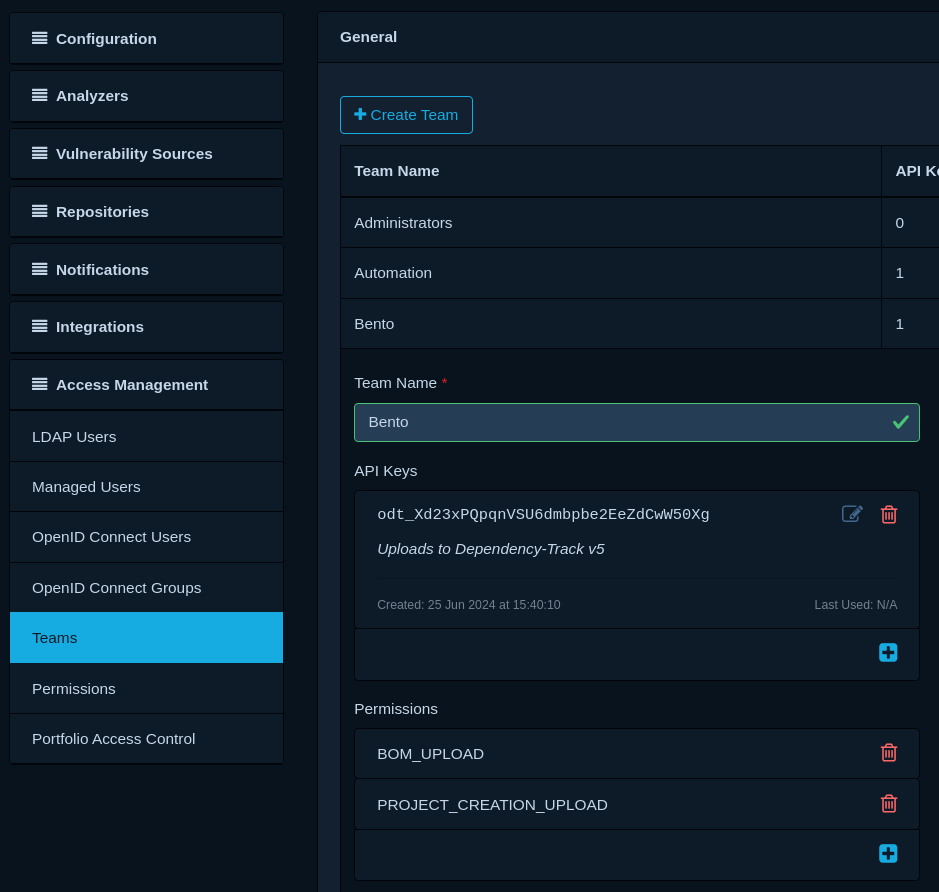
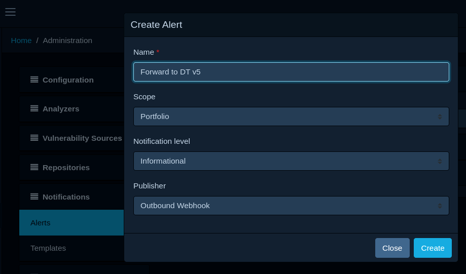
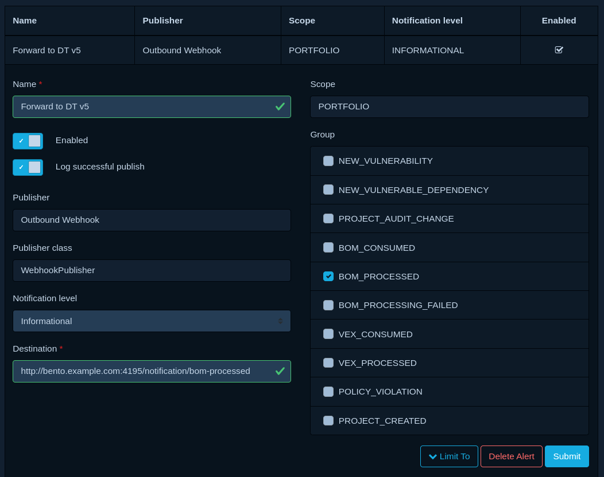

## Introduction

If you're currently running a Dependency-Track v4 deployment, don't worry!

We're aiming to provide tooling and guides on how to migrate to v5 once it reaches general availability.
The goal is to offer tools that perform the migration automatically, with little to no manual effort
(except the provisioning of infrastructure of course).

!!! tip
    Follow <https://github.com/DependencyTrack/hyades/issues/881> for updates on this topic.

## Running v4 and v5 in parallel

Given an existing production deployment of v4, it can be helpful to run a v5 test deployment in parallel,
to compare behavior and testing new features on *real* data.

This can be achieved by leveraging notifications, in particular `BOM_PROCESSED` notifications.
They are emitted by Dependency-Track *after* a BOM's contents are synchronized with the database.

The subject of `BOM_PROCESSED` notifications contains the original BOM that way uploaded, encoded in Base64.
It also contains the name and version of the project it was uploaded to. This information is sufficient to 
construct a BOM upload request, that can be submitted to another Dependency-Track instance.

All that's needed is an application that can:

* Receive Webhooks, and parse the JSON payload within them
* Perform a mapping from notification subject, to BOM upload request
* Forward the BOM upload request to another Dependency-Track instance

This can, of course, be scripted. However, we recommend using [Bento], which reduces it all to a single config file.

!!! tip
    You can use the same approach outlined here to construct a pre-prod / staging environment.

Conceptually, this is what the setup will accomplish:



<!-- TODO: Port instructions from https://github.com/DependencyTrack/hyades/blob/main/scripts/benthos/README.md -->

### Creating API Key

In order to upload BOMs to the Dependency-Track v5 system, an API key with `BOM_UPLOAD` and `PROJECT_CREATION_UPLOAD`
permissions is required. Log into your Dependency-Track v5 instance, navigate to *Administration* -> *Access Management*
-> *Teams*, and create a new team with accompanying API key:



### Deploy Bento

[Bento] works with the concept of pipelines, which are [configured via YAML](https://warpstreamlabs.github.io/bento/docs/configuration/about).  
The following pipeline will achieve the desired outcome:

```yaml linenums="1"
---
input:
  http_server:
    path: /notification/bom-processed
    allowed_verbs:
    - POST
    timeout: 5s
    sync_response:
      status: "202"

pipeline:
  processors:
  - mapping: |
      root.projectName = this.notification.subject.project.name
      root.projectVersion = this.notification.subject.project.version
      root.projectTags = this.notification.subject.project.tags.split(",").catch([]).map_each(tag -> {"name": tag})
      root.bom = this.notification.subject.bom.content
      root.autoCreate = true

output:
  http_client:
    url: "${DTV5_API_URL}/api/v1/bom"
    verb: PUT
    headers:
      Content-Type: application/json
      X-Api-Key: "${DTV5_API_KEY}"
    max_in_flight: 10
    # tls:
    #  skip_cert_verify: true
    #  ^-- Uncomment this if you're using self-signed certificates.
```

Refer to the respective pipeline component's documentation for more details:

* [`http_server` input](https://warpstreamlabs.github.io/bento/docs/components/inputs/http_server)
* [`mapping` processor](https://warpstreamlabs.github.io/bento/docs/components/processors/mapping)
* [`http_client` output](https://warpstreamlabs.github.io/bento/docs/components/outputs/http_client)

[Run Bento](https://github.com/warpstreamlabs/bento?tab=readme-ov-file#run) as container:

```shell linenums="1"
docker run -d --name bento \
    -p "4195:4195" \
    -v "$(pwd)/config.yaml:/bento.yaml" \
    -e 'DTV5_API_URL=https://dtv5.example.com' \
    -e 'DTV5_API_KEY=odt_****************' \
    ghcr.io/warpstreamlabs/bento
```

### Configure Notification

Log into your Dependency-Track v4 instance, navigate to *Administration* -> *Notifications* -> *Alerts*,
and create a new alert with the following settings:

* Scope: *Portfolio*
* Notification level: *Informational*
* Publisher: *Outbound Webhook*



Once created, enable `BOM_PROCESSED` under *Groups*, and configure the URL of your Bento endpoint as *Destination*:



### Testing

* Upload a BOM to a project in your Dependency-Track v4 instance.
* Head over to your Dependency-Track v5 instance and wait for the upload to replicate.

If all goes well, you're done! Happy testing!

!!! tip
    If the BOM upload does not replicate:
    
    1. Check the logs of your Dependency-Track v4 deployment for any errors during notification publishing.
    2. Check the logs of Bento for any errors or warnings.
    3. Check the logs of your Dependency-Track v5 deployment for any errors during BOM processing.
    4. Ensure that the API key you created has the correct permissions.
    5. Ensure that Bento is reachable from your Dependency-Track v4 deployment.
    6. Ensure that your Dependency-Track v5 deployment is reachable from Bento.

[Bento]: https://github.com/warpstreamlabs/bento