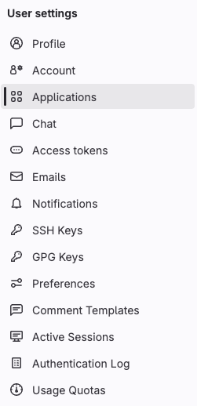
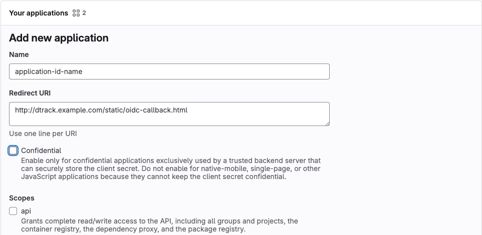
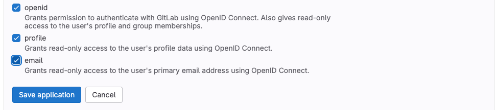
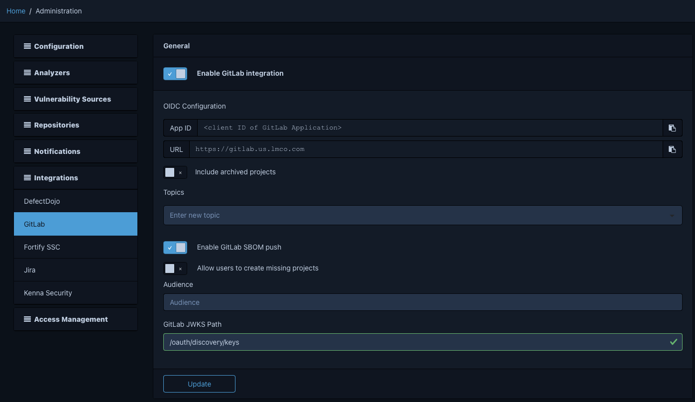

# GitLab Integration - SBOM Push

## What is SBOM Push with GitLab?

SBOM Push allows users to upload SBOMs from GitLab to Dependency-Track. The Dependency-Track API accepts a valid [GitLab ID Token](https://docs.gitlab.com/ci/secrets/id_token_authentication/) and base64 encoded BOM file, assesses if a user has permission to upload SBOMs, and then uses the accepted parameters to upload the BOM file to Dependency-Track.

## What is an Access Token?

An access token from the `/user/oidc/login` endpoint is required to authenticate GitLab with Dependency-Track and make subsequent API calls. The access token provided has an immediate expiration time, so nesting the request to `/user/oidc/login` as a bearer token will allow an additional API call.

If the setup below has been completed, this authentication request to Dependency-Track will provide an access token.

```bash
curl -X POST "http://dtrack.example.com/api/v1/user/oidc/login" \
    -H "Content-Type: application/x-www-form-urlencoded" \
    -d "idToken=$ID_TOKEN"
```

## Setup

### Generate a GitLab Application ID

A GitLab application ID will be needed for authentication.

1. Navigate to a profile in GitLab:
    * Select the profile image from the top banner
    * Select "Edit profile"
2. Select "Applications" from the User settings column on the left side of the screen
   
3. Select the Add new application button
4. Specify a name in the Name field
5. In the Redirect URI box, add the following: <http://dtrack.example.com/static/oidc-callback.html>
6. Ensure the Confidential button is unchecked
7. Check the following buttons in the Scopes field: openid, profile, email


8. Select the Save application button
9. Store the resulting Application ID for use in subsequent steps

### Configuration Settings

Pushing SBOMs from GitLab is an optional feature for Dependency-Track, so an admin will need to turn on the necessary settings to enable the feature.

Configurations to be set by admins in `Administration > Integrations > GitLab`:

* Turn on `Enable GitLab integration`
* Set `GitLab URL` to the correct base url (Ex. <https://gitlab.example.com>)
* Turn on `Enable GitLab SBOM push`
* Turn on `Allow users to create missing projects` (optional but won't work if projects are missing)
* Set `GitLab JWKS Path` to **/oauth/discovery/keys**



Make the following changes to the `application.properites` file

* alpine.oidc.enabled=true
* alpine.oidc.client.id=<APP_ID>
* alpine.oidc.issuer=<BASE_GITLAB_URL>
* alpine.oidc.user.provisioning=true
* alpine.oidc.team.synchronization=false
* alpine.oidc.teams.default=GitLab Users
* alpine.oidc.auth.customizer=org.dependencytrack.integrations.gitlab.GitLabAuthenticationCustomizer

## Usage

Using a GitLab job to upload a BOM file to Dependency-Track will only work for a user who has previously signed into Dependency-Track and has the `BOM_UPLOAD` permission.

### Adding the ID Token to a GitLab YAML File

To use a [GitLab ID Token](https://docs.gitlab.com/ci/secrets/id_token_authentication/) in the BOM upload api request, the application ID created above should be set to the ID Token's audience (aud) field.

```yml
bom_upload_job:
  id_tokens:
    ID_TOKEN:
      aud: <APP_ID>
```

### How to Submit a BOM Upload Request

The `/bom/gitlab` endpoint has the following form data parameters:

* `gitLabToken` (required) - Use the GitLab ID Token `ID_TOKEN` previously configured
* `bom` (required) - Must be a bom file that is base64 encoded
* `isLatest` (optional) - Set as true to mark the current upload as the latest version

To publish a BOM file from GitLab, use the access token from the login endpoint and an ID token from a GitLab job.

```bash
curl -X POST "http://dtrack.example.com/api/v1/bom/gitlab" \
-H "Authorization: Bearer $(curl -s -X POST "http://dtrack.example.com/api/v1/user/oidc/login" \
  -H "Content-Type: application/x-www-form-urlencoded" \
  -d "idToken=$ID_TOKEN")" \
-F "gitLabToken=$ID_TOKEN" \
-F "bom=$BOM_ENCODED"
```
