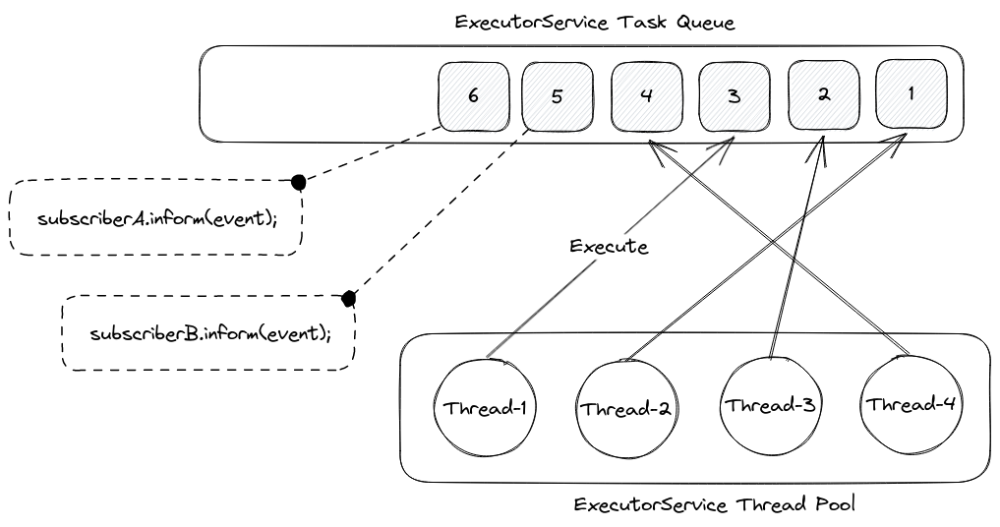

<figure markdown="span">
    
    <figcaption>&quot;<a href="https://commons.wikimedia.org/wiki/File:Hyades.jpg">Hyades</a>&quot; by Todd Vance (<a href="https://creativecommons.org/licenses/by-sa/2.5/legalcode" rel="license">CC BY-SA 2.5</a>)</figcaption>
</figure>

## Introduction

Project *Hyades*, named after [the star cluster closest to earth], is an *incubating* project for decoupling
responsibilities from [Dependency-Track]'s monolithic API server into separate, scalable™ services.

The main objectives of Hyades are:

* Enable Dependency-Track to handle portfolios spanning *hundreds of thousands of projects*
* Improve *resilience* of Dependency-Track, providing *more confidence* when relying on it in critical workflows
* Improve deployment and configuration management experience for containerized / cloud native tech stacks

Other than separating responsibilities, the API server has been modified to allow for high availability
(active-active) deployments. Various "hot paths", like processing of uploaded BOMs, have been optimized
in the existing code. Further optimization is an ongoing effort.

Hyades already is a *superset* of Dependency-Track, as changes up to Dependency-Track v4.11.4 were ported,
and features made possible by the new architecture have been implemented on top.

!!! warning
    Hyades is not yet fully production ready, please refer to the
    [GA roadmap](https://github.com/DependencyTrack/hyades/issues/860) for the current status.

!!! tip "Already using Dependency-Track v4?"
    Check out [Changes over v4] for a complete overview of changes, and have a look at [Migrating from v4]
    for migration instructions.

## Background

??? abstract "tl;dr"
    The architecture of Dependency-Track v4 prevents it from scaling past a certain workload.

Dependency-Track, for the most part, is an event-based system. As a platform for ingesting data (in the form of BOMs),
listening for and itself emitting signals on it, an event-based architecture makes sense conceptually. The majority of
operations Dependency-Track performs happen asynchronously, without client interaction.

On a technical level, Dependency-Track uses an in-memory [publish-subscribe](https://en.wikipedia.org/wiki/Publish%E2%80%93subscribe_pattern) architecture,
implemented using Java [`ExecutorService`](https://docs.oracle.com/en/java/javase/17/docs/api/java.base/java/util/concurrent/ExecutorService.html)s.
An `ExecutorService` can be thought of as a pool of worker threads, consuming from an internal task queue. Tasks can be
submitted to an `ExecutorService`, which will then execute them one-by-one. As multiple threads work on the queue in
parallel, the order in which tasks are being processed is not guaranteed. Thread pool sizes can vary from one,
up to unbounded numbers of threads.

In Dependency-Track, when an event is published, subscribers to the event are looked up.
Per [API contract](https://github.com/stevespringett/Alpine/blob/alpine-parent-2.2.0/alpine-infra/src/main/java/alpine/event/framework/Subscriber.java),
event subscribers must implement an `inform` method, which takes the published event as argument.
For any given event, 0-N tasks will be enqueued to the `ExecutorService`'s task queue - one for each subscriber.

There are three `ExecutorService` instances in Dependency-Track:

* [`EventService`](https://github.com/stevespringett/Alpine/blob/alpine-parent-2.2.0/alpine-infra/src/main/java/alpine/event/framework/EventService.java)
* [`SingleThreadedEventService`](https://github.com/stevespringett/Alpine/blob/alpine-parent-2.2.0/alpine-infra/src/main/java/alpine/event/framework/SingleThreadedEventService.java)
* [`NotificationService`](https://github.com/stevespringett/Alpine/blob/alpine-parent-2.2.0/alpine-infra/src/main/java/alpine/notification/NotificationService.java)

`EventService` forms the primary worker pool. Its thread pool size defaults to `<NUM_CPU> * 4`.
A machine with a 4-core CPU will thus have a thread pool size of `16`. The size is configurable.
Common tasks handled by this worker pool include:

* Processing of uploaded BOMs and VEXs
* Performing vulnerability analysis of components, projects, or the entire portfolio
* Performing repository meta analysis of components, projects, or the entire portfolio
* Calculation of metrics for components, projects, or the entire portfolio

`SingleThreadedEventService` is a worker pool with only a single thread. The purpose of this worker pool is execute
tasks that must not be run in parallel. As such, it serves as a means to serialize task execution.
Common tasks handled by this worker pool include:

* Mirroring of the [NVD](https://nvd.nist.gov/) vulnerability database
* Updating [Lucene](https://lucene.apache.org/) indexes on disk

`NotificationService` is a dedicated worker pool for dispatching [notifications](https://docs.dependencytrack.org/integrations/notifications/).
Its thread pool size defaults to `4` and is not configurable.

### Limitations of the v4 architecture

While this architecture works great for small to medium workloads, it presents various challenges for larger ones:

1. **Not horizontally scalable**. As pub-sub is happening entirely in-memory, it is not possible to distribute
   the work to multiple application instances. The only way to handle more load using this architecture is to scale
   vertically, e.g.
    * Increasing `ExecutorService` thread pool sizes (`alpine.worker.threads`, `alpine.worker.thread.multiplier`)
    * Increasing database connection pool sizes
    * Increasing resource allocations for CPU, RAM, and potentially disk / network
2. **No ordering guarantees of events**. As multiple threads work on a shared queue of tasks in parallel, there is no way
   of enforcing a reliable ordering of events.
3. **Limited fault-tolerance**. If an instance of Dependency-Track goes down, planned or unplanned, all queued tasks are
   gone. Not only does this impact business-as-usual operation, but also limits the times when upgrades can be applied.
4. **Shared, multipurpose task queue**. A single task queue is used to process all kinds of events. This means that
   lots of events of a certain type can "clog" the task queue, preventing other types of events from being processed.
   This is further amplified if processing of events "clogging" the queue relies on external services, introducing further
   latency. Ideally, there should be a dedicated queue per event type, so that one busy queue doesn't block others.
5. **Prone to race conditions**. As a consequence of (2), it is possible that multiple events addressing the same
   thing are processed in parallel, leading to race conditions in cache lookups or database operations. Race conditions
   would be an even bigger problem if the work was shared across multiple application instances, and would require
   distributed locking as a countermeasure, which is [inherently hard to get right](https://martin.kleppmann.com/2016/02/08/how-to-do-distributed-locking.html).

In order to scale Dependency-Track beyond its current capabilities, a distributed messaging service is required.

### Related Issues

On multiple occasions in the past, the Dependency-Track community raised questions about high availability (HA)
deployments, and / or how to better scale the platform:

* <https://github.com/DependencyTrack/dependency-track/issues/218>
* <https://github.com/DependencyTrack/dependency-track/issues/903>
* <https://github.com/DependencyTrack/dependency-track/issues/1210>
* <https://github.com/DependencyTrack/dependency-track/issues/1856>

[the star cluster closest to earth]: https://en.wikipedia.org/wiki/Hyades_(star_cluster)
[Apache Kafka]: https://kafka.apache.org/
[Changes over v4]: getting-started/changes-over-v4.md
[Dependency-Track]: https://dependencytrack.org/
[Migrating from v4]: getting-started/migrating-from-v4.md
[Redpanda]: https://redpanda.com/