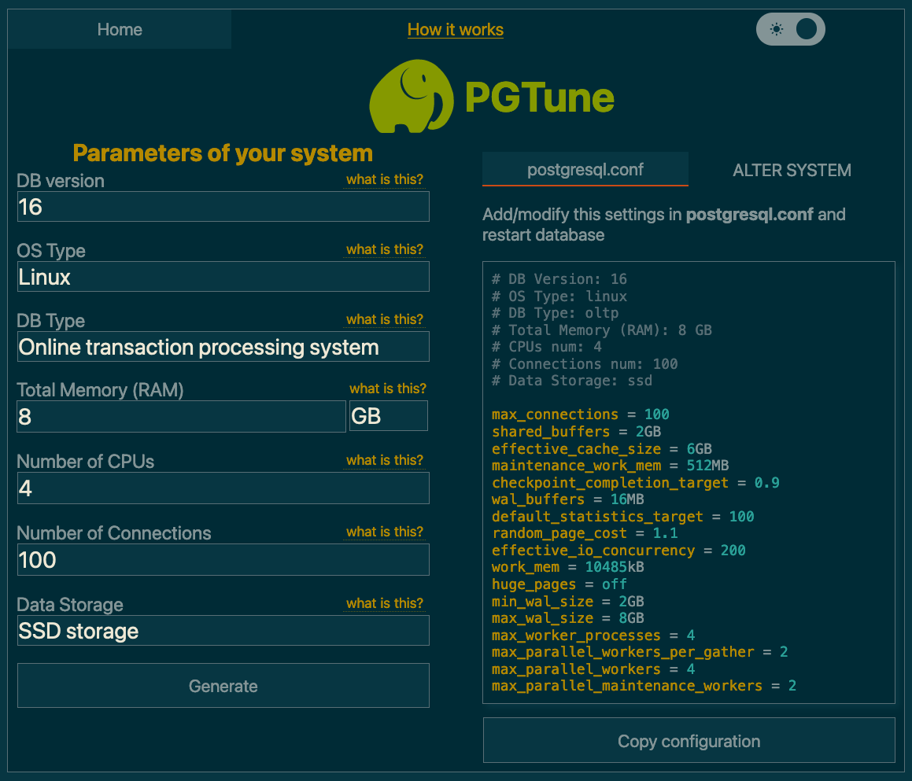

Dependency-Track requires a [PostgreSQL], or PostgreSQL-compatible database to operate.

The lowest supported version is 13. You are encouraged to use the [newest available version].

Depending on available resources, individual preferences, or organizational policies,
you will have to choose between a [managed](#managed-solutions), or [self-hosted](#self-hosting) solution.

## Extensions

The following PostgreSQL [extensions](https://www.postgresql.org/docs/current/external-extensions.html)
are **required** by Dependency-Track. When choosing a hosting solution, verify that the extensions listed
here are supported.

* [`pg_trgm`](https://www.postgresql.org/docs/current/pgtrgm.html): *Support for similarity of text using trigram matching*

!!! note
    Dependency-Track will execute the necessary `CREATE EXTENSION IF NOT EXISTS` statements
    during [schema migration](#schema-migrations). Enabling extensions manually is not necessary.

Generally, we limit usage of extensions to those that:

1. Ship with PostgreSQL [out-of-the-box](https://www.postgresql.org/docs/current/contrib.html)
2. Are [trusted](https://www.postgresql.org/about/featurematrix/detail/347/) by default

This ensures compatibility with *most* [managed solutions](#managed-solutions),
and reduces setup effort for [self-hosted](#self-hosting) deployments.

## Managed Solutions

The official PostgreSQL website hosts a [list of well-known commercial hosting providers].

Popular choices include:

* [Amazon RDS for PostgreSQL](https://aws.amazon.com/rds/postgresql/)
* [Aiven for PostgreSQL](https://aiven.io/postgresql)
* [Azure Database for PostgreSQL](https://azure.microsoft.com/en-us/products/postgresql/)
* [Google Cloud SQL for PostgreSQL](https://cloud.google.com/sql/docs/postgres/)

We are not actively testing against cloud offerings. But as a rule of thumb, solutions offering "vanilla" PostgreSQL, 
or extensions of it (for example [Neon] or [Timescale]), will most definitely work with Dependency-Track.

The same is not necessarily true for platforms based on heavily modified PostgreSQL, or even entire re-implementations
such as [CockroachDB] or [YugabyteDB]. Such solutions make certain trade-offs to achieve higher levels of scalability,
which might impact functionality that Dependency-Track relies on. If you'd like to see support for those, please [let us know]!

## Self-Hosting

### Bare Metal / Docker

For Docker deployments, use the official [`postgres`](https://hub.docker.com/_/postgres) image.

!!! warning
    Do **not** use the `latest` tag! You may end up doing a major version upgrade without knowing it,
    ultimately breaking your database! Pin the tag to at least the major version (e.g. `16`), or better
    yet the minor version (e.g. `16.2`). Refer to [Upgrades](#upgrades) to upgrade instructions.

For bare metal deloyments, it's usually best to install PostgreSQL from your distribution's package repository.
See for example:

* [PostgreSQL instructions for Debian](https://wiki.debian.org/PostgreSql)
* [Install and configure PostgreSQL on Ubuntu](https://ubuntu.com/server/docs/databases-postgresql)
* [Using PostgreSQL with Red Hat Enterprise Linux](https://access.redhat.com/documentation/en-us/red_hat_enterprise_linux/9/html/configuring_and_using_database_servers/using-postgresql_configuring-and-using-database-servers)

To get the most out of your Dependency-Track installation, we recommend to run PostgreSQL on a separate machine
than the application containers. You want PostgreSQL to be able to leverage the entire machine's resources,
without being impacted by other applications.

For smaller and non-critical deployments, it is totally fine to run everything on a single machine.

#### Basic Configuration

You should be aware that the default PostgreSQL configuration is *extremely* conservative.
It is intended to make PostgreSQL usable on minimal hardware, which is great for testing,
but can seriously cripple performance in production environments.
Not adjusting it to your specific setup will most certainly leave performance on the table.

If you're lucky enough to have access to professional database administrators, ask them for help.
They will know your organisation's best practices and can guide you in adjusting it for Dependency-Track.

If you're not as lucky, we can wholeheartedly recommend [PGTune]. Given a bit of basic info about your system,
it will provide a sensible baseline configuration. For the *DB Type* option, select `Online transaction processing system`.



The `postgresql.conf` is usually located at `/var/lib/postgresql/data/postgresql.conf`.
Most of these settings require a restart of the application.

In a Docker Compose setup, you can alternatively apply the desired configuration via command line flags.
For example:

```yaml
services:
  postgres:
    image: postgres:17
    command: >-
        -c 'shared_buffers=2GB'
        -c 'effective_cache_size=6GB'
```

#### Advanced Configuration

For larger deployments, you may eventually run into situations where database performance degrades
with just the basic configuration applied. Oftentimes, tweaking advanced settings can resolve
such problems. But knowing which knobs to turn is a challenge in itself.

If you happen to be in this situation, make sure you have database monitoring set up.
Changing advanced configuration options blindly can potentially cause more damage than it helps.

Below, you'll find a few options that, based on our observations with large-scale deployments,
make sense to tweak. Note that some settings are applied system-wide, while others are only
applied for certain tables.

!!! note
    Got more tips to configure or tune PostgreSQL, that may be helpful to others?  
    We'd love to include it in the docs, please do raise a PR!

##### checkpoint_completion_target

<table>
  <tbody style="border: 0">
    <tr>
      <th style="text-align: right">Default</th>
      <td style="border-width: 0">
        <ul>
          <li><code>0.5</code> (PostgreSQL <= 13)</li>
          <li><code>0.9</code> (PostgreSQL >= 14)</li>
        </ul>
      </td>
    </tr>
    <tr>
      <th style="text-align: right">Recommendation</th>
      <td style="border-width: 0"><code>0.9</code></td>
    </tr>
    <tr>
      <th style="text-align: right">Tables</th>
      <td style="border-width: 0"><code>*</code></td>
    </tr>
    <tr>
      <th style="text-align: right">References</th>
      <td style="border-width: 0"><a href="https://www.postgresql.org/docs/current/runtime-config-wal.html#GUC-CHECKPOINT-COMPLETION-TARGET">Documentation</a></td>
    </tr>
  </tbody>
</table>

Spreads the WAL checkpoint creation across a longer period of time,
resulting in a more evenly distributed I/O load. A lower value has been observed
to cause undesirable spikes in I/O usage on the database server.

```sql
ALTER SYSTEM SET CHECKPOINT_COMPLETION_TARGET = 0.9;
```

##### autovacuum_vacuum_scale_factor

<table>
  <tbody style="border: 0">
    <tr>
      <th style="text-align: right">Default</th>
      <td style="border-width: 0"><code>0.2</code></td>
    </tr>
    <tr>
      <th style="text-align: right">Recommendation</th>
      <td style="border-width: 0"><code>0.02</code></td>
    </tr>
    <tr>
      <th style="text-align: right">Tables</th>
      <td style="border-width: 0">
        <ul>
          <li><code>COMPONENT</code></li>
          <li><code>DEPENDENCYMETRICS</code></li>
        </ul>
      </td>
    </tr>
    <tr>
      <th style="text-align: right">References</th>
      <td style="border-width: 0"><a href="https://www.postgresql.org/docs/current/runtime-config-autovacuum.html#GUC-AUTOVACUUM-VACUUM-SCALE-FACTOR">Documentation</a></td>
    </tr>
  </tbody>
</table>

The default causes [Autovacuum] to start way too late on large tables with lots of churn,
yielding long execution times. Reduction in scale factor causes autovacuum to happen more often,
making each execution less time-intensive.

The `COMPONENT` and `DEPENDENCYMETRICS` table are very frequently inserted into, updated, and deleted from.
This causes lots of dead tuples that PostgreSQL needs to clean up. Because autovacuum also performs
[`ANALYZE`](https://www.postgresql.org/docs/current/sql-analyze.html), slow vacuuming can cause the
query planner to choose inefficient execution plans.

```sql
ALTER TABLE "COMPONENT" SET (AUTOVACUUM_VACUUM_SCALE_FACTOR = 0.02);
ALTER TABLE "DEPENDENCYMETRICS" SET (AUTOVACUUM_VACUUM_SCALE_FACTOR = 0.02);
```

#### Upgrades

Follow the [official upgrading guide]. Be sure to select the version of the documentation that corresponds to the
PostgreSQL version you are running.

!!! warning
    Pay attention to the fact that **major version upgrades usually require a backup-and-restore cycle**, due to potentially
    breaking changes in the underlying data storage format. Minor version upgrades are usually safe to perform in a
    rolling manor.

### Kubernetes

We generally advise **against** running PostgreSQL on Kubernetes, unless you *really* know what you're doing.
Wielding heavy machinery such as [Postgres Operator] is not something you should do lightheartedly.

If you know what you're doing, you definitely don't need advice from us. Smooth sailing! ⚓️

## Schema Migrations

Schema migrations are performed automatically by the API server upon startup. It leverages [Liquibase] for doing so.
There is usually no manual action required when upgrading from an older Dependency-Track version, unless explicitly
stated otherwise in the release notes.

This behavior can be turned off by setting [`database.run.migrations`](../reference/configuration/api-server.md#databaserunmigrations) 
on the API server container to `false`.

It is possible to use different credentials for migrations than for the application itself.
This can be achieved with the following options:

* [`database.migration.url`](../reference/configuration/api-server.md#databasemigrationurl)
* [`database.migration.username`](../reference/configuration/api-server.md#databasemigrationusername)
* [`database.migration.password`](../reference/configuration/api-server.md#databasemigrationpassword)

The above with default to the main database credentials if not provided explicitly.

[CockroachDB]: https://www.cockroachlabs.com/
[Liquibase]: https://www.liquibase.com/
[Neon]: https://neon.tech/
[PGTune]: https://pgtune.leopard.in.ua/
[PostgreSQL]: https://www.postgresql.org/
[Postgres Operator]: https://github.com/zalando/postgres-operator
[Timescale]: https://www.timescale.com/
[YugabyteDB]: https://www.yugabyte.com/
[let us know]: https://github.com/DependencyTrack/hyades/issues/new?assignees=&labels=enhancement&projects=&template=enhancement-request.yml
[list of well-known commercial hosting providers]: https://www.postgresql.org/support/professional_hosting/
[newest available version]: https://www.postgresql.org/support/versioning/
[official upgrading guide]: https://www.postgresql.org/docs/current/upgrading.html
[Autovacuum]: https://www.postgresql.org/docs/current/routine-vacuuming.html