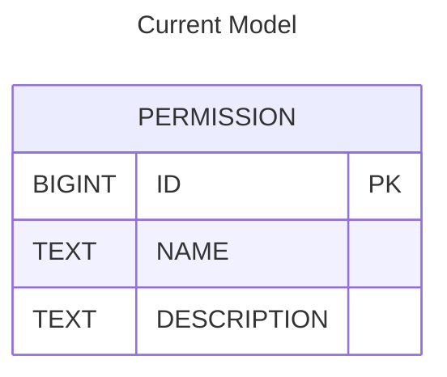
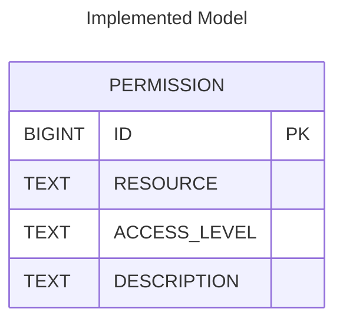

# Roles 

# Scoped Permissions

With the addition to the introduction of `Roles`, we had to normalize the permssion model for more fine-grained access control. The current set was split into global, shared, and teams/project based permission. 
This is done by seperating the current `NAME` text value into the distinct cincepts of `RESOURCE` and `ACCESS_LEVEL`. The enforcemen is implemented through a combination of annotations, query logic, and request filtering—particularly in the context of REST API endpoints that deal with projects and their related resources.

Current `PERMISSION TABLE`:

---
Implemented `PERMISSION TABLE`:

# How to Use Them?
**Walkthrough of assigning a role to a user**

**Creating a New Role**

As a user with `ADMIN` access: 
- Navigate to the `Administration > Access Management > Roles` page. There you will see all four default Roles, with accompanied permissions.
- Click the `+ Create Role` button.
- Provide a `Role Name` and any `Permissions` then click `Create`.

**Assigning a Role to a User**
- Navigate to any of the three user pages: `LDAPUsers`, `Managed Users`, or `OpenID Connect Users`.
- Click the `+ Create User` button.
- Complete the fields in the **Create User Modal** and click `Create`.
- Click the `+` button in the `Permissions` column select desired permissions.