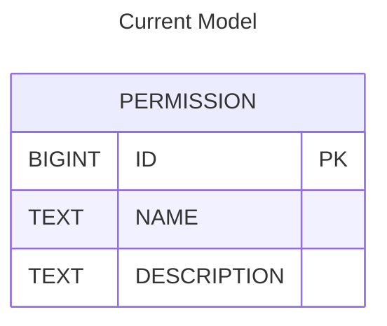
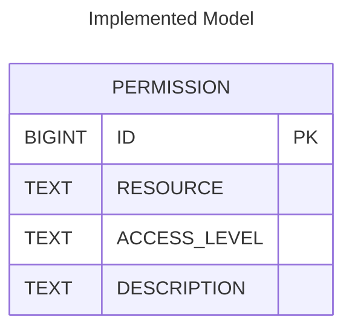

# Roles 
**What are they for?**

Talk about relationship between a user, a project, and an assigned role.
Also can talk about the introduction of Custom Roles (can make a seperate header if you want)

# Scoped Permissions
**Talk about how permissions on a role are scoped to the project**

With the addition to the introduction of `Roles`, we had to normalize the permssion model for more fine-grained access control. The current set was split into global, shared, and teams/project based permission. 
This is done by seperating the current `NAME` text value into the distinct cincepts of `RESOURCE` and `ACCESS_LEVEL`. The enforcemen is implemented through a combination of annotations, query logic, and request filtering—particularly in the context of REST API endpoints that deal with projects and their related resources.

Current `PERMISSION TABLE`:

---
Implemented `PERMISSION TABLE`:

# How to Use Them?
**Walkthrough of assigning a role to a user**
**Operating as a user with `ADMIN` rights**
