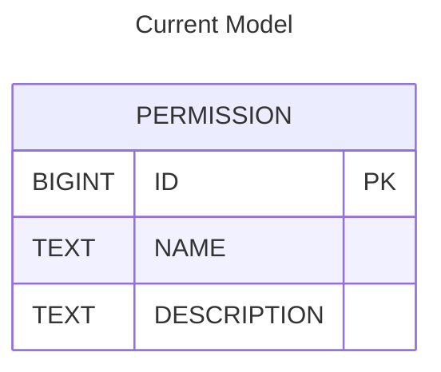
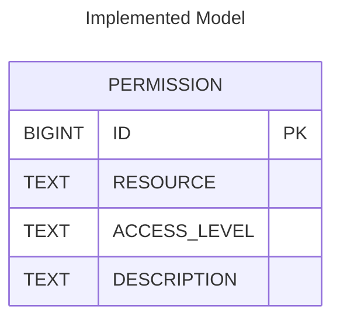
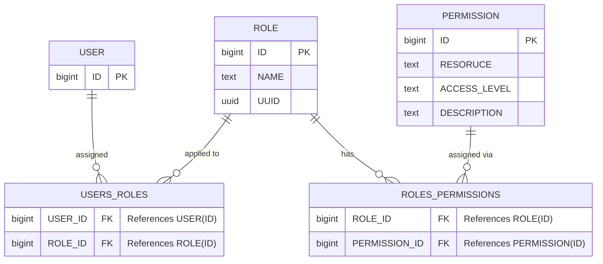

# Roles 
Roles increase privacy and allow for better ease of use in large scale projects. Roles are synced to the user's Gitlab account with their LM SSO and they are automatically given access to the necessary projects. Custom roles are also included, allowing for the user to create unique permissions for specific use case.

# Scoped Permissions

With the addition of `Roles`, we had to normalize the permssion model for more fine-grained access control. The current model was split into a global, shared, and teams/project based permission set. 
This is done by seperating the current `NAME` text value into the distinct concepts of `RESOURCE` and `ACCESS_LEVEL`. The enforcement is implemented through a combination of annotations, query logic, and request filtering—particularly in the context of REST API endpoints that deal with projects and their related resources.

Current `PERMISSION TABLE`:

---
Implemented `PERMISSION TABLE`:

# User, Role, Permission Relationship Diagram 

---

# How to Use Them?

**Creating a New Role**

As a user with `ADMIN` access: 
- Navigate to the `Administration > Access Management > Roles` page. There you will see all four default Roles, with accompanied permissions.
- Click the `+ Create Role` button.
- Provide a `Role Name` and add `Permissions` 
- click `Create`.

**Assigning a Role, Project, and Permissions to a User**
- Navigate to any of the three user pages: `LDAPUsers`, `Managed Users`, or `OpenID Connect Users`.
- Click `+ Create User` button.
- Complete the fields in the **Create User Modal** and click `Create`.
- Click `+` in the `Roles` modal.
- Select your desired `Project` and `Role`. 
- Click `Assign`.
- Click `+` button in the `Permissions` modal select desired permissions.
- Click `Select`.

