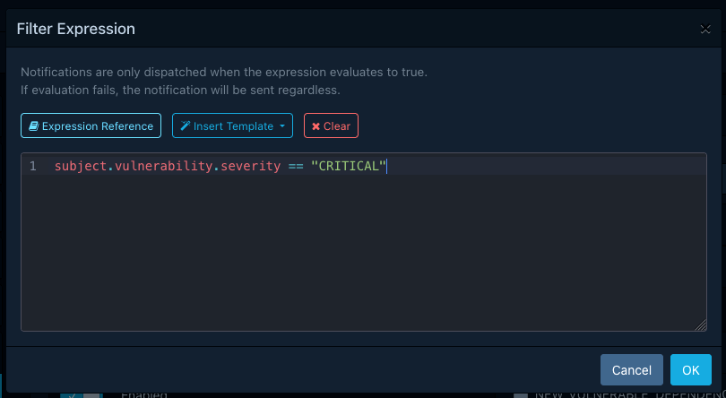
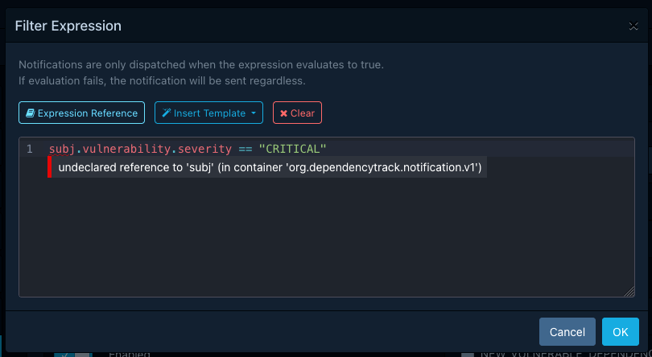

## Introduction

Alerts can include a filter expression to control which notifications are dispatched
based on their content. Filter expressions are written in [CEL] (Common Expression Language),
the same language used for [policy compliance expressions](../policy-compliance/expressions.md).

Without a filter expression, an alert matches all notifications that satisfy its scope, group,
level, and project or tag restrictions. A filter expression adds a further condition: the
notification is only dispatched when the expression evaluates to `true`.



## Syntax

Filter expressions use the same [CEL syntax](../policy-compliance/expressions.md#syntax) as
policy compliance expressions. CEL is not [Turing-complete] and does not support constructs
like `if` statements or loops. It compensates for this with [macros] like `all`, `exists`,
`exists_one`, `map`, and `filter`.

Refer to the official [language definition] for a thorough description of the syntax.

## Evaluation Context

The context in which filter expressions are evaluated contains the following variables:

| Variable    | Type                                                         | Description                                                                            |
|:------------|:-------------------------------------------------------------|:---------------------------------------------------------------------------------------|
| `level`     | [`Level`](../../reference/schemas/notification.md#level)     | The notification level, as an integer enum value. Use named constants (see below).      |
| `scope`     | [`Scope`](../../reference/schemas/notification.md#scope)     | The notification scope, as an integer enum value. Use named constants (see below).      |
| `group`     | [`Group`](../../reference/schemas/notification.md#group)     | The notification group, as an integer enum value. Use named constants (see below).      |
| `title`     | `string`                                                     | The notification title.                                                                |
| `content`   | `string`                                                     | The notification content.                                                              |
| `timestamp` | [`google.protobuf.Timestamp`][protobuf-ts-docs]              | The time at which the notification was created.                                        |
| `subject`   | dynamic                                                      | The notification subject, typed according to the notification group (see below).        |

### Enum Constants

The `level`, `scope`, and `group` variables hold integer values. To compare them in a readable way,
use the named constants from the [notification schema](../../reference/schemas/notification.md#enums):

```js
level == Level.LEVEL_INFORMATIONAL
```

```js
group == Group.GROUP_NEW_VULNERABILITY
```

```js
scope == Scope.SCOPE_PORTFOLIO
```

### Subject Types

The `subject` variable holds the notification's subject, which varies depending on the notification
group. Refer to the [notification schema reference](../../reference/schemas/notification.md#subjects)
for full details of each subject type and its fields.

| Group                                                   | Subject Type                                                                                                                                            |
|:--------------------------------------------------------|:--------------------------------------------------------------------------------------------------------------------------------------------------------|
| `BOM_CONSUMED`, `BOM_PROCESSED`                         | [BomConsumedOrProcessedSubject](../../reference/schemas/notification.md#bomconsumedorprocessedsubject)                                                   |
| `BOM_PROCESSING_FAILED`                                 | [BomProcessingFailedSubject](../../reference/schemas/notification.md#bomprocessingfailedsubject)                                                         |
| `BOM_VALIDATION_FAILED`                                 | [BomValidationFailedSubject](../../reference/schemas/notification.md#bomvalidationfailedsubject)                                                         |
| `NEW_VULNERABILITY`                                     | [NewVulnerabilitySubject](../../reference/schemas/notification.md#newvulnerabilitysubject)                                                               |
| `NEW_VULNERABLE_DEPENDENCY`                             | [NewVulnerableDependencySubject](../../reference/schemas/notification.md#newvulnerabledependencysubject)                                                 |
| `POLICY_VIOLATION`                                      | [PolicyViolationSubject](../../reference/schemas/notification.md#policyviolationsubject)                                                                 |
| `PROJECT_AUDIT_CHANGE`                                  | [VulnerabilityAnalysisDecisionChangeSubject](../../reference/schemas/notification.md#vulnerabilityanalysisdecisionchangesubject) or [PolicyViolationAnalysisDecisionChangeSubject](../../reference/schemas/notification.md#policyviolationanalysisdecisionchangesubject) |
| `PROJECT_VULN_ANALYSIS_COMPLETE`                        | [ProjectVulnAnalysisCompleteSubject](../../reference/schemas/notification.md#projectvulnanalysiscompletesubject)                                         |
| `VEX_CONSUMED`, `VEX_PROCESSED`                         | [VexConsumedOrProcessedSubject](../../reference/schemas/notification.md#vexconsumedorprocessedsubject)                                                   |
| `USER_CREATED`, `USER_DELETED`                          | [UserSubject](../../reference/schemas/notification.md#usersubject)                                                                                       |

## Validation

Filter expressions are validated when an alert is saved. If the expression contains syntax errors
or references types that do not exist, the save operation will fail and the errors will be reported
with their exact location (line and column).



The maximum length of a filter expression is 2048 characters.

## Failure Behaviour

If a filter expression fails to evaluate at dispatch time (for example due to accessing a field
that does not exist on the subject), the alert matches the notification regardless.
This "fail-open" strategy ensures that a broken expression causes over-notification rather than
silently suppressing notifications. Evaluation failures are logged as warnings.

!!! warning
    An alert with an expression that consistently fails will behave as though
    it has no filter expression at all. Check the application logs for evaluation warnings
    if an alert appears to match more broadly than expected.

## Filtering Order

When a notification is dispatched, Dependency-Track evaluates the following filters in order:

1. **Scope, group, and level** matching (configured on the alert).
2. **Project and tag restrictions** (if the alert is limited to specific projects or tags).
3. **Filter expression** (if the alert has one).

The filter expression is only evaluated when the notification has already passed the preceding
checks. This means that project and tag restrictions are always enforced, regardless of what the
expression contains.

## Examples

### Only critical and high severity vulnerabilities

The following expression matches `NEW_VULNERABILITY` notifications where the vulnerability
severity is `CRITICAL` or `HIGH`:

```js linenums="1"
subject.vulnerability.severity in ["CRITICAL", "HIGH"]
```

### Vulnerabilities with a CVSS v3 score above a threshold

```js linenums="1"
subject.vulnerability.cvss_v3 >= 7.0
```

### Notifications for projects matching a name prefix

The following expression matches notifications whose subject contains a project with a name
starting with `acme-`:

```js linenums="1"
subject.project.name.startsWith("acme-")
```

!!! tip
    For simple project-based filtering, consider using project and tag restrictions on the
    alert instead. Filter expressions are more useful for content-based conditions
    that cannot be expressed through project or tag restrictions alone.

### Vulnerabilities with a specific CWE

The following expression matches `NEW_VULNERABILITY` notifications where the vulnerability
has CWE-79 (Cross-site Scripting) among its CWEs:

```js linenums="1"
subject.vulnerability.cwes.exists(cwe, cwe.cwe_id == 79)
```

### Combining multiple conditions

The following expression matches `NEW_VULNERABILITY` notifications for `CRITICAL` vulnerabilities
with a network attack vector in CVSSv3:

```js linenums="1"
subject.vulnerability.severity == "CRITICAL"
  && subject.vulnerability.cvss_v3_vector.matches(".*/AV:N/.*")
```

### Scheduled alerts: only when critical vulnerabilities were found

For scheduled alerts that produce vulnerability summaries, the subject contains
an overview with vulnerability counts grouped by severity. The following expression matches
only when at least one `CRITICAL` vulnerability was found in the reporting period:

```js linenums="1"
"CRITICAL" in subject.overview.new_vulnerabilities_count_by_severity
```

### Optional field checking

CEL does not have a concept of `null`. Accessing a field that is not set returns its default
value (e.g. `""` for strings, `0` for numbers), which can lead to misleading matches.
Use the `has()` macro to check for field presence before accessing it:

```js linenums="1"
has(subject.vulnerability.cvss_v3_vector)
  && subject.vulnerability.cvss_v3_vector.matches(".*/AV:N/.*")
```

[CEL]: https://cel.dev/
[Turing-complete]: https://en.wikipedia.org/wiki/Turing_completeness
[language definition]: https://github.com/google/cel-spec/blob/v0.13.0/doc/langdef.md#language-definition
[macros]: https://github.com/google/cel-spec/blob/v0.13.0/doc/langdef.md#macros
[protobuf-ts-docs]: https://protobuf.dev/reference/protobuf/google.protobuf/#timestamp