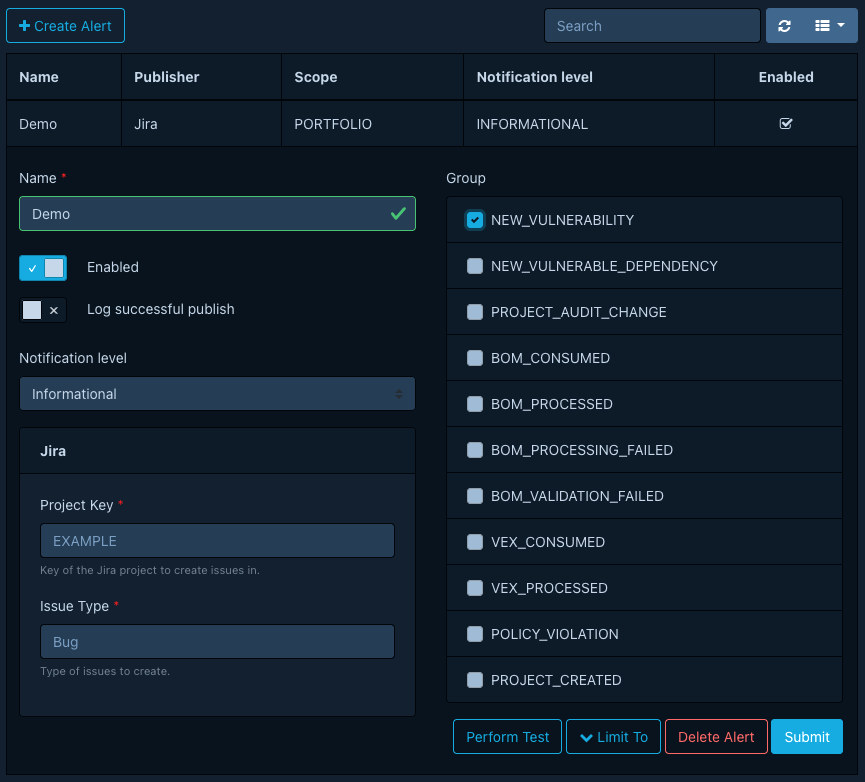

## Console

Publishes notifications by writing them to standard output.

This publisher is intended for testing. It does not provide any configuration options.

## Email

Publishes notifications as emails. [SMTP] and [SMTPS] protocols are supported.

**Global Config**

The global configuration defines how Dependency-Track connects to your email server.

**Alert Config**

The alert configuration defines the recipients of email notifications,
as well as an optional subject prefix.

In addition to listing recipient addresses explicitly, you can also specify
one or more teams as recipients. When teams are specified, emails will be sent
to all members of those teams.

You can mix explicit recipient addresses and teams, but you must configure
*at least one* of the two.

## Jira

Publishes notifications by creating issues in an Atlassian Jira instance.

**Global Config**

The global configuration defines how Dependency-Track connects to your Jira server.

**Alert Config**

The alert configuration defines properties of the issues to create.

!!! note
    Selecting teams as recipients has no effect for this publisher.

## Kafka

Publishes notifications by emitting records to an Apache Kafka cluster.

**Global Config**

The global configuration defines how Dependency-Track connects to your Kafka cluster.

!!! note "Configuring TLS"
    When enabling TLS, you **must** provide the certificate of the certificate authority (CA)
    that signed the certificate used by your Kafka brokers. It **must** be provided in
    [PEM] format and **must not** be encrypted, i.e. **not** password-protected.

!!! note "Configuring mTLS"
    When enabling [mutual TLS], you **must** provide a client certificate and key in [PEM] format.
    Both **must not** be encrypted. The client key **must** be a [managed secret](../secret-management/overview.md).

!!! note "Default Producer Configs"
    Dependency-Track applies the following [configs](https://kafka.apache.org/41/configuration/producer-configs/)
    to the underlying Kafka producer by default:

      * [`compression.type`](https://kafka.apache.org/41/configuration/producer-configs/#producerconfigs_compression.type): `snappy`
      * [`enable.idempotence`](https://kafka.apache.org/41/configuration/producer-configs/#producerconfigs_enable.idempotence): `true`

**Alert Config**

The alert config defines the destination and format of Kafka records emitted by the publisher.

!!! note
    Selecting teams as recipients has no effect for this publisher.

!!! tip "Protobuf"
    You are strongly encouraged to publish notifications in Protobuf format.
    Dependency-Track ensures that changes to the Protobuf schema are backward-compatible,
    which is crucial when notifications are stored in a durable log like Kafka.

!!! warning "Templating"
    The Kafka publisher does not ship with a default template, since it's meant to
    be used with Protobuf. If you prefer a different payload format, you must configure
    a custom template first. Refer to [Templating](templating.md) for details.

!!! tip "Record Keys"
    If a notification's subject is a project, as is the case for groups like `BOM_CONSUMED`,
    `NEW_VULNERABILITY` etc., then the Kafka record key will be the project's UUID.
    If the notification's subject is *not* a project, the key will be `null`.

## Mattermost

Publishes notifications as Mattermost messages.

**Alert Config**

The alert config defines the destination of Mattermost messages.

This should be the URL of an [incoming Webhook](https://docs.mattermost.com/integrations-guide/incoming-webhooks.html).

!!! note
    Selecting teams as recipients has no effect for this publisher.

## Microsoft Teams

Publishes notifications as Microsoft Teams messages.

**Alert Config**

The alert config defines the destination of Microsoft Teams messages.

This should be the URL of an [incoming Webhook](https://learn.microsoft.com/en-us/microsoftteams/platform/webhooks-and-connectors/how-to/add-incoming-webhook).

!!! note
    Selecting teams as recipients has no effect for this publisher.

## Slack

Publishes notifications as Slack messages.

**Alert Config**

The alert config defines the destination of Microsoft Teams messages.

This should be the URL of an [incoming Webhook](https://docs.slack.dev/messaging/sending-messages-using-incoming-webhooks/).

!!! note
    Selecting teams as recipients has no effect for this publisher.

## Webex

Publishes notifications as Cisco Webex messages.

**Alert Config**

The alert config defines the destination of Microsoft Teams messages.

This should be the URL of an [incoming Webhook](https://apphub.webex.com/applications/incoming-webhooks-cisco-systems-38054-23307-75252).

!!! note
    Selecting teams as recipients has no effect for this publisher.

## Webhook

Publishes notifications as Webhooks.

**Alert Config**

!!! note
    Selecting teams as recipients has no effect for this publisher.

[PEM]: https://en.wikipedia.org/wiki/Privacy-Enhanced_Mail
[SMTP]: https://en.wikipedia.org/wiki/Simple_Mail_Transfer_Protocol
[SMTPS]: https://en.wikipedia.org/wiki/SMTPS
[mutual TLS]: https://en.wikipedia.org/wiki/Mutual_authentication#mTLS