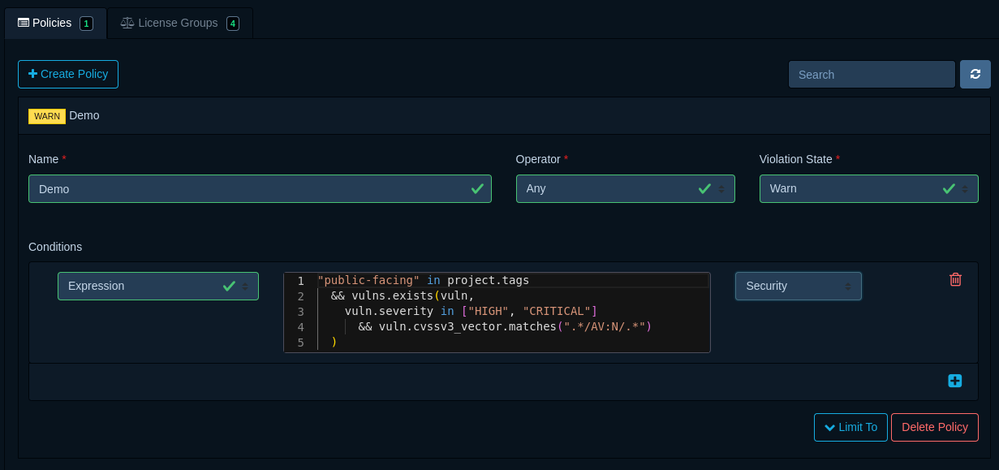

## Introduction

Dependency-Track allows policy conditions to be defined using the [Common Expression Language] (CEL),
enabling more flexibility, and more control compared to predefined conditions.

To use CEL, simply select the subject `Expression` when adding a new condition. A code editor will appear in which
expressions can be provided.



In addition to the expression itself, it's necessary to specify a *violation type*, which may be any of `License`,
`Operational`, or `Security`. The violation type aids in communicating what kind of risk is introduced by the
condition being matched.

## Syntax

The CEL syntax is similar to other [C-style languages] like Java and JavaScript.
However, CEL is not [Turing-complete]. As such, it does *not* support constructs like `if` statements or loops (i.e. `for`, `while`).

As a compensation for missing loops, CEL offers [macros] like `all`, `exists`, `exists_one`, `map`, and `filter`.
Refer to the [macros] documentation for more details, or have a look at the [examples](#examples) to see how they may
be utilized in practice.

CEL syntax is described thoroughly in the official [language definition].

## Evaluation Context

Conditions are scoped to individual components.  
Each condition is evaluated for every single component in a project.

The context in which expressions are evaluated in contains the following variables:

| Variable    | Type                               | Description                                  |
|:------------|:-----------------------------------|:---------------------------------------------|
| `component` | <code>[Component]</code>           | The component being evaluated                |
| `project`   | <code>[Project]</code>             | The project the component is part of         |
| `vulns`     | <code>list([Vulnerability])</code> | Vulnerabilities the component is affected by |

## Best Practices

1. **Keep expressions simple and concise**. The more complex an expression becomes, the harder it gets to determine why
it did or did not match. Use policy operators (`Any`, `All`) to chain multiple expressions if practical.
2. **Call functions last**. [Custom functions](#function-definitions) involve additional computation that is more
expensive than simple field accesses. Performing any checks on fields first, and calling functions last, oftentimes
allows evaluation to short-circuit.
3. **Remove conditions that are no longer needed**. Dependency-Track analyzes the configured expressions to determine
what data it has to load from the database in order to evaluate them. The more fields are being accessed,
the more data has to be loaded. Removal of outdated conditions thus has a direct positive performance impact.

## Examples

### Component age

Besides out-of-date versions, component age is another indicator of potential risk. Components may be on the latest
available version, but still be 20 years old. 

Component age can be evaluated using the `compare_age` [function](#function-definitions). The first function argument 
is a numeric comparator (`<`, `<=`, `=`, `!=`, `>`, `>=`), and the second is a [duration in ISO8601 notation](https://en.wikipedia.org/wiki/ISO_8601#Durations).

The following expression matches [Component]s that are two years old, or even older:

```js linenums="1"
component.compare_age(">=", "P2Y")
```

### Component blacklist

The following expression matches on the [Component]'s [Package URL], using a regular expression in [RE2] syntax.
Additionally, it checks whether the [Component]'s version falls into a given [vers] range, consisting of multiple
constraints.

```js linenums="1"
component.purl.matches("^pkg:maven/com.acme/acme-lib\\b.*")
  && component.matches_range("vers:maven/>0|<1|!=0.2.4")
```

The expression will match:

* `pkg:maven/com.acme/acme-lib@0.1.0`
* `pkg:maven/com.acme/acme-lib@0.9.9`

but not:

* `pkg:maven/com.acme/acme-library@0.1.0`
* `pkg:maven/com.acme/acme-lib@0.2.4`

`matches_range` currently supports the following versioning schemes:

| Versioning Scheme | Ecosystem                        |
|:------------------|:---------------------------------|
| `deb`             | Debian / Ubuntu                  |
| `generic`         | Generic / Any                    |
| `golang`          | Go                               |
| `maven`           | Java / Maven                     |
| `npm`             | JavaScript / NodeJS              |
| `rpm`             | CentOS / Fedora / Red Hat / SUSE |

!!! note
    If the ecosystem of the component(s) to match against is known upfront, it's good practice to use the according
    versioning scheme in `matches_range`. This helps with accuracy, as versioning schemes have different nuances
    across ecosystems, which makes comparisons error-prone.

### Dependency graph traversal

The following expression matches [Component]s that are a (possibly transitive) dependency of a [Component]
with name `foo`, *but only if* a [Component] with name `bar` is also present in the [Project].

```js linenums="1"
component.is_dependency_of(v1.Component{name: "foo"})
  && project.depends_on(v1.Component{name: "bar"})
```

`is_dependency_of` and `depends_on` lookups currently support the following [Component] fields:

* `uuid`
* `group`
* `name`
* `version`
* `classifier`
* `cpe`
* `purl`
* `swid_tag_id`
* `internal`

Initially, only exact matches on those fields are supported. In the future, more sophisticated matching options
will be added.

!!! note
    When constructing objects like [Component] on-the-fly, it is necessary to use their version namespace,
    i.e. `v1`. This is required in order to perform type checking, as well as ensuring backward compatibility.

### License blacklist

The following expression matches [Component]s that are **not** internal to the organization,
and have either:

* No resolved [License] at all
* A resolved [License] that is not part of the `Permissive` license group

```js linenums="1"
!component.is_internal && (
  !has(component.resolved_license)
    || component.resolved_license.groups.exisits(licenseGroup, 
         licenseGroup.name == "Permissive")
)
```

### Vulnerability blacklist

The following expression matches [Component]s in [Project]s tagged as `3rd-party`, with at least one [Vulnerability]
being any of the given blacklisted IDs.

```js linenums="1"
"3rd-party" in project.tags
  && vulns.exists(vuln, vuln.id in [
       "CVE-2017-5638",  // struts RCE
       "CVE-2021-44228", // log4shell
       "CVE-2022-22965", // spring4shell
     ])
```

### Vulnerabilities with high severity in public facing projects

The following expression matches [Component]s in [Project]s tagged as `public-facing`, with at least one `HIGH`
or `CRITICAL`
[Vulnerability], where the [CVSSv3] attack vector is `Network`.

```js linenums="1"
"public-facing" in project.tags
  && vulns.exists(vuln,
    vuln.severity in ["HIGH", "CRITICAL"]
      && vuln.cvssv3_vector.matches(".*/AV:N/.*")
  )
```

## Reference

### Types

#### `Component`

| Field                | Type                        | Description                      |
|:---------------------|:----------------------------|:---------------------------------|
| `uuid`               | `string`                    | Internal [UUID]                  |
| `group`              | `string`                    | Group / namespace                |
| `name`               | `string`                    | Name                             |
| `version`            | `string`                    | Version                          |
| `classifier`         | `string`                    | Classifier / type                |
| `cpe`                | `string`                    | [CPE]                            |
| `purl`               | `string`                    | [Package URL]                    |
| `swid_tag_id`        | `string`                    | [SWID] Tag ID                    |
| `is_internal`        | `bool`                      | Is internal?                     |
| `md5`                | `string`                    | MD5 hash                         |
| `sha1`               | `string`                    | SHA1 hash                        |
| `sha256`             | `string`                    | SHA256 hash                      |
| `sha384`             | `string`                    | SHA384 hash                      |
| `sha512`             | `string`                    | SHA512 hash                      |
| `sha3_256`           | `string`                    | SHA3-256 hash                    |
| `sha3_384`           | `string`                    | SHA3-384 hash                    |
| `sha3_512`           | `string`                    | SHA3-512 hash                    |
| `blake2b_256`        | `string`                    | BLAKE2b-256 hash                 |
| `blake2b_384`        | `string`                    | BLAKE2b-384 hash                 |
| `blake2b_512`        | `string`                    | BLAKE2b-512 hash                 |
| `blake3`             | `string`                    | BLAKE3 hash                      |
| `license_name`       | `string`                    | License name (if unresolved)     |
| `license_expression` | `string`                    | [SPDX license expression]        |
| `resolved_license`   | <code>[License]</code>      | Resolved license                 |
| `published_at`       | `google.protobuf.Timestamp` | When the component was published |
| `latest_version`     | `string`                    | Latest known version             |

#### `License`

| Field              | Type                               | Description                                      |
|:-------------------|:-----------------------------------|:-------------------------------------------------|
| `uuid`             | `string`                           | Internal [UUID]                                  |
| `id`               | `string`                           | SPDX license ID                                  |
| `name`             | `string`                           | License name                                     |
| `groups`           | <code>list([License.Group])</code> | Groups this license is included in               |
| `is_osi_approved`  | `bool`                             | Is [OSI-approved]?                               |
| `is_fsf_libre`     | `bool`                             | Is included in [FSF license list]?               |
| `is_deprecated_id` | `bool`                             | Uses a deprecated SPDX license ID?               |
| `is_custom`        | `bool`                             | Is custom / not included in [SPDX license list]? |

#### `License.Group`

| Field  | Type     | Description     |
|:-------|:---------|:----------------|
| `uuid` | `string` | Internal [UUID] |
| `name` | `string` | Group name      |

#### `Project`

| Field             | Type                                  | Description       |
|:------------------|:--------------------------------------|:------------------|
| `uuid`            | `string`                              | Internal [UUID]   |
| `group`           | `string`                              | Group / namespace |
| `name`            | `string`                              | Name              |
| `version`         | `string`                              | Version           |
| `classifier`      | `string`                              | Classifier / type |
| `inactive_since`  | `google.protobuf.Timestamp`           | Inactive Since    |
| `tags`            | `list(string)`                        | Tags              |
| `properties`      | <code>list([Project.Property])</code> | Properties        |
| `cpe`             | `string`                              | [CPE]             |
| `purl`            | `string`                              | [Package URL]     |
| `swid_tag_id`     | `string`                              | [SWID] Tag ID     |
| `last_bom_import` | `google.protobuf.Timestamp`           |                   |

#### `Project.Property`

| Field   | Type     | Description |
|:--------|:---------|:------------|
| `group` | `string` |             |
| `name`  | `string` |             |
| `value` | `string` |             |
| `type`  | `string` |             |

#### `Vulnerability`

| Field                             | Type                                     | Description                                |
|:----------------------------------|:-----------------------------------------|:-------------------------------------------|
| `uuid`                            | `string`                                 | Internal [UUID]                            |
| `id`                              | `string`                                 | ID of the vulnerability (e.g. `CVE-123`)   |
| `source`                          | `string`                                 | Authoritative source (e.g. `NVD`)          |
| `aliases`                         | <code>list([Vulnerability.Alias])</code> | Known aliases                              |
| `cwes`                            | `list(int)`                              | [CWE] IDs                                  |
| `created`                         | `google.protobuf.Timestamp`              | When the vulnerability was created         |
| `published`                       | `google.protobuf.Timestamp`              | When the vulnerability was published       |
| `updated`                         | `google.protobuf.Timestamp`              | Then the vulnerability was updated         |
| `severity`                        | `string`                                 |                                            |
| `cvssv2_base_score`               | `double`                                 | [CVSSv2] base score                        |
| `cvssv2_impact_subscore`          | `double`                                 | [CVSSv2] impact sub score                  |
| `cvssv2_exploitability_subscore`  | `double`                                 | [CVSSv2] exploitability sub score          |
| `cvssv2_vector`                   | `string`                                 | [CVSSv2] vector                            |
| `cvssv3_base_score`               | `double`                                 | [CVSSv3] base score                        |
| `cvssv3_impact_subscore`          | `double`                                 | [CVSSv3] impact sub score                  |
| `cvssv3_exploitability_subscore`  | `double`                                 | [CVSSv3] exploitability sub score          |
| `cvssv3_vector`                   | `string`                                 | [CVSSv3] vector                            |
| `owasp_rr_likelihood_score`       | `double`                                 | [OWASP Risk Rating] likelihood score       |
| `owasp_rr_technical_impact_score` | `double`                                 | [OWASP Risk Rating] technical impact score |
| `owasp_rr_business_impact_score`  | `double`                                 | [OWASP Risk Rating] business impact score  |
| `owasp_rr_vector`                 | `string`                                 | [OWASP Risk Rating] vector                 |
| `epss_score`                      | `double`                                 | [EPSS] score                               |
| `epss_percentile`                 | `double`                                 | [EPSS] percentile                          |

#### `Vulnerability.Alias`

| Field    | Type     | Description                               |
|:---------|:---------|:------------------------------------------|
| `id`     | `string` | ID of the vulnerability (e.g. `GHSA-123`) |
| `source` | `string` | Authoritative source (e.g. `GITHUB`)      |

### Function Definitions

In addition to the [standard definitions] of the CEL specification, Dependency-Track offers additional functions
to unlock even more use cases:

| Symbol                     | Type                                                                                        | Description                                                   |
|:---------------------------|:--------------------------------------------------------------------------------------------|:--------------------------------------------------------------|
| `depends_on`               | <code>([Project], [Component])</code> -> `bool`                                             | Check if `Project` depends on `Component`                     |
| `compare_age`              | <code>([Component], string, string)</code> -> `bool`                                        | Check if a `Component`'s age matches a given duration         |
| `is_dependency_of`         | <code>([Component], [Component])</code> -> `bool`                                           | Check if a `Component` is a dependency of another `Component` |
| `matches_range`            | <code>([Project], string)</code> -> `bool`<br/><code>([Component], string)</code> -> `bool` | Check if a `Project` or `Component` matches a [vers] range    |
| `matches_version_distance` | <code>([Component], string, string)</code> -> `bool`                                        | Check if a `Component`'s version matches a given distance     |

[C-style languages]: https://en.wikipedia.org/wiki/List_of_C-family_programming_languages
[CVSSv2]: https://www.first.org/cvss/v2/guide
[CVSSv3]: https://www.first.org/cvss/v3.0/specification-document
[CPE]: https://csrc.nist.gov/projects/security-content-automation-protocol/specifications/cpe
[CWE]: https://cwe.mitre.org/
[Common Expression Language]: https://cel.dev/
[Component]: #component
[EPSS]: https://www.first.org/epss/
[FSF license list]: https://www.gnu.org/licenses/license-list.en.html
[License.Group]: #licensegroup
[License]: #license
[OSI-approved]: https://opensource.org/licenses
[OWASP Risk Rating]: https://owasp.org/www-community/OWASP_Risk_Rating_Methodology
[Package URL]: https://github.com/package-url/purl-spec/blob/master/PURL-SPECIFICATION.rst
[Project.Property]: #projectproperty
[Project]: #project
[RE2]: https://github.com/google/re2/wiki/Syntax
[SPDX license expression]: https://spdx.github.io/spdx-spec/v2-draft/SPDX-license-expressions/
[SPDX license list]: https://spdx.org/licenses/
[Turing-complete]: https://en.wikipedia.org/wiki/Turing_completeness
[SWID]: https://csrc.nist.gov/projects/Software-Identification-SWID
[UUID]: https://en.wikipedia.org/wiki/Universally_unique_identifier
[Vulnerability.Alias]: #vulnerabilityalias
[Vulnerability]: #vulnerability
[introduction]: https://github.com/google/cel-spec/blob/v0.13.0/doc/intro.md
[language definition]: https://github.com/google/cel-spec/blob/v0.13.0/doc/langdef.md#language-definition
[macros]: https://github.com/google/cel-spec/blob/v0.13.0/doc/langdef.md#macros
[standard definitions]: https://github.com/google/cel-spec/blob/v0.13.0/doc/langdef.md#list-of-standard-definitions
[vers]: https://github.com/package-url/purl-spec/blob/version-range-spec/VERSION-RANGE-SPEC.rst