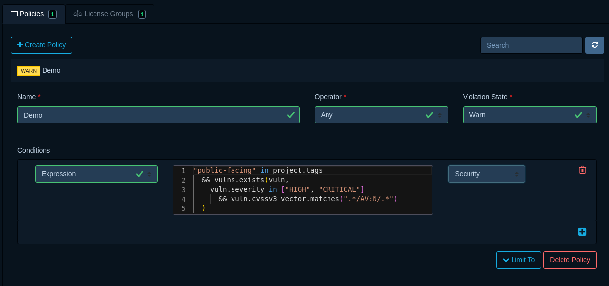
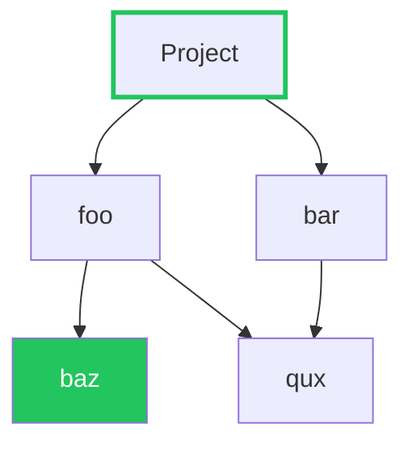
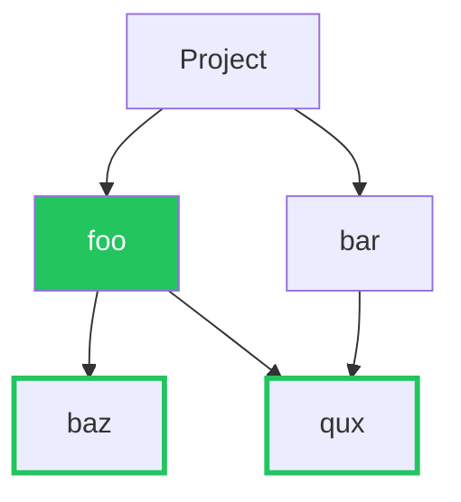
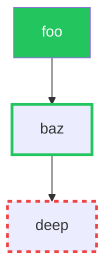
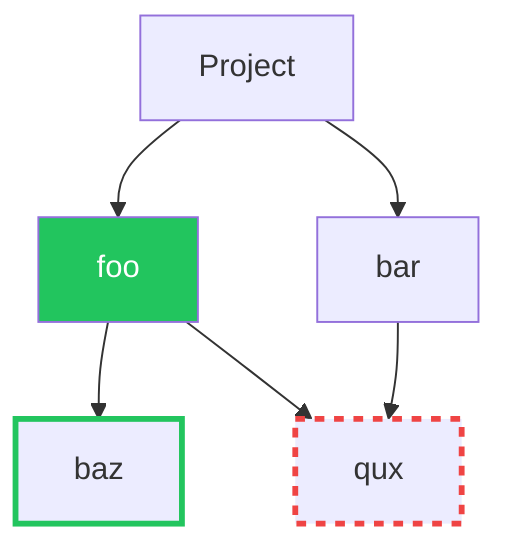

## Introduction

Dependency-Track allows policy conditions to be defined using the [Common Expression Language] (CEL),
enabling more flexibility, and more control compared to predefined conditions.

To use CEL, simply select the subject `Expression` when adding a new condition. A code editor will appear in which
expressions can be provided.



In addition to the expression itself, it's necessary to specify a *violation type*, which may be any of `License`,
`Operational`, or `Security`. The violation type aids in communicating what kind of risk is introduced by the
condition being matched.

## Syntax

The CEL syntax is similar to other [C-style languages] like Java and JavaScript.
However, CEL is not [Turing-complete]. As such, it does *not* support constructs like `if` statements or loops (i.e. `for`, `while`).

As a compensation for missing loops, CEL offers [macros] like `all`, `exists`, `exists_one`, `map`, and `filter`.
Refer to the [macros] documentation for more details, or have a look at the [examples](#examples) to see how they may
be utilized in practice.

CEL syntax is described thoroughly in the official [language definition].

## Evaluation Context

Conditions are scoped to individual components.
Each condition is evaluated for every single component in a project.

The context in which expressions are evaluated in contains the following variables:

| Variable    | Type                                            | Description                                  |
|:------------|:------------------------------------------------|:---------------------------------------------|
| `component` | [Component]                                     | The component being evaluated                |
| `project`   | [Project]                                       | The project the component is part of         |
| `vulns`     | list([Vulnerability])                           | Vulnerabilities the component is affected by |
| `now`       | [`google.protobuf.Timestamp`][protobuf-ts-docs] | The current time at the start of evaluation  |

!!! note
    Many fields on [Component], [Project], and [Vulnerability] are optional.
    Use the `has()` macro to [check for presence of optional fields](#optional-field-checking)
    before accessing them.

## Best Practices

1. **Keep expressions simple and concise**. The more complex an expression becomes, the harder it gets to determine why
it did or did not match. Use policy operators (`Any`, `All`) to chain multiple expressions if practical.
2. **Call functions last**. [Custom functions](#function-reference) involve additional computation that is more
expensive than simple field accesses. Performing any checks on fields first, and calling functions last, oftentimes
allows evaluation to short-circuit.
3. **Remove conditions that are no longer needed**. Dependency-Track analyzes the configured expressions to determine
what data it has to load from the database in order to evaluate them. The more fields are being accessed,
the more data has to be loaded. Removal of outdated conditions thus has a direct positive performance impact.

## Examples

### Component age

Besides out-of-date versions, component age is another indicator of potential risk. Components may be on the latest
available version, but still be 20 years old.

The following expression matches [Component]s that are two years old, or even older, using the `now`
variable and timestamp arithmetic:

```js linenums="1"
has(component.published_at)
  && component.published_at < now - duration("17520h") // ~2 years
```

### Component blacklist

The following expression matches on the [Component]'s [Package URL], using a regular expression in [RE2] syntax.
Additionally, it checks whether the [Component]'s version falls into a given [vers] range using
[`matches_range`](#matches_range), consisting of multiple constraints.

```js linenums="1"
component.purl.matches("^pkg:maven/com.acme/acme-lib\\b.*")
  && component.matches_range("vers:maven/>0|<1|!=0.2.4")
```

The expression will match:

* `pkg:maven/com.acme/acme-lib@0.1.0`
* `pkg:maven/com.acme/acme-lib@0.9.9`

but not:

* `pkg:maven/com.acme/acme-library@0.1.0`
* `pkg:maven/com.acme/acme-lib@0.2.4`

### Dependency graph traversal

The following expression matches [Component]s that are a (possibly transitive) dependency of a [Component]
with name `foo`, *but only if* a [Component] with name `bar` is also present in the [Project].

```js linenums="1"
component.is_dependency_of(v1.Component{name: "foo"})
  && project.depends_on(v1.Component{name: "bar"})
```

To check whether a component is a *direct* (i.e. non-transitive) dependency:

```js linenums="1"
component.is_direct_dependency_of(v1.Component{name: "foo"})
```

To check whether a component is *exclusively* introduced through another component
(i.e. no other path in the dependency graph leads to it):

```js linenums="1"
component.is_exclusive_dependency_of(v1.Component{name: "foo"})
```

Dependency graph functions support the following [Component] fields for matching:

| Field         | `re:` prefix | `vers:` prefix |
|:--------------|:------------:|:--------------:|
| `uuid`        |              |                |
| `group`       |      ✅       |                |
| `name`        |      ✅       |                |
| `version`     |      ✅       |       ✅        |
| `classifier`  |              |                |
| `cpe`         |      ✅       |                |
| `purl`        |      ✅       |                |
| `swid_tag_id` |      ✅       |                |
| `is_internal` |              |                |

The `re:` prefix enables [RE2] regex matching on the field value:

```js linenums="1"
project.depends_on(v1.Component{name: "re:^acme-.*"})
```

The `vers:` prefix enables [vers] range matching on the `version` field:

```js linenums="1"
project.depends_on(v1.Component{
  name: "acme-lib",
  version: "vers:maven/>1.0.0|<2.0.0"
})
```

!!! note
    When constructing objects like [Component] on-the-fly, it is necessary to use their version namespace,
    i.e. `v1`. This is required in order to perform type checking, as well as ensuring backward compatibility.

### License expression allowlist

The following expression matches non-internal [Component]s whose [SPDX license expression][SPDX license expressions]
cannot be satisfied using only the approved set of licenses.
License-with-exception combinations are listed as a single compound entry.

```js linenums="1"
!spdx_expr_allows(component.license_expression, [
  "MIT", "Apache-2.0", "BSD-3-Clause",
  "GPL-2.0-only WITH Classpath-exception-2.0"
])
```

When components don't have a license expression, `component.resolved_license.id` can be used as a fallback.
A single license ID is a valid SPDX expression, so it gets the same version-aware treatment:

```js linenums="1"
!spdx_expr_allows(
  has(component.license_expression)
    ? component.license_expression
    : component.resolved_license.id,
  ["MIT", "Apache-2.0"]
)
```

### License blacklist

The following expression matches [Component]s that are **not** internal to the organization,
and have either:

* No resolved [License] at all
* A resolved [License] that is not part of the `Permissive` license group

```js linenums="1"
!component.is_internal && (
  !has(component.resolved_license)
    || !component.resolved_license.groups.exists(licenseGroup,
         licenseGroup.name == "Permissive")
)
```

### Vulnerability blacklist

The following expression matches [Component]s in [Project]s tagged as `3rd-party`, with at least one [Vulnerability]
being any of the given blacklisted IDs.

```js linenums="1"
"3rd-party" in project.tags
  && vulns.exists(vuln, vuln.id in [
       "CVE-2017-5638",  // struts RCE
       "CVE-2021-44228", // log4shell
       "CVE-2022-22965", // spring4shell
     ])
```

### Vulnerabilities with high severity in public facing projects

The following expression matches [Component]s in [Project]s tagged as `public-facing`, with at least one `HIGH`
or `CRITICAL`
[Vulnerability], where the [CVSSv3] attack vector is `Network`.

```js linenums="1"
"public-facing" in project.tags
  && vulns.exists(vuln,
    vuln.severity in ["HIGH", "CRITICAL"]
      && vuln.cvssv3_vector.matches(".*/AV:N/.*")
  )
```

### Version distance

The [`version_distance`](#version_distance) function allows matching based on how far behind a component's version
is from the latest known version. The distance is specified using a [VersionDistance] object with `epoch`, `major`,
`minor`, and `patch` fields.

The following expression matches components that are more than one major version behind:

```js linenums="1"
component.version_distance(">=", v1.VersionDistance{major: 1})
```

### Optional field checking

CEL does not have a concept of `null`. Accessing a field that is not set
returns its default value (e.g. `""` for strings, `0` for numbers, `false` for booleans), which can
lead to misleading matches. Use the `has()` macro to check for field presence before accessing it:

```js linenums="1"
has(component.published_at)
  && component.published_at < now - duration("8760h")
```

```js linenums="1"
has(project.metadata) && has(project.metadata.tools)
```

## SPDX License Expressions

The `spdx_expr_*` functions evaluate [SPDX license expressions]. They operate on expression strings
(typically `component.license_expression`) and can also be used with `component.resolved_license.id`
as a fallback for components without a license expression.

All license ID comparisons are **case-insensitive** per the SPDX specification.

### Version equivalence

Deprecated license IDs are treated as equivalent to their modern counterparts.
For example, `GPL-2.0` and `GPL-2.0-only` are considered the same license.

### Version ranges

The `+` operator and `-or-later` suffix are understood as "this version or any later
version in the same license family." For example, `GPL-3.0-only` satisfies an allow-list containing
`GPL-2.0-or-later`, and `Apache-1.0+` satisfies an allow-list containing `Apache-2.0`.

### Deprecated `WITH`-compounds

Legacy compound IDs like `GPL-2.0-with-classpath-exception` are automatically
resolved to their modern `WITH` expression form (`GPL-2.0-only WITH Classpath-exception-2.0`).

### `WITH` composites

License-with-exception combinations are treated as atomic composites. The full
compound (e.g. `"GPL-2.0-only WITH Classpath-exception-2.0"`) must appear as a single entry in
allow-lists, not as separate license and exception IDs. The license part uses version-aware matching
(e.g. `GPL-2.0 WITH ...` matches `GPL-2.0-only WITH ...`), while the exception part requires an exact match.

## Function Reference

For type definitions, refer to the [schema reference](../../reference/schemas/policy.md).

In addition to the [standard definitions] of the CEL specification, Dependency-Track offers the following functions.

### `depends_on`

Checks whether a [Project] contains a [Component] matching the given criteria.
Useful for enforcing policies only when specific components are present in a project.

| Name        | Type        | Description                                                     |
|:------------|:------------|:----------------------------------------------------------------|
| *receiver*  | [Project]   | The project to check                                            |
| `component` | [Component] | Criteria to match against. Supports `re:` and `vers:` prefixes. |

**Returns:** `true` if a matching component exists in the project.

```js linenums="1"
project.depends_on(v1.Component{name: "baz"})
```


```mermaid
graph TD
  P["Project"]:::match --> A["foo"]
  P --> B["bar"]
  A --> C["baz"]:::criteria
  A --> D["qux"]
  B --> D
  classDef match stroke:#22c55e,stroke-width:3
  classDef criteria fill:#22c55e,color:#fff
```

!!! tip
    `project` matches because `baz` exists in its dependency graph.

### `is_dependency_of`

Checks whether a [Component] is a (possibly transitive) dependency of another [Component].

| Name        | Type        | Description                                                                |
|:------------|:------------|:---------------------------------------------------------------------------|
| *receiver*  | [Component] | The component being evaluated                                              |
| `component` | [Component] | Criteria to match the parent against. Supports `re:` and `vers:` prefixes. |

**Returns:** `true` if the receiver is a dependency (direct or transitive) of a matching component.

```js linenums="1"
component.is_dependency_of(v1.Component{name: "foo"})
```


```mermaid
graph TD
  P["Project"] --> A["foo"]:::criteria
  P --> B["bar"]
  A --> C["baz"]:::match
  A --> D["qux"]:::match
  B --> D
  classDef match stroke:#22c55e,stroke-width:3
  classDef criteria fill:#22c55e,color:#fff
```

!!! tip
    `baz` and `qux` match since both are dependencies of `foo`.
    `qux` matches even though it's also reachable through `bar`.

### `is_direct_dependency_of`

Checks whether a [Component] is a *direct* (non-transitive) dependency of another [Component].

| Name        | Type        | Description                                                                |
|:------------|:------------|:---------------------------------------------------------------------------|
| *receiver*  | [Component] | The component being evaluated                                              |
| `component` | [Component] | Criteria to match the parent against. Supports `re:` and `vers:` prefixes. |

**Returns:** `true` if the receiver is a direct dependency of a matching component.

```js linenums="1"
component.is_direct_dependency_of(v1.Component{name: "foo"})
```


```mermaid
graph TD
  P["Project"] --> A["foo"]:::criteria
  P --> B["bar"]
  A --> C["baz"]:::match
  A --> D["qux"]:::match
  B --> D
  classDef match stroke:#22c55e,stroke-width:3
  classDef criteria fill:#22c55e,color:#fff
```

!!! tip
    `baz` and `qux` match since both are direct children of `foo`.

With a deeper graph, transitive dependencies do **not** match:


```mermaid
graph TD
  A["foo"]:::criteria --> C["baz"]:::match
  C --> E["deep"]:::nomatch
  classDef match stroke:#22c55e,stroke-width:3
  classDef criteria fill:#22c55e,color:#fff
  classDef nomatch stroke:#ef4444,stroke-width:3,stroke-dasharray:5
```

!!! tip
    `baz` matches since it's a direct child of `foo`.  
    `deep` does **not** match, as it's a transitive dependency.

### `is_exclusive_dependency_of`

Checks whether a [Component] is *exclusively* introduced through another [Component].
Returns `true` only if every path from the project root to the receiver passes through a matching component.

| Name        | Type        | Description                                                                |
|:------------|:------------|:---------------------------------------------------------------------------|
| *receiver*  | [Component] | The component being evaluated                                              |
| `component` | [Component] | Criteria to match the parent against. Supports `re:` and `vers:` prefixes. |

**Returns:** `true` if the receiver is exclusively introduced through a matching component.

```js linenums="1"
component.is_exclusive_dependency_of(v1.Component{name: "foo"})
```


```mermaid
graph TD
  P["Project"] --> A["foo"]:::criteria
  P --> B["bar"]
  A --> C["baz"]:::match
  A --> D["qux"]:::nomatch
  B --> D
  classDef match stroke:#22c55e,stroke-width:3
  classDef criteria fill:#22c55e,color:#fff
  classDef nomatch stroke:#ef4444,stroke-width:3,stroke-dasharray:5
```

!!! tip
    `baz` matches since it's only reachable through `foo`.  
    `qux` does **not** match, as it's also reachable through `bar`.

### `matches_range`

Checks whether a [Component]'s or [Project]'s version falls within a [vers] range.

| Name       | Type                     | Description                                                |
|:-----------|:-------------------------|:-----------------------------------------------------------|
| *receiver* | [Component] or [Project] | The component or project to check                          |
| `range`    | `string`                 | A [vers] range string (e.g. `"vers:maven/>1.0.0\|<2.0.0"`) |

**Returns:** `true` if the version is within the specified range.

```js linenums="1"
component.matches_range("vers:maven/>0|<1|!=0.2.4")
```

Currently supported versioning schemes:

| Versioning Scheme | Ecosystem                        |
|:------------------|:---------------------------------|
| `deb`             | Debian / Ubuntu                  |
| `generic`         | Generic / Any                    |
| `golang`          | Go                               |
| `maven`           | Java / Maven                     |
| `npm`             | JavaScript / NodeJS              |
| `rpm`             | CentOS / Fedora / Red Hat / SUSE |

!!! note
    If the ecosystem of the component(s) to match against is known upfront, it's good practice to use the according
    versioning scheme in `matches_range`. This helps with accuracy, as versioning schemes have different nuances
    across ecosystems, which makes comparisons error-prone.

### `spdx_expr_allows`

Checks whether an [SPDX license expression][SPDX license expressions] can be satisfied
using only licenses from the given set. For `OR` expressions, at least one branch must
be satisfiable. For `AND` expressions, all children must be satisfiable. `WITH` expressions
are treated as atomic composites (see below).

| Name         | Type           | Description                                              |
|:-------------|:---------------|:---------------------------------------------------------|
| `expression` | `string`       | An SPDX license expression                               |
| `ids`        | `list(string)` | Allowed licenses, including `WITH` composites if needed  |

**Returns:** `true` if the expression is satisfiable with the given IDs.

```js linenums="1"
spdx_expr_allows(component.license_expression, ["MIT", "Apache-2.0"])
// "MIT"                  => true  (MIT is allowed)
// "MIT OR GPL-3.0-only"  => true  (MIT branch is satisfiable)
// "MIT AND Apache-2.0"   => true  (both are allowed)
// "MIT AND GPL-3.0-only" => false (GPL-3.0-only is not allowed)
// "GPL-3.0-only"         => false (not in the allowed set)
```

Version-range matching is applied automatically:

```js linenums="1"
spdx_expr_allows(component.license_expression, ["GPL-2.0-or-later"])
// "GPL-2.0-only" => true  (2.0 is within 2.0-or-later range)
// "GPL-3.0-only" => true  (3.0 is within 2.0-or-later range)
// "GPL-1.0-only" => false (1.0 is below 2.0)
// "GPL-2.0"      => true  (deprecated ID, equivalent to GPL-2.0-only)
```

!!! tip
    `WITH` expressions (license-with-exception) are matched as a single unit.
    The allowed set must contain the full compound entry, not the license and exception separately:

    ```js linenums="1"
    spdx_expr_allows(component.license_expression, [
      "GPL-2.0-only WITH Classpath-exception-2.0"
    ])
    // "GPL-2.0-only WITH Classpath-exception-2.0" => true  (composite matches)
    // "GPL-2.0-only"                              => false (plain license, not in set)
    // "GPL-2.0-only WITH LLVM-exception"          => false (different composite)
    ```

### `spdx_expr_requires_any`

Checks whether at least one of the given license IDs is required in every possible satisfaction
of an [SPDX license expression][SPDX license expressions]. For `OR` expressions, at least one of
the IDs must be required in all branches. For `AND` expressions, at least one of the IDs must be
required in at least one child.

| Name         | Type            | Description                |
|:-------------|:----------------|:---------------------------|
| `expression` | `string`        | An SPDX license expression |
| `ids`        | `list(string)`  | License IDs to check       |

**Returns:** `true` if at least one of the IDs is always required.

```js linenums="1"
spdx_expr_requires_any(component.license_expression, ["GPL-2.0-only", "GPL-3.0-only"])
// "GPL-2.0-only AND MIT"         => true  (GPL-2.0-only always required)
// "GPL-2.0-only OR GPL-3.0-only" => true  (every branch requires one)
// "GPL-2.0 AND MIT"              => true  (GPL-2.0 is equivalent to GPL-2.0-only)
// "GPL-2.0-only OR MIT"          => false (MIT branch requires neither)
```

### `version_distance`

Checks whether the distance between a [Component]'s current version and its latest known version
matches a given [VersionDistance].

| Name       | Type              | Description                                         |
|:-----------|:------------------|:----------------------------------------------------|
| *receiver* | [Component]       | The component to check                              |
| `operator` | `string`          | Numeric comparator: `<`, `<=`, `=`, `!=`, `>`, `>=` |
| `distance` | [VersionDistance] | The version distance to compare against             |

**Returns:** `true` if the version distance satisfies the comparison.

```js linenums="1"
component.version_distance(">=", v1.VersionDistance{major: 1})
```

[C-style languages]: https://en.wikipedia.org/wiki/List_of_C-family_programming_languages
[CVSSv3]: https://www.first.org/cvss/v3.0/specification-document
[Common Expression Language]: https://cel.dev/
[Component]: ../../reference/schemas/policy.md#component
[License]: ../../reference/schemas/policy.md#license
[Package URL]: https://github.com/package-url/purl-spec/blob/master/PURL-SPECIFICATION.rst
[Project]: ../../reference/schemas/policy.md#project
[RE2]: https://github.com/google/re2/wiki/Syntax
[SPDX license expressions]: https://spdx.github.io/spdx-spec/v2.3/SPDX-license-expressions/
[Turing-complete]: https://en.wikipedia.org/wiki/Turing_completeness
[VersionDistance]: ../../reference/schemas/policy.md#versiondistance
[Vulnerability]: ../../reference/schemas/policy.md#vulnerability
[language definition]: https://github.com/google/cel-spec/blob/v0.13.0/doc/langdef.md#language-definition
[macros]: https://github.com/google/cel-spec/blob/v0.13.0/doc/langdef.md#macros
[protobuf-ts-docs]: https://protobuf.dev/reference/protobuf/google.protobuf/#timestamp
[standard definitions]: https://github.com/google/cel-spec/blob/v0.13.0/doc/langdef.md#list-of-standard-definitions
[vers]: https://github.com/package-url/vers-spec