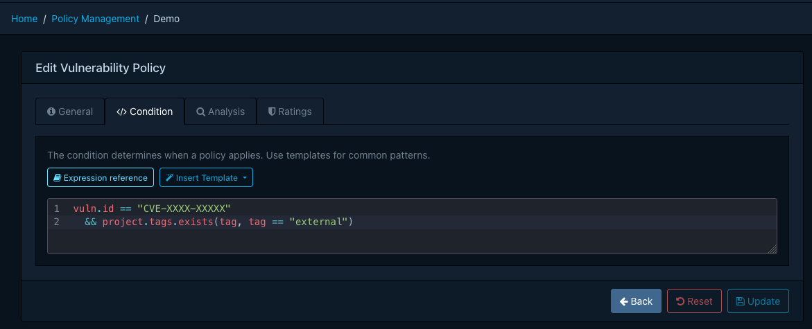
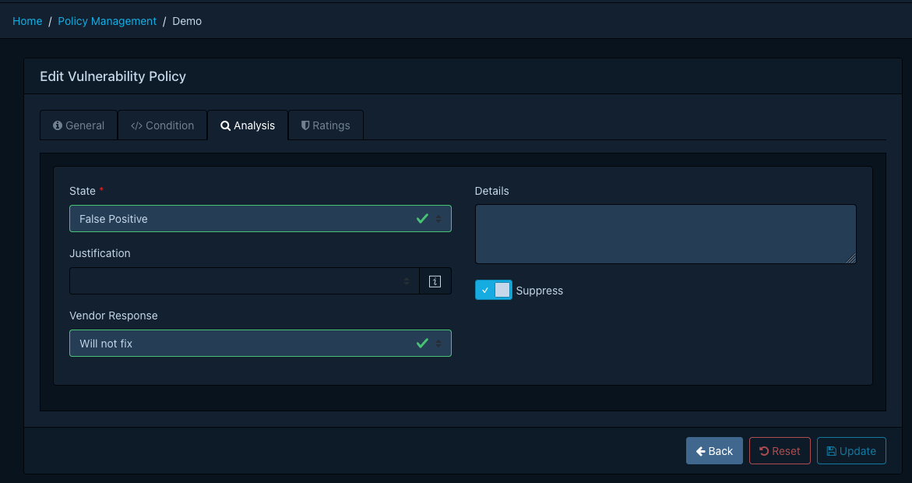
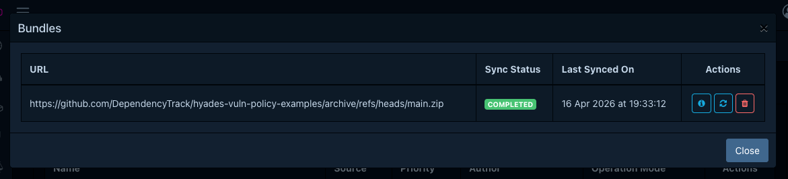

## Introduction

Vulnerability policies let organisations encode how specific vulnerabilities should be triaged across
the portfolio. Where a [standard policy](./overview.md) raises violations, a vulnerability policy acts
on the finding itself. It applies an analysis (state, justification, vendor response, details),
optionally overrides the vulnerability's ratings, and can suppress the finding altogether.

Typical use cases include:

* Suppress a CVE that has been assessed as not applicable to a given component or project.
* Downgrade or upgrade a vulnerability's severity based on organisational context.
* Centralise triage decisions so that every project benefits from them automatically, including
  projects imported in the future.

Policies are evaluated every time a project's vulnerabilities are analysed. Analyses applied by a
policy populate the finding's audit trail in the same way as a manual analysis.

## Why Not VEX?

[CycloneDX VEX] and [VDR] can also communicate triage decisions. Vulnerability policies complement them
rather than replace them. The important differences are:

* **VEX analyses are static.** A VEX statement records a decision for a specific finding at a specific
  point in time. Vulnerability policies are rules. A single policy can match many findings now and in
  the future, based on conditions such as component version ranges, project tags, or dependency graph
  relationships.
* **VEX cannot express constraints.** A policy condition can say "apply this decision only while the
  affected component is reached through Spring Cloud" or "only for projects tagged `3rd-party`". VEX
  cannot do this.
* **VEX has no built-in expiration or scope change.** A policy has a validity window and can be edited
  or removed centrally. When it stops matching, the analyses it applied are automatically reverted.

## Policy Sources

A vulnerability policy originates from one of two sources:

| Source | How it is managed                                    | Editable |
|:-------|:-----------------------------------------------------|:---------|
| User   | Created and edited directly in Dependency-Track      | Yes      |
| Bundle | Synchronised from a remote ZIP archive of YAML files | No       |

Both sources share a single namespace. Policy names are globally unique across user-managed and
bundle-managed policies. If a bundle sync encounters a policy whose name is already taken by a
user-managed policy, the sync fails rather than silently overwriting either side.

!!! info
    Bundle-managed policies are displayed with a lock icon and cannot be edited or deleted. To change a
    bundle policy, edit it in its source repository and re-sync the bundle.

## Evaluation

Each policy is evaluated once per `(component, vulnerability)` pair. When multiple policies match the
same finding, the policy with the highest `priority` value wins, and only its analysis and ratings are
applied. When two or more matching policies have the same priority, the policy that was created first
wins.

### Validity Window

A policy is evaluated only while the current time falls within its *Valid From* and *Valid Until*
timestamps. Both bounds are optional. A policy with neither bound is always active.

When a policy leaves its validity window (for example because *Valid Until* has elapsed, or because the
policy is deleted), any analyses and rating overrides that were applied by it are automatically
reverted on the next evaluation. The finding returns to whatever state it would have without the policy,
or to the decision of the next-highest-priority policy that still matches. This makes it safe to use
time-bounded policies for temporary suppressions, embargoes, or phased rollouts.

### Operation Modes

Every policy has an operation mode that determines what happens when its condition matches.

| Mode     | Behaviour                                                                                            |
|:---------|:-----------------------------------------------------------------------------------------------------|
| Apply    | Apply the analysis and ratings to the finding. This is the default.                                  |
| Log      | Record that the policy matched, but do not modify the finding. Useful for validating a new policy.   |
| Disabled | The policy is not evaluated at all.                                                                  |

!!! tip
    *Log* mode is particularly useful when introducing a new policy. It lets you observe how often a
    policy would match without risking unintended suppression of real findings. Once confident, switch to *Apply*.

### Condition

Conditions use the same [Common Expression Language](./expressions.md) syntax, functions, and variables
as standard policy expressions, with one exception: A vulnerability policy is scoped to a
single vulnerability, exposed as the `vuln` variable, rather than a list of vulnerabilities.

| Variable    | Type                                            | Description                                 |
|:------------|:------------------------------------------------|:--------------------------------------------|
| `vuln`      | [Vulnerability]                                 | The vulnerability being evaluated           |
| `component` | [Component]                                     | The component the vulnerability applies to  |
| `project`   | [Project]                                       | The project the component belongs to        |
| `now`       | [`google.protobuf.Timestamp`][protobuf-ts-docs] | The current time at the start of evaluation |

!!! tip
    Because `vuln` is a single object rather than a list, constructs like `vulns.exists(...)` from
    standard policies become direct field accesses such as `vuln.id == "CVE-2022-41852"`. Everything
    else works identically, including [`matches_range`](./expressions.md#matches_range),
    [`is_dependency_of`](./expressions.md#is_dependency_of), `has()`, and the full CEL standard library.
    Refer to the [expressions reference](./expressions.md) for the complete function list.

### Analysis and Ratings

When a policy matches in *Apply* mode, Dependency-Track applies the policy's analysis to the finding:

* **State** (required). One of `EXPLOITABLE`, `IN_TRIAGE`, `FALSE_POSITIVE`, `NOT_AFFECTED`, `RESOLVED`.
* **Justification**. Only applicable when the state is `NOT_AFFECTED`. Follows the CycloneDX VEX values
  (for example `CODE_NOT_REACHABLE`, `PROTECTED_BY_MITIGATING_CONTROL`).
* **Vendor response**. The response communicated to consumers (`CAN_NOT_FIX`, `WILL_NOT_FIX`, `UPDATE`,
  `ROLLBACK`, `WORKAROUND_AVAILABLE`).
* **Details**. Free-form text explaining the analysis.
* **Suppress**. Whether to suppress the finding.

Up to three ratings may be attached to a policy. Each rating specifies a method (`CVSSv2`, `CVSSv3`,
`CVSSv4`, `OWASP`), a severity, and optionally a score and vector. Ratings are how a policy raises or
lowers the perceived severity of a vulnerability for your organisation, for example by enriching a CVSS
vector with environmental metrics.

## Managing Policies

Vulnerability policies are managed under *Policy Management* → *Vulnerability Policies*. The required
permission is `POLICY_MANAGEMENT`, or one of the finer-grained `POLICY_MANAGEMENT_CREATE`,
`POLICY_MANAGEMENT_READ`, `POLICY_MANAGEMENT_UPDATE`, `POLICY_MANAGEMENT_DELETE`.


### Creating a Policy

1. Click *Create Policy* to open the editor.
2. On the *General* tab, provide a name, optional description and author, an operation mode, and a
   priority between `0` and `100`. Higher values are evaluated first. Optionally set a validity window.
3. On the *Condition* tab, write a CEL expression. The editor offers autocompletion for the available
   variables and functions, and a template dropdown with common patterns.
4. On the *Analysis* tab, pick the state and any additional analysis fields to apply when the policy
   matches.
5. On the *Ratings* tab, optionally add up to three rating overrides.
6. Click *Create*.







### Editing and Deleting

User-managed policies can be edited or deleted from the list view. Bundle-managed policies appear
read-only and must be changed at the bundle source.

## Managing Policies via Bundles

A bundle is a ZIP archive of YAML files, one per policy, hosted on an HTTP(S) endpoint that
Dependency-Track fetches on a schedule. Bundles are suited for centrally curated policy sets that are
reviewed, versioned, and distributed alongside other infrastructure-as-code.

!!! info
    Bundles are provisioned through server configuration. A single default bundle is currently
    supported. The data model has been prepared for multiple bundles in a future release, but creating
    additional bundles from Dependency-Track itself is not yet available.

### Configuring the Bundle Source

Configure the bundle URL and (optionally) credentials on the API server.

| Property                                                                                                                                     | Description                                         |
|:---------------------------------------------------------------------------------------------------------------------------------------------|:----------------------------------------------------|
| [`dt.vulnerability.policy.bundle.url`](../../reference/configuration/api-server.md#dtvulnerabilitypolicybundleurl)                           | HTTP(S) URL of the bundle ZIP                       |
| [`dt.vulnerability.policy.bundle.auth.username`](../../reference/configuration/api-server.md#dtvulnerabilitypolicybundleauthusername)        | Basic-auth username                                 |
| [`dt.vulnerability.policy.bundle.auth.password`](../../reference/configuration/api-server.md#dtvulnerabilitypolicybundleauthpassword)        | Basic-auth password                                 |
| [`dt.vulnerability.policy.bundle.auth.bearer.token`](../../reference/configuration/api-server.md#dtvulnerabilitypolicybundleauthbearertoken) | Bearer token, used when no basic-auth is configured |
| [`dt.task.vulnerability-policy-bundle-sync.cron`](../../reference/configuration/api-server.md#dttaskvulnerability-policy-bundle-synccron)    | Cron expression for the scheduled sync              |

Once the URL is configured, Dependency-Track fetches the bundle on the configured schedule. A bundle
whose digest matches the last successful sync is skipped. An administrator may also trigger an immediate
sync from *Policy Management* → *Vulnerability Policies* → *Bundles* → *Sync*.



### Bundle Layout

A bundle is a plain ZIP archive of YAML files at the root. File names must end in `.yaml` or `.yml` and
must not start with `.` or `_`. Non-YAML files are ignored.

```
bundle.zip
├── cve-2022-41852.yaml
└── spring-cloud-suppressions.yaml
```

The following size limits apply to protect the sync job from denial-of-service.

* The bundle ZIP must not exceed 10 MiB.
* It may contain at most 1000 entries.
* Each individual YAML file must not exceed 1 MiB.

### Policy File Format

Each YAML file is a single policy. The schema is validated on every sync. If any policy in the bundle
fails to validate, the entire bundle is rejected and the database is left untouched.

??? example "Example policy file: `cve-2022-41852.yaml`"

    ```yaml linenums="1"
    apiVersion: v1.0
    type: Vulnerability Policy
    name: Spring Cloud CVE-2022-41852 Suppression
    description: |-
      Suppresses occurrences of CVE-2022-41852 in commons-jxpath,
      when commons-jxpath is introduced through Spring Cloud.
    operationMode: APPLY
    author: Jane Doe
    condition: |-
      vuln.id == "CVE-2022-41852"
        && component.name == "commons-jxpath"
        && component.is_dependency_of(v1.Component{
             group: "org.springframework.cloud",
             version: "vers:maven/>3.1|<3.3"
           })
    analysis:
      state: NOT_AFFECTED
      justification: CODE_NOT_REACHABLE
      details: |-
        It was determined that CVE-2022-41852 is not exploitable in Spring Cloud
        components, because the vulnerable code is not used.
      suppress: true
    ```

The top-level fields are:

| Field           | Required | Description                                                                  |
|:----------------|:---------|:-----------------------------------------------------------------------------|
| `apiVersion`    | Yes      | Schema version. Currently `v1.0`.                                            |
| `type`          | Yes      | Must be the literal string `Vulnerability Policy`.                           |
| `name`          | Yes      | Globally unique policy name.                                                 |
| `description`   | No       | Short description, up to 512 characters.                                     |
| `author`        | No       | Free-form author identifier.                                                 |
| `validFrom`     | No       | RFC 3339 timestamp. The policy is inactive before this instant.              |
| `validUntil`    | No       | RFC 3339 timestamp. The policy is inactive after this instant.               |
| `condition`     | Yes      | CEL expression.                                                              |
| `analysis`      | Yes      | Analysis to apply on match. See [above](#analysis-and-ratings).              |
| `ratings`       | No       | Up to 3 rating overrides.                                                    |
| `operationMode` | No       | `APPLY` (default), `LOG`, or `DISABLED`. See [above](#operation-modes).      |
| `priority`      | No       | Integer between 0 and 100. Higher values are evaluated first. Defaults to 0. |

### Sync Behaviour and Conflicts

Each sync reconciles the bundle with the database:

* Policies present in the bundle but absent from the database are *created*.
* Policies present in both are *updated* in place.
* Policies previously synced from the bundle but no longer present are *deleted*. Any analyses applied
  by those policies are reset and an audit trail entry is recorded.
* User-managed policies are never touched, regardless of whether they appear in the bundle.

A sync is aborted without any database changes when:

* The bundle exceeds the size or entry limits.
* The ZIP is malformed, or the bundle file is not reachable.
* Any policy file fails schema validation or its CEL condition fails to compile.
* The bundle contains two policies with the same `name`.
* The bundle introduces a policy whose `name` already exists as a user-managed policy.

The last failure reason is surfaced in the *Bundles* view so that operators can diagnose sync issues
without needing access to the server logs.

[Component]: ../../reference/schemas/policy.md#component
[CycloneDX VEX]: https://cyclonedx.org/capabilities/vex/
[Project]: ../../reference/schemas/policy.md#project
[VDR]: https://cyclonedx.org/capabilities/vdr/
[Vulnerability]: ../../reference/schemas/policy.md#vulnerability
[protobuf-ts-docs]: https://protobuf.dev/reference/protobuf/google.protobuf/#timestamp
