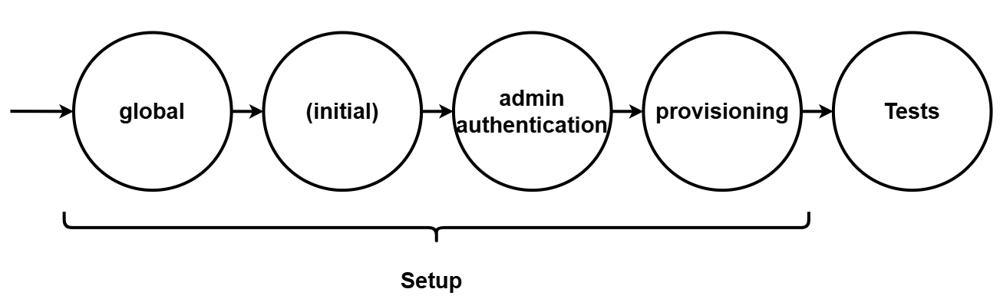

# E2E Test Execution with Playwright BDD

## Table of Contents

- [Playwright Minimum Requirements](#1-playwright-minimum-requirements-as-of-march-2025-wrench)
  - [Installation](#11-installation-package)
  - [Configuration](#12-configuration-hammer_and_wrench)
- [Cucumber Tests with Playwright](#2-tests-with-playwright-bdd-scroll)
  - [Writing a Test with Gherkin Syntax](#21-writing-a-test-with-gherkin-syntax-writing_hand)
  - [Running a Test](#22-running-a-test-test_tube)
- [Test Report](#3-test-report-bar_chart)
  - [Local HTML Report](#31-local---html-report-desktop_computer)
  - [CI/CD Allure Report](#32-cicd---allure-report-satellite)
- [Troubleshoot](#4-troubleshooting-ambulance)

---

## 1. Playwright Minimum Requirements (as of March 2025) :wrench:

To install and execute Playwright tests, ensure you meet the following minimum requirements:

- Latest version of Node.js 18, 20, or 22.
- Supported Operating Systems:
  - Windows 10+, Windows Server 2016+, or Windows Subsystem for Linux (WSL).
  - macOS 13 Ventura or later.
  - Debian 12, Ubuntu 22.04, Ubuntu 24.04 (x86-64 and arm64 architecture).

### 1.1 Installation :package:

To set up Playwright, run the following command in the root directory of your project:

```sh
npm run playwright:init
```

This script installs the dev-dependencies inside `package.json` and the dependencies necessary for playwright to function (e.g. browsers)

If no errors occur, you're ready to use Playwright! 🎉 _If errors occur, stay calm and troubleshoot!_ 🚨

### 1.2 Configuration :hammer_and_wrench:

All the configuration is happening inside `playwright.config.ts`.
Most of the configuration should be trivial, but adding playwright-bdd to it is a bit different. Here is the gist:

- **testDir**: Specifies the directory where the test files are located.
- **outputDir**: Defines where test artifacts (e.g., screenshots, videos) are saved.
- **globalTimeout**: Maximum time for all tests to complete.
- **timeout**: Time allowed for each individual test to run.
- **expect.timeout**: Timeout for assertions within tests.
- **fullyParallel**: Determines whether tests run in parallel or sequentially.
- **forbidOnly**: Prevents the use of `test.only()` in the code on CI.
- **retries**: Number of retries for failed tests.
- **reporter**: Specifies the format and destination for test reports.
- **globalSetup**: A script that runs before all tests to set up the environment.
- **use**: Global settings for browser context, like base URL, video recording, and screenshots.
- **projects**: Defines configurations for running tests across different browsers or devices.

But rather than creating another wiki here, we would suggest visiting the [Playwright Config Documentation](https://playwright.dev/docs/test-configuration)

## 2. Tests with Playwright BDD :scroll:

Playwright does not natively support Behavior-Driven Development (BDD) ([official issue](https://github.com/microsoft/playwright/issues/11975)), but recommends a plugin that makes it possible: [Playwright BDD](https://vitalets.github.io/playwright-bdd/#/).

### 2.1 Writing a Test with Gherkin Syntax :writing_hand:

We use Playwright-BDD for the tests, which makes use of cucumber/gherkin. 

**Feature**: High-level functionality written in `.feature` files using Gherkin syntax.
```gherkin
Feature: VIEW_PORTFOLIO
  Scenario: Without VIEW_PORTFOLIO Permission The User Cannot Log In
    Given the user "test-user0_PERMS" tries to log in to DependencyTrack
    Then the user receives login error toast
```
**Steps**: Define the behavior for each scenario step, implemented in `.step.ts`-files linking with the Gherkin steps:
```typescript
Given('the user {string} tries to log in to DependencyTrack', async ({ loginPage }, username: string) => {
  await loginPage.goto();
  await loginPage.verifyVisibleLoginPage();
  await loginPage.login(username, process.env.RANDOM_PASSWORD);
});
```
**Page Objects**: Similar to classes but for locators of a page (e.g. [LoginPage](./page-objects/login.pom.ts))

**Fixtures**: Used to isolate test steps from another by initializing page-objects for each step (e.g. loginPage from the Given-step above)

### 2.2 Running a Test :test_tube:

Some scripts are already present within `package.json`. They refer to the respective projects mentioned inside `playwright.config.ts` and follow a default structure:


When running the tests for example in chromium, you would use the following script

```sh
npm run playwright:test:chromium
```

It will run all the tests, including the setup. **V1 of the setup takes quite long so if you just want to run the tests without the setup, use**:

```sh
npm run playwright:test:only:chromium
```

By adding `@only` above a feature (or scenario), you can reduce the test count to just that feature, or even to just a scenario, depending on your use case :sunglasses::ok_hand:

### 2.3 Debugging :bug:

When a test is failing and there is not enough information in the report, running the test-command with certain parameters can help to narrow it down.
Common debugging parameters are:

- `--headed` - Runs tests visually.
- `--debug` - Enables the integrated debugger (does not require `--headed`).
- `--ui` - Opens a UI similar.

E.g. (Don't forget to add `--` before, as you are passing a parameter into a script)

```sh
npm run playwright:test:chromium -- --headed
```

To use the Trace Viewer for debugging just open [Playwright Trace Viewer](https://trace.playwright.dev/) and locate the trace file inside the report folder.

## 3. Test Report :bar_chart:

For reporting, different solutions are used based on the environment:

### 3.1 Local - HTML Report :desktop_computer:

Playwright's built-in HTML report is used locally. The report opens automatically if there were failing tests, but you can still open the report by running:

```sh
npm run playwright:show:report
```

### 3.2 CI/CD - Allure Report :satellite:

For CI/CD purposes [Allure Report](https://allurereport.org/) is used for reporting.
The configuration is inside `.github/workflows/e2e-playwright-allure_report.yml`.
We basically execute the tests, let allure generate a report and publish it on the owasp allure-report-repository by using github-pages. :raised_hands:

## 4 Troubleshooting :ambulance:

**Potential Issues:**

- **Playwright installation errors?**
  - _Ensure you have the correct Node.js version (18, 20, or 22) and try reinstalling dependencies:_
- **Test Errors occur?**
  - _Verify that the .feature-files are referenced properly inside the .steps.ts-files_
- _There may be more issues coming in the future_

For more details, visit the [official Playwright documentation](https://playwright.dev/) and [Playwright-BDD](https://vitalets.github.io/playwright-bdd/#/) for the BDD approach.
