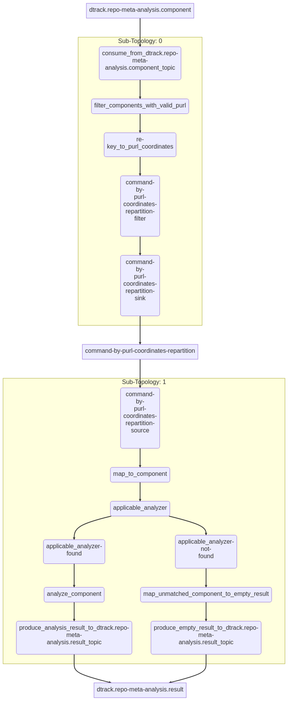

# Repository Metadata Analyzer

The repository metadata analyzer is responsible for fetching metadata about
packages from remote repositories.

In contrast to the [vulnerability analyzer](../vulnerability-analyzer/README.md),
it exclusively supports the [package URL](https://github.com/package-url/purl-spec)
component identifier. CPE and SWID tag IDs are not supported.

## How it works

> **Note**  
> The repository metadata analyzer's API is defined using Protocol Buffers.
> The respective protocol definitions can be found here:
> * [`repo-meta-analysis_v1.proto`](../proto/src/main/proto/repo-meta-analysis_v1.proto)

An analysis can be triggered by emitting an `AnalysisCommand` event to the 
`dtrack.repo-meta-analysis.component` topic. The event key can be of arbitrary
format; it doesn't matter. 

The event value (`AnalysisCommand`) *must* contain a component with a valid package URL.
Events without valid PURL will be silently dropped. For components internal to the organization, 
the `internal` field may be set to indicate the same. Internal components will not be looked up
in public repositories. Refer to https://docs.dependencytrack.org/datasources/internal-components/
for details.

In practice (and translated to JSON for readability), a valid `AnalysisCommand` may end up looking like this:

```json
{
  "component": {
    "purl": "pkg:maven/foo/bar@1.2.3",
    "internal": true
  }
}
```

`AnalysisCommand`s are re-keyed to package URLs, *excluding the version*. For example, and event with
PURL `pkg:maven/foo/bar@1.2.3` will be re-keyed to `pkg:maven/foo/bar`. This is done to ensure that all events
referring to the same package end up in the same topic partition.

Each `AnalysisCommand` is checked for whether an applicable repository analyzer is available.
There are repository analyzers for each package ecosystem, e.g. Ruby Gems, Maven, and Go Modules.
In case no applicable analyzer is available, an "empty" `AnalysisResult` event is published
to the `dtrack.repo-meta-analysis.result` topic. Such "empty" results only contain the component
of the respective `AnalysisCommand`.

```
pkg:maven/foo/bar
```
```json
{
  "component": {
    "purl": "pkg:maven/foo/bar@1.2.3",
    "internal": true
  }
}
```

In case an applicable analyzer is found, the component is analyzed with it.
If the component was found in one of the configured repositories, an `AnalysisResult`
like the following is published to the `dtrack.repo-meta-analysis.result` topic.

```
pkg:maven/foo/bar
```
```json
{
  "component": {
    "purl": "pkg:maven/foo/bar@1.2.3",
    "internal": true
  },
  "repository": "acme-nexus-rm",
  "latestVersion": "2.1.0",
  "published": 1664395172
}
```

If none of the configured repositories contain the requested component, an "empty" event
is published instead.

The key of events in the `dtrack.repo-meta-analysis.result` remains the package URL without version.
Consumers can thus safely rely on Kafka's ordering guarantees without having to worry about race conditions
when processing results.

## Streams topology

The repository metadata analyzer is implemented as [Kafka Streams] application. As such, 
it is possible to generate a diagram of the [topology] that every single event processed by 
application will be funnelled through.



[Kafka Streams]: https://kafka.apache.org/33/documentation/streams/core-concepts
[topology]: https://kafka.apache.org/33/documentation/streams/core-concepts#streams_topology