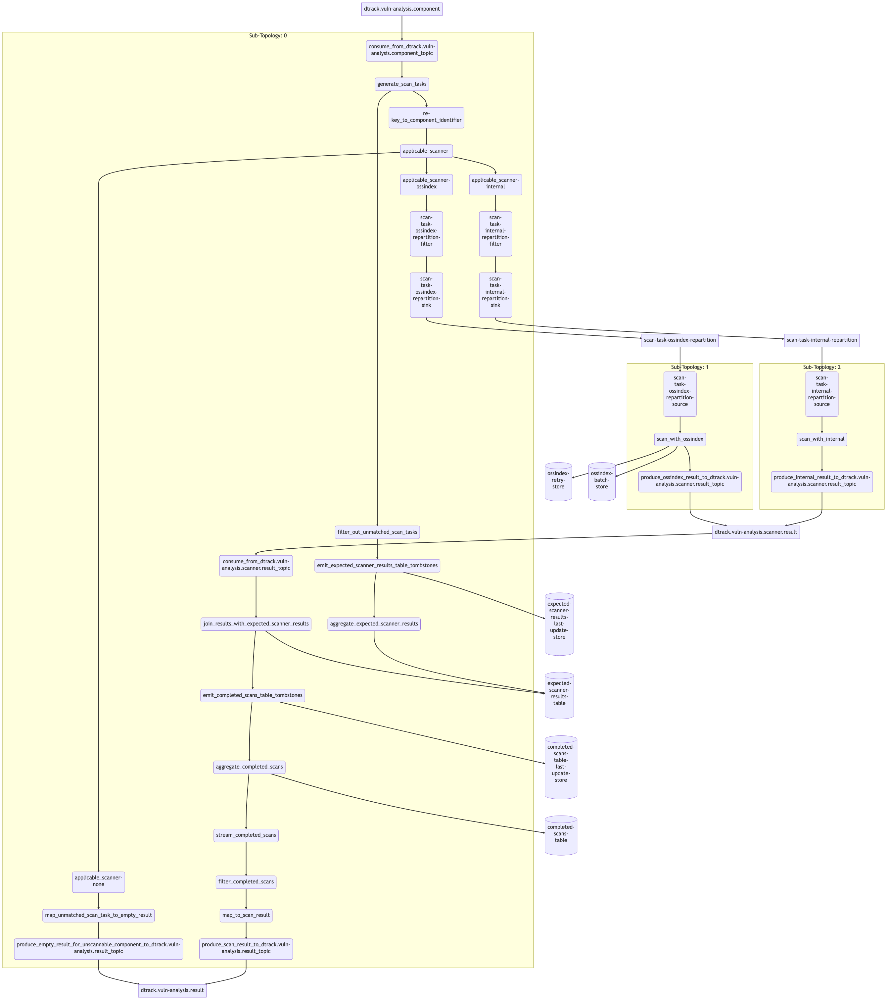

# Vulnerability Analyzer

The vulnerability analyzer is responsible for scanning components for known vulnerabilities.

## Streams topology

The vulnerability analyzer is implemented as [Kafka Streams] application. As such, it is possible to generate a diagram
of the [topology] that every single event processed by application will be funnelled through.



## How it works

> **Note**  
> The vulnerability analyzer's API is defined using Protocol Buffers.
> The respective protocol definitions can be found here:
> * [`vuln-analysis_v1.proto`](../proto/src/main/proto/vuln-analysis_v1.proto)
> * [`vuln_v1.proto`](../proto/src/main/proto/vuln_v1.proto)

A scan can be triggered by emitting a `ScanCommand` event to the `dtrack.vuln-analysis.component` topic.  
The event key (`ScanKey`) is a composite key, consisting of a *scan token* and a *component UUID*, where:

* *Scan token* is an arbitrary string used to correlate one or more scans with each other
* *Component UUID* is the UUID of the to-be-scanned component in the API server's database

In practice (and translated to JSON for readability), a valid `ScanKey` may end up looking like this:

```json
{
  "correlation_id": "6cb18e5f-518b-44bc-a042-ba3794ba0e6e",
  "component_uuid": "848f1dba-08bb-40dc-8bf8-354d9fe8019c"
}
```

The event value (`ScanCommand`) *must* contain all necessary information for identifying the component that shall be scanned.
At the very least, it should include:

* The component's UUID
* The component's CPE and / or PURL

A minimal `ScanCommand` would be:

```json
{
  "uuid": "848f1dba-08bb-40dc-8bf8-354d9fe8019c",
  "purl": "pkg:maven/foo/bar@1.2.3"
}
```

Internally, a `ScanTask` (see [`vuln-analysis-internal_v1.proto`](../proto/src/main/proto/vuln-analysis-internal_v1.proto)) 
will be generated for each scanner that is both:

1. Enabled (see [`CONFIGURATION.md`])
2. Capable of scanning the component

> **Note**  
> Whether a scanner is capable scanning a given component primarily depends on the component's identifiers.   
> While most scanners are capable of dealing with PURLs, only the internal analyzer is capable of handling CPEs.

`ScanTask`s are re-keyed to the "primary" identifier of the component. If a PURL is available, the coordinates
(type, namespace, name, and version, but excluding qualifiers and subpaths) of it will be used. Alternatively, 
CPE or UUID will be used. This re-key operation is performed to ensure that tasks for the same component identity
are published to the same topic partition.

Each scan task is then forwarded to the topic of the respective scanner. As the number of partitions is the means of
achieving parallelism in Kafka consumers, it is expected that the partition count will differ from scanner to scanner.

OSS Index allows for batching of up to 128 PURLs per request, while Snyk requires individual PURLs to be submitted.
In (local) testing, requests to OSS Index take about 600-900ms to complete, whereas requests to Snyk take about 200-400ms.
In order to achieve a throughput with Snyk that is similar to what is possible with OSS Index, the Snyk topic requires
a lot more partitions. The number of partitions are configurable for each scanner, see [`CONFIGURATION.md`].

Scanner results are re-keyed back to the `ScanKey` again, and finally published to
the `dtrack.vuln-analysis.result` topic. A `ScanResult` is a an object composed of the following fields:

* `key`: The `ScanKey`, as also used as event key
  * Keeping it in the event value is required for internal processing
* `scanner`: The scanner that produced this result (e.g. `SCANNER_OSSINDEX`)
* `status`: Status of the scan (e.g. `SCAN_STATUS_SUCCESSFUL`)
* `vulnerabilities`: Any vulnerabilities that have been identified
  * When `status` is `SCAN_STATUS_SUCCESSFUL`
* `failureReason`: Reason for the failure
  * When `status` is `SCAN_STATUS_FAILED`

Applications consuming from `dtrack.vuln-analysis.result` can correlate results with their initial `ScanCommand`
based on the `ScanKey`.

In order to provide a way to determine when all capable scanners completed for a given `ScanKey`, the vulnerability
analyzer application consumes from `dtrack.vuln-analysis.result`, too. By observing the `ScanTask`s created, and the
`ScanResult`s received, it is able to deduce when the initial `ScanCommand` has been completed for all capable scanners.

Once completion is detected, an additional *completion event* is published to `dtrack.vuln-analysis.result`,
with the `scanner` field set to `SCANNER_NONE`, and `status` set to `SCAN_STATUS_COMPLETE`. 

For a component that was scanned by both the internal scanner and OSS Index, a complete series of events
in the `dtrack.vuln-analysis.result` topic would look like this:


[`CONFIGURATION.md`]: ../CONFIGURATION.md
[Kafka Streams]: https://kafka.apache.org/33/documentation/streams/core-concepts
[topology]: https://kafka.apache.org/33/documentation/streams/core-concepts#streams_topology